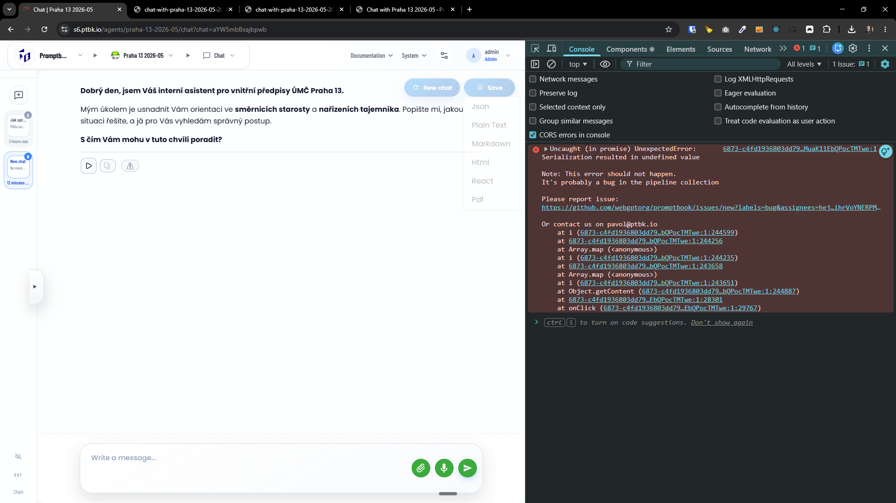
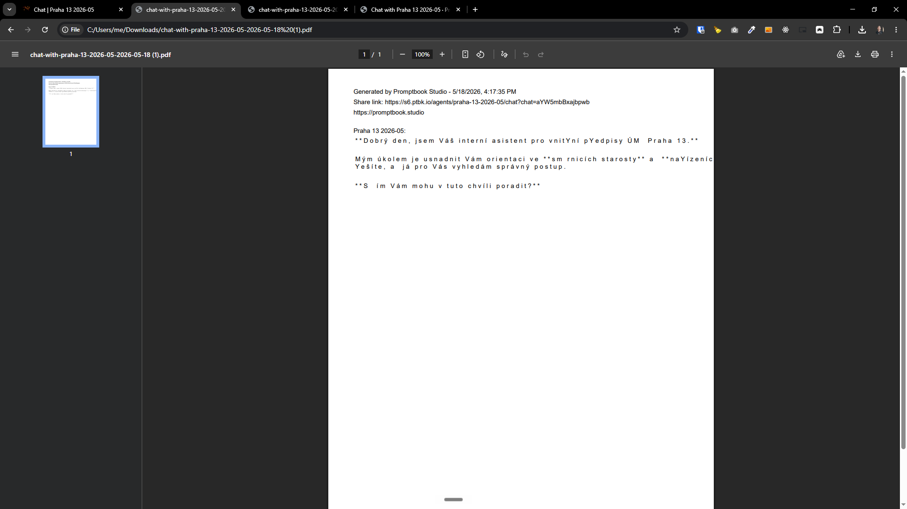
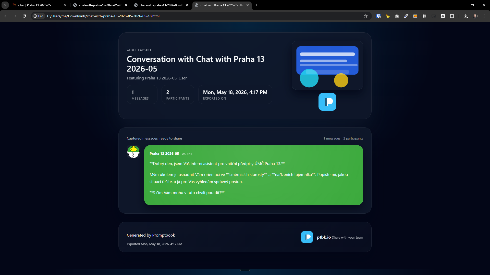
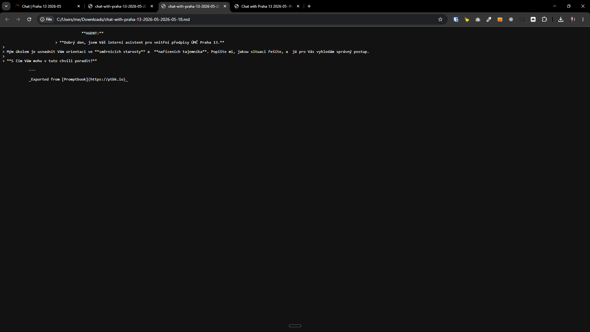

[x] (2 attempts) ~$0.00 43 minutes by GitHub Copilot `gpt-5.4`

---

[ ] !!

[✨©️] Fix the export to "React" of the chat in the Agents Server

```
6873-c4fd1936803dd798.js?dpl=dpl_FihrVoYNERPMuaK11EbQPocTMTwe:1 Uncaught (in promise) UnexpectedError: Serialization resulted in undefined value

Note: This error should not happen.
It's probably a bug in the pipeline collection

Please report issue:
https://github.com/webgptorg/promptbook/issues/new?labels=bug&assignees=hejny&title=%F0%9F%90%9C+Error+report+from+Promptbook&body=%60Error%60+has+occurred+in+the+%5BPromptbook%5D%2C+please+look+into+it+%40hejny.%0A%0A%60%60%60%0ASerialization+resulted+in+undefined+value%0A%60%60%60%0A%0A%0A%23%23+More+info%3A%0A%0A-+**Promptbook+engine+version%3A**+0.112.0-72%0A-+**Book+language+version%3A**+2.0.0%0A-+**Time%3A**+2026-05-18T14%3A27%3A38.287Z%0A%0A%3Cdetails%3E%0A%3Csummary%3EStack+trace%3A%3C%2Fsummary%3E%0A%0A%23%23+Stack+trace%3A%0A%0A%60%60%60stacktrace%0AError%3A+Serialization+resulted+in+undefined+value%0A++++at+https%3A%2F%2Fs6.ptbk.io%2F_next%2Fstatic%2Fchunks%2F8110-32ac36219216c1fa.js%3Fdpl%3Ddpl_FihrVoYNERPMuaK11EbQPocTMTwe%3A1%3A6839%0A++++at+u+%28https%3A%2F%2Fs6.ptbk.io%2F_next%2Fstatic%2Fchunks%2F9964-b81cd31e5b9f7508.js%3Fdpl%3Ddpl_FihrVoYNERPMuaK11EbQPocTMTwe%3A1%3A9781%29%0A++++at+new+l+%28https%3A%2F%2Fs6.ptbk.io%2F_next%2Fstatic%2Fchunks%2F8110-32ac36219216c1fa.js%3Fdpl%3Ddpl_FihrVoYNERPMuaK11EbQPocTMTwe%3A1%3A5616%29%0A++++at+i+%28https%3A%2F%2Fs6.ptbk.io%2F_next%2Fstatic%2Fchunks%2F6873-c4fd1936803dd798.js%3Fdpl%3Ddpl_FihrVoYNERPMuaK11EbQPocTMTwe%3A1%3A244599%29%0A++++at+https%3A%2F%2Fs6.ptbk.io%2F_next%2Fstatic%2Fchunks%2F6873-c4fd1936803dd798.js%3Fdpl%3Ddpl_FihrVoYNERPMuaK11EbQPocTMTwe%3A1%3A244256%0A++++at+Array.map+%28%3Canonymous%3E%29%0A++++at+i+%28https%3A%2F%2Fs6.ptbk.io%2F_next%2Fstatic%2Fchunks%2F6873-c4fd1936803dd798.js%3Fdpl%3Ddpl_FihrVoYNERPMuaK11EbQPocTMTwe%3A1%3A244235%29%0A++++at+https%3A%2F%2Fs6.ptbk.io%2F_next%2Fstatic%2Fchunks%2F6873-c4fd1936803dd798.js%3Fdpl%3Ddpl_FihrVoYNERPMuaK11EbQPocTMTwe%3A1%3A243658%0A++++at+Array.map+%28%3Canonymous%3E%29%0A++++at+i+%28https%3A%2F%2Fs6.ptbk.io%2F_next%2Fstatic%2Fchunks%2F6873-c4fd1936803dd798.js%3Fdpl%3Ddpl_FihrVoYNERPMuaK11EbQPocTMTwe%3A1%3A243651%29%0A%60%60%60%0A%3C%2Fdetails%3E

Or contact us on pavol@ptbk.io
    at i (6873-c4fd1936803dd798.js?dpl=dpl_FihrVoYNERPMuaK11EbQPocTMTwe:1:244599)
    at 6873-c4fd1936803dd798.js?dpl=dpl_FihrVoYNERPMuaK11EbQPocTMTwe:1:244256
    at Array.map (<anonymous>)
    at i (6873-c4fd1936803dd798.js?dpl=dpl_FihrVoYNERPMuaK11EbQPocTMTwe:1:244235)
    at 6873-c4fd1936803dd798.js?dpl=dpl_FihrVoYNERPMuaK11EbQPocTMTwe:1:243658
    at Array.map (<anonymous>)
    at i (6873-c4fd1936803dd798.js?dpl=dpl_FihrVoYNERPMuaK11EbQPocTMTwe:1:243651)
    at Object.getContent (6873-c4fd1936803dd798.js?dpl=dpl_FihrVoYNERPMuaK11EbQPocTMTwe:1:244887)
    at 6873-c4fd1936803dd798.js?dpl=dpl_FihrVoYNERPMuaK11EbQPocTMTwe:1:28301
    at onClick (6873-c4fd1936803dd798.js?dpl=dpl_FihrVoYNERPMuaK11EbQPocTMTwe:1:29767)
i @ 6873-c4fd1936803dd798.js?dpl=dpl_FihrVoYNERPMuaK11EbQPocTMTwe:1
(anonymous) @ 6873-c4fd1936803dd798.js?dpl=dpl_FihrVoYNERPMuaK11EbQPocTMTwe:1
i @ 6873-c4fd1936803dd798.js?dpl=dpl_FihrVoYNERPMuaK11EbQPocTMTwe:1
(anonymous) @ 6873-c4fd1936803dd798.js?dpl=dpl_FihrVoYNERPMuaK11EbQPocTMTwe:1
i @ 6873-c4fd1936803dd798.js?dpl=dpl_FihrVoYNERPMuaK11EbQPocTMTwe:1
getContent @ 6873-c4fd1936803dd798.js?dpl=dpl_FihrVoYNERPMuaK11EbQPocTMTwe:1
(anonymous) @ 6873-c4fd1936803dd798.js?dpl=dpl_FihrVoYNERPMuaK11EbQPocTMTwe:1
onClick @ 6873-c4fd1936803dd798.js?dpl=dpl_FihrVoYNERPMuaK11EbQPocTMTwe:1
i4 @ 87c73c54-3c195070c5cbb22b.js?dpl=dpl_FihrVoYNERPMuaK11EbQPocTMTwe:1
(anonymous) @ 87c73c54-3c195070c5cbb22b.js?dpl=dpl_FihrVoYNERPMuaK11EbQPocTMTwe:1
nz @ 87c73c54-3c195070c5cbb22b.js?dpl=dpl_FihrVoYNERPMuaK11EbQPocTMTwe:1
se @ 87c73c54-3c195070c5cbb22b.js?dpl=dpl_FihrVoYNERPMuaK11EbQPocTMTwe:1
cs @ 87c73c54-3c195070c5cbb22b.js?dpl=dpl_FihrVoYNERPMuaK11EbQPocTMTwe:1
cu @ 87c73c54-3c195070c5cbb22b.js?dpl=dpl_FihrVoYNERPMuaK11EbQPocTMTwe:1
1902-7e12ba84e5a8cc94.js?dpl=dpl_FihrVoYNERPMuaK11EbQPocTMTwe:1 [Violation] 'message' handler took 454ms
```

-   In every chat there is a "Save" button that allows to export the chat in different formats, one of the formats is "React" which should be fixed
-   When exporting to "React" it ends up with error in console and nothing is downloaded
-   Keep the Promptbook branding simple and inconspicuous
-   There should be a comment with branding of Promptbook and version information, reuse [existing components and functions](src/utils/misc/aboutPromptbookInformation.ts) for this from the repository
-   Keep in mind the DRY _(don't repeat yourself)_ principle.
-   Do a proper analysis of the current functionality before you start implementing.
-   You are working with the [Agents Server](apps/agents-server)




---

[ ] !

[✨©️] Fix the export to "PDF" of the chat in the Agents Server

-   In every chat there is a "Save" button that allows to export the chat in different formats, one of the formats is "PDF" which should be fixed
-   PDF is exported but its completely broken, looking ugly and does not convert markdown to proper format, it should be fixed to look good and properly convert markdown to PDF format
-   Keep the Promptbook branding simple and inconspicuous
-   The file should have a metadata which contains the Branding of Promptbook and version information, reuse [existing components and functions](src/utils/misc/aboutPromptbookInformation.ts) for this from the repository
-   Keep in mind the DRY _(don't repeat yourself)_ principle.
-   Do a proper analysis of the current functionality before you start implementing.
-   You are working with the [Agents Server](apps/agents-server)




---

[x] (2 attempts) ~$0.00 41 minutes by GitHub Copilot `gpt-5.4`

[✨©️] Fix the export to "HTML" of the chat in the Agents Server

-   In every chat there is a "Save" button that allows to export the chat in different formats, one of the formats is "HTML" which should be fixed
-   HTML has not converted markdown to html properly
-   Also it is cluttered with a lot of unnecessary information that should not be in the exported file, it should be cleaned up to contain only the chat content and properly convert markdown to html
-   Keep the Promptbook branding simple and inconspicuous
-   The file should have a meta tags which contains the Branding of Promptbook and version information, reuse [existing components and functions](src/utils/misc/aboutPromptbookInformation.ts) for this from the repository
-   Keep in mind the DRY _(don't repeat yourself)_ principle.
-   Do a proper analysis of the current functionality before you start implementing.
-   You are working with the [Agents Server](apps/agents-server)




---

[x] (2 attempts) ~$0.00 an hour by GitHub Copilot `gpt-5.4`

[✨©️] Fix the export to "Markdown" of the chat in the Agents Server

```markdown
                                    **AGENT:**

                        > **Dobrý den, jsem Váš interní asistent pro vnitřní předpisy ÚMČ Praha 13.**

> Mým úkolem je usnadnit Vám orientaci ve **směrnicích starosty** a **nařízeních tajemníka**. Popište mi, jakou situaci řešíte, a já pro Vás vyhledám správný postup.
>
> **S čím Vám mohu v tuto chvíli poradit?**

            ---

            _Exported from [Promptbook](https://ptbk.io)_
```

-   In every chat there is a "Save" button that allows to export the chat in different formats, one of the formats is "Markdown" which should be fixed
-   The indentation of the exported markdown is broken, it should be fixed to properly indent the markdown and make it look good when exported
-   Use `spaceTrim` utiluity function for the fixing of the indentation
-   Keep the Promptbook branding simple and inconspicuous
-   There should be a comment with branding of Promptbook and version information, reuse [existing components and functions](src/utils/misc/aboutPromptbookInformation.ts) for this from the repository
-   Keep in mind the DRY _(don't repeat yourself)_ principle.
-   Do a proper analysis of the current functionality before you start implementing.
-   You are working with the [Agents Server](apps/agents-server)



