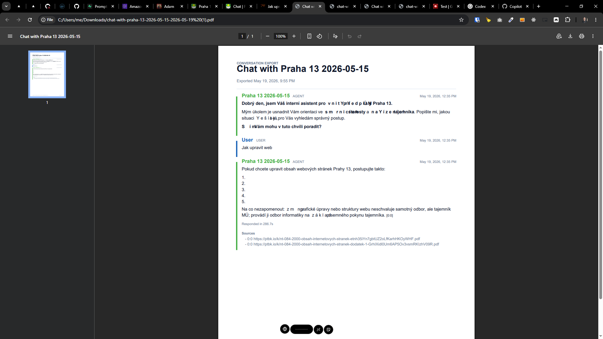
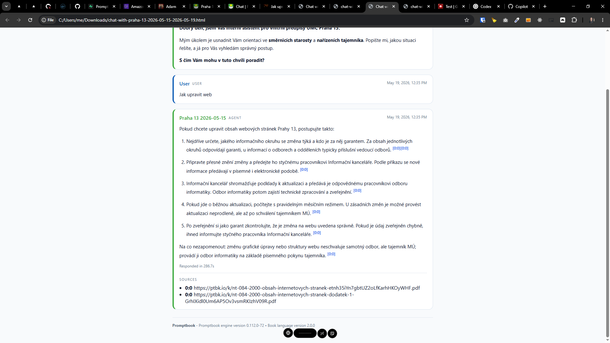

[x] ~$0.8644 an hour by OpenAI Codex `gpt-5.5`

[✨©️] Fix the export to "PDF" of the chat in the Agents Server

-   In every chat there is a "Save" button that allows to export the chat in different formats, one of the formats is "PDF" which should be fixed
-   PDF is exported but its completely broken, looking ugly and does not convert markdown to proper format, it should be fixed to look good and properly convert markdown to PDF format
-   In the chat messages there can be sources in format "【https://ptbk.io/k/nt-084-2000-obsah-internetovych-stranek-etnh35iYn7gbtUZ2oLfKarhHKOyWHF.pdf】" inside a text message, these sources should be properly extracted and in the text kept as small number like [1], [2], etc. and in the footnote of the PDF there should be a list of all the sources with their numbers and links, so in this example it should be [1] https://ptbk.io/k/nt-084-2000-obsah-internetovych-stranek-etnh35iYn7gbtUZ2oLfKarhHKOyWHF.pdf
-   Keep the Promptbook branding simple and inconspicuous
-   The file should have a metadata which contains the Branding of Promptbook and version information, reuse [existing components and functions](src/utils/misc/aboutPromptbookInformation.ts) for this from the repository
-   Keep in mind the DRY _(don't repeat yourself)_ principle.
-   Do a proper analysis of the current functionality before you start implementing.
-   You are working with the [Agents Server](apps/agents-server)

---

[x] ~$0.7525 an hour by OpenAI Codex `gpt-5.5`

[✨©️] Fix the sources in export to "HTML" of the chat in the Agents Server

-   In every chat there is a "Save" button that allows to export the chat in different formats, one of the formats is "HTML" which should be fixed
-   HTML has not converted markdown to html properly
-   In the chat messages there can be sources in format "【https://ptbk.io/k/nt-084-2000-obsah-internetovych-stranek-etnh35iYn7gbtUZ2oLfKarhHKOyWHF.pdf】" inside a text message, these sources should be properly extracted and in the text kept as small number like [1], [2], etc. and in the footnote of the HTML there should be a list of all the sources with their numbers and links, so in this example it should be [1] https://ptbk.io/k/nt-084-2000-obsah-internetovych-stranek-etnh35iYn7gbtUZ2oLfKarhHKOyWHF.pdf
-   Keep in mind the DRY _(don't repeat yourself)_ principle.
-   Do a proper analysis of the current functionality before you start implementing.
-   You are working with the [Agents Server](apps/agents-server)

---

[ ] !!

[✨©️] Fix the sources in export to "Markdown" of the chat in the Agents Server

-   In every chat there is a "Save" button that allows to export the chat in different formats, one of the formats is "Markdown" which should be fixed
-   In the chat messages there can be sources in format "【https://ptbk.io/k/nt-084-2000-obsah-internetovych-stranek-etnh35iYn7gbtUZ2oLfKarhHKOyWHF.pdf】" inside a text message, these sources should be properly extracted and in the text kept as small number like [1], [2], etc. and in the footnote of the Markdown there should be a list of all the sources with their numbers and links, so in this example it should be [1] https://ptbk.io/k/nt-084-2000-obsah-internetovych-stranek-etnh35iYn7gbtUZ2oLfKarhHKOyWHF.pdf
-   The indentation of the exported markdown is broken, it should be fixed to properly indent the markdown and make it look good when exported
-   Use `spaceTrim` utiluity function for the fixing of the indentation
-   Keep the Promptbook branding simple and inconspicuous
-   There should be a comment with branding of Promptbook and version information, reuse [existing components and functions](src/utils/misc/aboutPromptbookInformation.ts) for this from the repository
-   Keep in mind the DRY _(don't repeat yourself)_ principle.
-   Do a proper analysis of the current functionality before you start implementing.
-   You are working with the [Agents Server](apps/agents-server)

