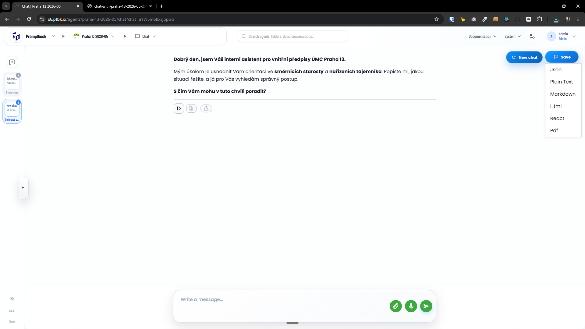
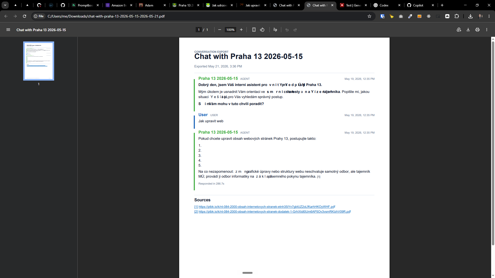
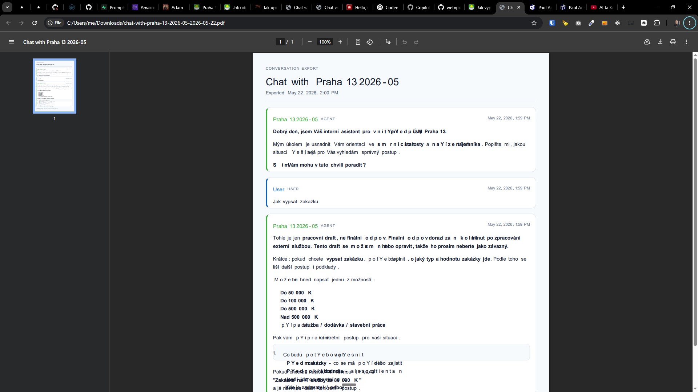
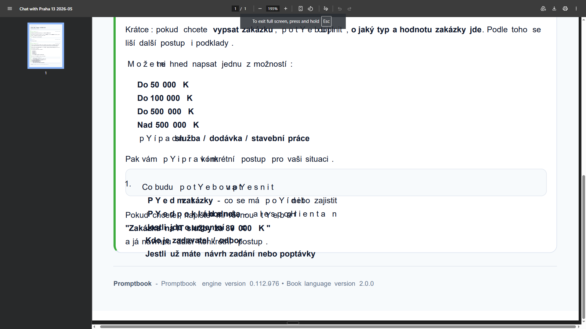

[x] ~$0.4353 an hour by OpenAI Codex `gpt-5.5`

[✨©️] Fix the export to "PDF" of the chat in the Agents Server

-   In every chat there is a "Save" button that allows to export the chat in different formats, one of the formats is "PDF" which should be fixed
-   PDF is exported but is broken
-   On the other hand, the HTML export isn't broken.
-   **Base the PDF export on the HTML export**, so it should look exactly the same as the HTML export but in PDF format, and it should properly convert markdown to PDF format
-   In the chat messages there can be sources in format "【https://ptbk.io/k/nt-084-2000-obsah-internetovych-stranek-etnh35iYn7gbtUZ2oLfKarhHKOyWHF.pdf】" inside a text message, these sources should be properly extracted and in the text kept as small number like [1], [2], etc. and in the footnote of the PDF there should be a list of all the sources with their numbers and links, so in this example it should be [1] https://ptbk.io/k/nt-084-2000-obsah-internetovych-stranek-etnh35iYn7gbtUZ2oLfKarhHKOyWHF.pdf
-   Keep the Promptbook branding simple and inconspicuous
-   The file should have a metadata which contains the Branding of Promptbook and version information, reuse [existing components and functions](src/utils/misc/aboutPromptbookInformation.ts) for this from the repository
-   Keep in mind the DRY _(don't repeat yourself)_ principle.
-   Do a proper analysis of the current functionality before you start implementing.
-   You are working with the [Agents Server](apps/agents-server)

---

[ ] !!!

[✨©️] Fix the export to "PDF" of the chat in the Agents Server

-   In every chat there is a "Save" button that allows to export the chat in different formats, one of the formats is "PDF" which should be fixed
-   PDF is exported but is broken, the characters are not rendered in correct positions, espetially the diacritics are rendered in wrong positions, so the PDF is not readable
-   Do a proper analysis of the current functionality before you start implementing.
-   You are working with the [Agents Server](apps/agents-server)

