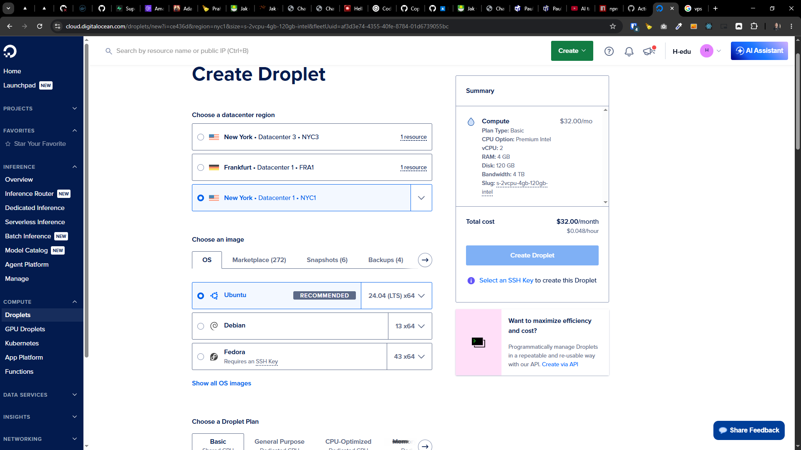
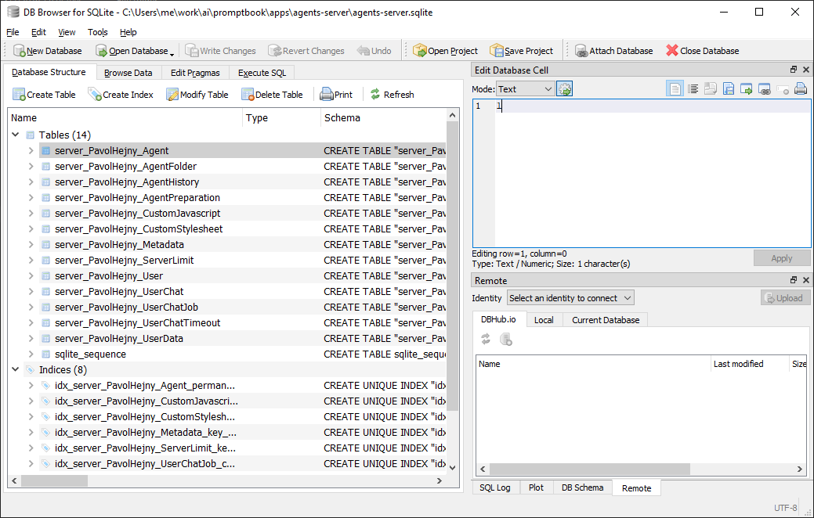

[x] ~$1.37 2 hours by OpenAI Codex `gpt-5.5`

[✨🤬] Allow to install Agents server in single standalone VPS server by one command

-   Make it to `other/vps/install.sh`
-   When you run this script on a fresh VPS server, it should install all the necessary dependencies and start the Agents server with the command above.
    -   It should be enough to pass something like this into the bash of the fresh VPS `curl -fsSL https://raw.githubusercontent.com/webgptorg/promptbook/refs/heads/main/other/vps/install.sh | bash` and everything should be set up and the server should be running after that.
    -   By running the server I mean running `ptbk agents-server start --agent github-copilot --model gpt-5.4 --thinking-level xhigh` in some deamonized way, so it will be running even after the user disconnects from the server.
    -   It should install everything needed for the server to run, including Node.js, Promptbook itself, let the user to sign in to Github copilot coding agent (or other code runner), and all the necessary configuration should be done by the script as well.
    -   The installation script can be interactive, it can ask user to input some values if needed, for example to choose the code runner and input the credentials for it.
    -   The installation script should be 100% standalone, it should not require any additional configuration or setup from the user, it should do everything from fresh VPS server to running Agents server
    -   The installation script must be idempotent, so if the user runs it multiple times, it should not break anything and should just make sure that everything is installed and running.
    -   The agent server should be configured in a `pm2` process manager and automatically set up to start on server boot.
    -   The installation script can require sudo permissions, but it if does, it should ask for them in the beginning and explain why they are needed.
-   The installation script should work for Ubuntu 24.04 LTS x64 _(on DigitalOcean, AWS, or any other VPS provider)_
-   Now the server requires Supabase which is configured in environment variables. But for standalone server we should use standalone solution, allow the Agents server to be configured via both options:
    -   With Supabase _(current solution)_
    -   With local SQLite database in `.promptbook` folder in `CWD`
-   Keep in mind the DRY _(don't repeat yourself)_ principle
    -   Do some common abstracton for database
-   Do a proper analysis of the current functionality of `ptbk agents-server` and related functionality before you start implementing.
-   In future this will be part of `Dockerfile` but for now do not worry about Docker, just make sure the installation script works on fresh VPS server and starts the server after installation.
-   You are working with [`ptbk agents-server`](src/cli/cli-commands/agents-server/run.ts)
-   Add the changes into the [changelog](changelog/_current-preversion.md)



---

[x] ~$1.19 2 hours by OpenAI Codex `gpt-5.5`

[✨🤬] Installation script installs the Agents server but the server crashes during first build, fix it

```bash

root@collboard-agents-server-x15:~# sudo curl -fsSL https://raw.githubusercontent.com/webgptorg/promptbook/refs/heads/main/other/vps/install.sh | bash

...

root@collboard-agents-server-x15:~# pm2 logs 0
0|promptbook-agents-server  | 2026-05-25T11:44:38: [next-build] ./src/app/agents/[agentName]/AgentChatWrapper.tsx
0|promptbook-agents-server  | 2026-05-25T11:44:38: [next-build] Module not found: Can't resolve '@common/hooks/usePromise'
0|promptbook-agents-server  | 2026-05-25T11:44:38: [next-build] https://nextjs.org/docs/messages/module-not-found
0|promptbook-agents-server  | 2026-05-25T11:44:38: [next-build] Import trace for requested module:
0|promptbook-agents-server  | 2026-05-25T11:44:38: [next-build] ./src/app/agents/[agentName]/book+chat/AgentBookAndChat.tsx
0|promptbook-agents-server  | 2026-05-25T11:44:38: [next-build] > Build failed because of webpack errors
0|promptbook-agents-server  | 2026-05-25T11:44:38: next-build exited with code 1.
0|promptbook-agents-server  | 2026-05-25T11:44:40: Starting Promptbook Agents Server on port 4440.
0|promptbook-agents-server  | 2026-05-25T11:44:40: [next-build] Building the Agents Server Next app.
0|promptbook-agents-server  | 2026-05-25T11:44:41: [next-build]    ▲ Next.js 15.4.11
0|promptbook-agents-server  | 2026-05-25T11:44:41: [next-build]    - Experiments (use with caution):
0|promptbook-agents-server  | 2026-05-25T11:44:41: [next-build]      ✓ externalDir
0|promptbook-agents-server  | 2026-05-25T11:44:41: [next-build]    Creating an optimized production build ...
0|promptbook-agents-server  | 2026-05-25T11:44:52: [next-build] Failed to compile.
0|promptbook-agents-server  | 2026-05-25T11:44:52: [next-build] ./src/pages/_app.tsx
0|promptbook-agents-server  | 2026-05-25T11:44:52: [next-build] Module parse failed: Unexpected token (1:12)
0|promptbook-agents-server  | 2026-05-25T11:44:52: [next-build] You may need an appropriate loader to handle this file type, currently no loaders are configured to process this file. See https://webpack.js.org/concepts#loaders
0|promptbook-agents-server  | 2026-05-25T11:44:52: [next-build] > import type { AppProps } from 'next/app';
0|promptbook-agents-server  | 2026-05-25T11:44:52: [next-build] | import '../app/globals.css';
0|promptbook-agents-server  | 2026-05-25T11:44:52: [next-build] |
0|promptbook-agents-server  | 2026-05-25T11:44:52: [next-build] ./src/pages/_document.tsx
0|promptbook-agents-server  | 2026-05-25T11:44:52: [next-build] Module parse failed: Unexpected token (9:8)
0|promptbook-agents-server  | 2026-05-25T11:44:52: [next-build] You may need an appropriate loader to handle this file type, currently no loaders are configured to process this file. See https://webpack.js.org/concepts#loaders
0|promptbook-agents-server  | 2026-05-25T11:44:52: [next-build] | export default function LegacyPagesDocument() {
0|promptbook-agents-server  | 2026-05-25T11:44:52: [next-build] |     return (
0|promptbook-agents-server  | 2026-05-25T11:44:52: [next-build] >         <Html lang="en">
0|promptbook-agents-server  | 2026-05-25T11:44:52: [next-build] |             <Head />
0|promptbook-agents-server  | 2026-05-25T11:44:52: [next-build] |             <body className={`${APPLICATION_FONT_VARIABLE_CLASS_NAME} bg-white text-gray-900 antialiased`}>
0|promptbook-agents-server  | 2026-05-25T11:44:52: [next-build] ./src/pages/500.tsx
0|promptbook-agents-server  | 2026-05-25T11:44:52: [next-build] Module parse failed: Unexpected token (28:8)
0|promptbook-agents-server  | 2026-05-25T11:44:52: [next-build] You may need an appropriate loader to handle this file type, currently no loaders are configured to process this file. See https://webpack.js.org/concepts#loaders
0|promptbook-agents-server  | 2026-05-25T11:44:52: [next-build] | export default function Custom500Page() {
0|promptbook-agents-server  | 2026-05-25T11:44:52: [next-build] |     return (
0|promptbook-agents-server  | 2026-05-25T11:44:52: [next-build] >         <>
0|promptbook-agents-server  | 2026-05-25T11:44:52: [next-build] |             <Head>
0|promptbook-agents-server  | 2026-05-25T11:44:52: [next-build] |                 <title>500 / Internal Server Error</title>
0|promptbook-agents-server  | 2026-05-25T11:44:52: [next-build] Import trace for requested module:
0|promptbook-agents-server  | 2026-05-25T11:44:52: [next-build] ./src/pages/500.tsx
0|promptbook-agents-server  | 2026-05-25T11:44:52: [next-build] ./src/app/agents/[agentName]/AgentChatWrapper.tsx
0|promptbook-agents-server  | 2026-05-25T11:44:52: [next-build] Module not found: Can't resolve '@/src/components/WalletRecordDialog/WalletRecordDialog'
0|promptbook-agents-server  | 2026-05-25T11:44:52: [next-build] https://nextjs.org/docs/messages/module-not-found
0|promptbook-agents-server  | 2026-05-25T11:44:52: [next-build] Import trace for requested module:
0|promptbook-agents-server  | 2026-05-25T11:44:52: [next-build] ./src/app/agents/[agentName]/book+chat/AgentBookAndChat.tsx
0|promptbook-agents-server  | 2026-05-25T11:44:52: [next-build] ./src/app/agents/[agentName]/AgentChatWrapper.tsx
0|promptbook-agents-server  | 2026-05-25T11:44:52: [next-build] Module not found: Can't resolve '@common/hooks/usePromise'
0|promptbook-agents-server  | 2026-05-25T11:44:52: [next-build] https://nextjs.org/docs/messages/module-not-found
0|promptbook-agents-server  | 2026-05-25T11:44:52: [next-build] Import trace for requested module:
0|promptbook-agents-server  | 2026-05-25T11:44:52: [next-build] ./src/app/agents/[agentName]/book+chat/AgentBookAndChat.tsx
0|promptbook-agents-server  | 2026-05-25T11:44:52: [next-build] > Build failed because of webpack errors
0|promptbook-agents-server  | 2026-05-25T11:44:52: next-build exited with code 1.
0|promptbook-agents-server  | 2026-05-25T11:44:54: Starting Promptbook Agents Server on port 4440.
0|promptbook-agents-server  | 2026-05-25T11:44:54: [next-build] Building the Agents Server Next app.
0|promptbook-agents-server  | 2026-05-25T11:44:55: [next-build]    ▲ Next.js 15.4.11
0|promptbook-agents-server  | 2026-05-25T11:44:55: [next-build]    - Experiments (use with caution):
0|promptbook-agents-server  | 2026-05-25T11:44:55: [next-build]      ✓ externalDir
0|promptbook-agents-server  | 2026-05-25T11:44:55: [next-build]    Creating an optimized production build ...
...
```

```bash
root@collboard-agents-server-x15:~# pm2 show 0
 Describing process with id 0 - name promptbook-agents-server
┌───────────────────┬───────────────────────────────────────────────────────────────────────────────────────────────────────┐
│ status            │ online                                                                                                │
│ name              │ promptbook-agents-server                                                                              │
│ namespace         │ default                                                                                               │
│ version           │ N/A                                                                                                   │
│ restarts          │ 133                                                                                                   │
│ uptime            │ 3s                                                                                                    │
│ script path       │ /usr/bin/ptbk                                                                                         │
│ script args       │ agents-server start --agent github-copilot --model gpt-5.4 --thinking-level xhigh --port 4440 --no-ui │
│ error log path    │ /root/.pm2/logs/promptbook-agents-server-error.log                                                    │
│ out log path      │ /root/.pm2/logs/promptbook-agents-server-out.log                                                      │
│ pid path          │ /root/.pm2/pids/promptbook-agents-server-0.pid                                                        │
│ interpreter       │ /usr/bin/node                                                                                         │
│ interpreter args  │ N/A                                                                                                   │
│ script id         │ 0                                                                                                     │
│ exec cwd          │ /opt/promptbook-agents-server                                                                         │
│ exec mode         │ fork_mode                                                                                             │
│ node.js version   │ 22.22.2                                                                                               │
│ node env          │ N/A                                                                                                   │
│ watch & reload    │ ✘                                                                                                     │
│ unstable restarts │ 0                                                                                                     │
│ created at        │ 2026-05-25T11:19:56.818Z                                                                              │
└───────────────────┴───────────────────────────────────────────────────────────────────────────────────────────────────────┘
 Actions available
┌────────────────────────┐
│ km:heapdump            │
│ km:cpu:profiling:start │
│ km:cpu:profiling:stop  │
│ km:heap:sampling:start │
│ km:heap:sampling:stop  │
└────────────────────────┘
 Trigger via: pm2 trigger promptbook-agents-server <action_name>

 Code metrics value
┌────────────────────────┬────────────┐
│ Heap Size              │ 139.62 MiB │
│ Heap Usage             │ 71.19 %    │
│ Used Heap Size         │ 99.39 MiB  │
│ Active requests        │ 3          │
│ Active handles         │ 3          │
│ Event Loop Latency     │ 747.55 ms  │
│ Event Loop Latency p95 │ 747.55 ms  │
└────────────────────────┴────────────┘
 Divergent env variables from local env
┌───────┬───────────────────────────────┐
│ PWD   │ /opt/promptbook-agents-server │
│ SHLVL │ 3                             │
└───────┴───────────────────────────────┘

```

-   Do a proper analysis of the current functionality of `ptbk agents-server` and `other/vps/install.sh` and related functionality before you start implementing.
-   You are working with [`ptbk agents-server`](src/cli/cli-commands/agents-server/run.ts) and installation script at `other/vps/install.sh`

---

[ ] !!!

[✨🤬] Try to do login to Github Copilot (and other code runners) via non-interactive mode

```bash
curl -fsSL https://raw.githubusercontent.com/webgptorg/promptbook/refs/heads/main/other/vps/install.sh | bash
```

```bash
  ╭─╮╭─╮
  ╰─╯╰─╯  Copilot v1.0.54 uses AI.
  █ ▘▝ █  Check for mistakes.
   ▔▔▔▔

● No copilot-instructions.md found. Run /init to generate.

● Tip: /feedback
  └ Provide feedback about the CLI


 ◎ Waiting for authorization...

 Enter one-time code: 0123-9DEE at https://github.com/login/device

```

```
added 3 packages in 7s
[promptbook-vps] Configuring /opt/promptbook-agents-server.
[promptbook-vps] Initializing Promptbook Agents Server project files.
Public Agents Server URL [http://134.122.68.98:4440]: Open GitHub Copilot CLI now for /login and project trust setup? [yes]:
[promptbook-vps] Starting GitHub Copilot CLI. Use /login if prompted, trust this directory, then exit Copilot to continue.
... (waiting for user to do /login and /trust in Github Copilot CLI) ...
[promptbook-vps] Configuring pm2 startup for user root.
Created symlink /etc/systemd/system/multi-user.target.wants/pm2-root.service → /etc/systemd/system/pm2-root.service.
[promptbook-vps] Building Agents Server before starting pm2.
Building Promptbook Agents Server.
```

-   @@@
-   _(@@@ After VPS server is working)_
-   User needs to manually write `/login` and `/exit`
-   In future the `vps/install.sh` should be possible to run in completely non-interactive mode, for now just do not fall into 3rd party non-interactive terminal UIs
-   Keep in mind the DRY _(don't repeat yourself)_ principle.
-   Do a proper analysis of the current functionality of `ptbk agents-server` and related functionality before you start implementing.
-   You are working with [auto installation script](vps/install.sh)
-   Add the changes into the [changelog](changelog/_current-preversion.md)

---

[x] ~$1.07 2 hours by OpenAI Codex `gpt-5.5`

[✨🤬] The installation script should spawn 100% production ready server running on custom domain with production server

```bash
curl -fsSL https://raw.githubusercontent.com/webgptorg/promptbook/refs/heads/main/other/vps/install.sh | bash
```

-   Now it missing custom domain setup, production ready proxy server and SSL certificate, add it to the installation script, so after running the installation script, the user will have fully working Agents server running on custom domain with SSL certificate.
    -   The installation script should ask user for the domain during the installation process
    -   It should install and configure `nginx` as a reverse proxy server to proxy the requests from the custom domain to the Agents server running on localhost
    -   Automatically set up SSL certificate for the custom domain using `certbot` and configure `nginx` to use it
    -   Allow to put one or more domains during the installation process, and set up SSL certificate for all of them, and configure `nginx` to proxy requests from all of them to the Agents server, leverage `SERVERS=www.domain1.com,www.domain2.com` environment variable for that
    -   All of the servers are using same Supabase/SQLite database, but tables are prefixed with the normalized domain name, so they are separated in the database, but still using same database instance, this way we can have multiple domains pointing to the same server and using the same database, but still having separate data for each domain
    -   All of this should be done automatically by the installation script, so the user just need to run the installation script and set up the proper DNS record for the custom domain, and everything else will be done by the installation script
    -   After the installation is complete, the user should be able to access the Agents server on the custom domain with SSL certificate, and the server should be running in production mode with all necessary optimizations and configurations for production use.
-   Only possible intervention that is needed to be done externally is to set up the proper DNS record, but the installation script should show all the instructions
-   You are working with [auto installation script](vps/install.sh)



---

[x] $0.6387 an hour by OpenAI Codex `gpt-5.5`

[✨🤬] The installation asks for Let's Encrypt email but not for the actual domains the agents server should run

```bash
root@collboard-agents-server-x15:~# sudo curl -fsSL https://raw.githubusercontent.com/webgptorg/promptbook/refs/heads/main/other/vps/install.sh | bash

Coding runner [github-copilot]:
Runner model [gpt-5.4]:
Runner thinking level [xhigh]:
Agents Server port [4440]:
Let's Encrypt email (optional) []: pavol@ptbk.io

... (installation logs; BUT no domain(s) configuration) ...


[promptbook-vps] Installing system packages.
Hit:1 http://security.ubuntu.com/ubuntu noble-security InRelease
Hit:2 http://mirrors.digitalocean.com/ubuntu noble InRelease
Hit:3 http://mirrors.digitalocean.com/ubuntu noble-updates InRelease
Hit:4 http://mirrors.digitalocean.com/ubuntu noble-backports InRelease
```

-   Some of the steps are implemented, but the installation script is still missing the part where it **asks for the domain(s)** and sets up the reverse proxy and SSL certificate for each domain
-   The installation script should ask user for the domain(s) during the installation process
-   It should install and configure `nginx` as a reverse proxy server to proxy the requests from the custom domain to the Agents server running on localhost
-   Automatically set up SSL certificate for the custom domain using `certbot` and configure `nginx` to use it
-   Allow to put one or more domains during the installation process, and set up SSL certificate for all of them, and configure `nginx` to proxy requests from all of them to the Agents server, leverage `SERVERS=www.domain1.com,www.domain2.com` environment variable for that
-   All of the servers are using same Supabase/SQLite database, but tables are prefixed with the normalized domain name, so they are separated in the database, but still using same database instance, this way we can have multiple domains pointing to the same server and using the same database, but still having separate data for each domain
-   All of this should be done automatically by the installation script, so the user just need to run the installation script and set up the proper DNS record for the custom domain, and everything else will be done by the installation script
-   After the installation is complete, the user should be able to access the Agents server on the custom domain with SSL certificate, and the server should be running in production mode with all necessary optimizations and configurations for production use.
-   Only possible intervention that is needed to be done externally is to set up the proper DNS record, but the installation script should show all the instructions
-   You are working with [auto installation script](vps/install.sh)

---

[x] ~$0.8438 2 hours by OpenAI Codex `gpt-5.5`

[✨🤬] Ask for api keys and admin password during the installation

```bash
curl -fsSL https://raw.githubusercontent.com/webgptorg/promptbook/refs/heads/main/other/vps/install.sh | bash
```

-   API keys will be saved in environment variables, so the installation script should ask user for the API keys during the installation process and save them in the `.env` file
-   Allow to just [enter] it to keep it empty _(current behavior)_, or input custom API key if user wants to
-   The installation script should also ask for the admin password during the installation process and save it in the `.env` file as `ADMIN_PASSWORD`
-   Allow to just [enter] it to auto-generate a random password _(current behavior)_, or input custom password if user wants to
-   You are working with [auto installation script](vps/install.sh)

