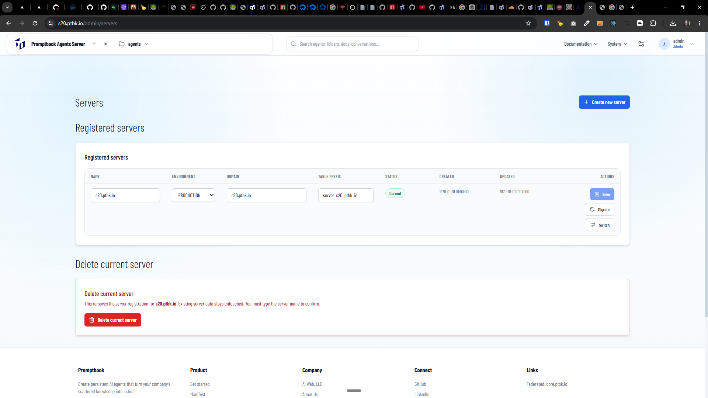
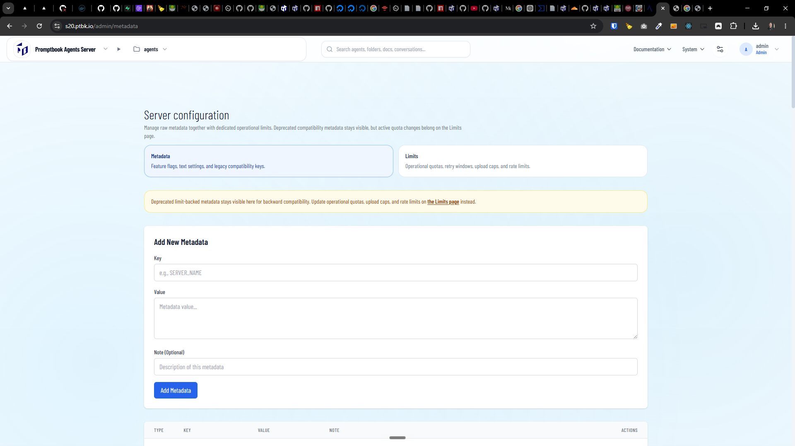

[ ]

[✨🤬] Allow to configure the installed Agents server on VPS throught UI when logged in as `admin`

**This is how Agents server is installed:**

```bash
root@collboard-agents-server-x21:~# sudo curl -fsSL https://raw.githubusercontent.com/webgptorg/promptbook/refs/heads/main/other/vps/install.sh | bash
Coding runner [github-copilot]:
Runner model [gpt-5.4]:
Runner thinking level [xhigh]:
Agents Server port [4440]:
Custom domain(s), comma-separated []: s21.ptbk.io
[promptbook-vps] Before SSL is issued, point these DNS records to this VPS:
[promptbook-vps]   s21.ptbk.io  A  165.245.252.161
[promptbook-vps] If your VPS provider gave you an IPv6 address, add matching AAAA records as well.
Have the DNS records propagated and should SSL setup continue now? [yes]: s21.ptbk.io,s21-1.ptbk.io
...
... Installation ...
```

-   @@@ Allow to skip all the values and configure them later through the UI if it's possible.
-   Allow to re-configure all the values later through the UI, especially changing the servers and domains
-   Obtain the SSL certificates when the domain is added through the UI.
    -   It shouldn't matter if the domain is added through UI or installation script. In any case, auto-obtain the certificates, configure Nginx, Database. Migrations,..., and do everything to get the server to work on that domain.
    -   Also show when the DNS isn't set up properly and instructions on how to set it up properly.
-   Allow to edit environment variables through admin UI, there are 2 types of environment variables:
    -   1. Environment variables in `.env` file, they should be viewable through "System" -> "Super Admin" -> "Environment variables", BUT hide all the sensitive variables, they are global for entire VPS
    -   2. Metadata, which is stored in the database, they should be editable through "System" -> "Administration" -> "Metadata" and are specific for each domain configured in `SERVERS`
    -   Share the UI components and patterns between 1. and 2.
    -   Also there should be 3 tabs connecting "Environment variables", "Metadata" and "Limits"
-   Servers editing or editing environment variables editing should be possible only for the super `admin`, whose password is configured via `ADMIN_PASSWORD`
-   Viewing environment variables or servers should be possible for normal administrators, but editing should be only possible for super `admin`, just never allow to read sensitive environment variables like `OPENAI_API_KEY` for anyone through the UI, super `admin` can just edit it if needed which will be reflected in the `.env` file, but it should not be visible in the UI for anyone, including super `admin`
-   Move Servers item in menu from "System" -> "Administration" -> "Servers" to "System" -> "Super Admin" -> "Servers"
-   There are 3 levels of permissions for the users in the Agents server:
    -   Super `admin` - can edit servers, can edit environment variables, can view environment variables (but hide sensitive ones), can edit metadata, can view metadata, can edit limits, can view limits, everything in "Super Admin" section
    -   Normal `admin` - cannot edit servers, cannot edit environment variables, can view environment variables (but hide sensitive ones), can edit metadata, can view metadata, can edit limits, can view limits, view "Super Admin" section, edit "Administration" section
    -   Normal user - can access just "My Account" _(which is created ad-hoc for anonymous users)_ and "Legal & About" but nothing edit
-   By hiding environment variables in the UI I mean showing \* stars instead of the value
-   Keep in mind the DRY _(don't repeat yourself)_ principle, especially logic between the installation script and the changes which you can do in the UI or later in the UI. For each thing, there should be just one code, which is just run from a different context one time from the installation script, and one time from the UI.
-   You are working with the [Agents Server](apps/agents-server)
-   You are working with [auto installation script](vps/install.sh)
-   Add the changes into the [changelog](changelog/_current-preversion.md)



