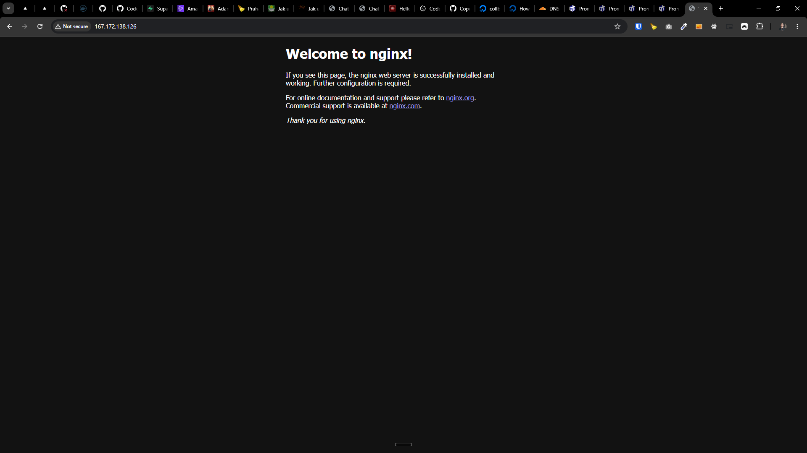

[x] $2.45 43 minutes by OpenAI Codex `gpt-5.5`

[✨🤬] When installing server via auto installation script, hide all the default Nginx pages

```bash
root@collboard-agents-server-x21:~# sudo curl -fsSL https://raw.githubusercontent.com/webgptorg/promptbook/refs/heads/main/other/vps/install.sh | bash
```

-   Pages like "Welcome to nginx!" or "403 Forbidden | Nginx" should not be shown when the server is called, create instead some simple custom fallback pages branded by Promptbook, which will be shown instead of the default Nginx pages
-   Also hide headers like "Server: nginx" and instead replace them with "Server: Promptbook Agents Server" or something similar, so it is not obvious that the server is running on Nginx, and also to make it more branded by Promptbook
-   Both for security and branding reasons, it is better to hide the fact that the server is running on Nginx, so do not show any default Nginx pages or headers, and instead show custom branded pages and headers for the Agents server
-   You are doing theese changes on level of Nginx and installed VPS server not the Agents server app in Next.js
-   Keep in mind the DRY _(don't repeat yourself)_ principle
-   You are working with [auto installation script](vps/install.sh)
-   You are NOT working with the [Agents Server](apps/agents-server)



