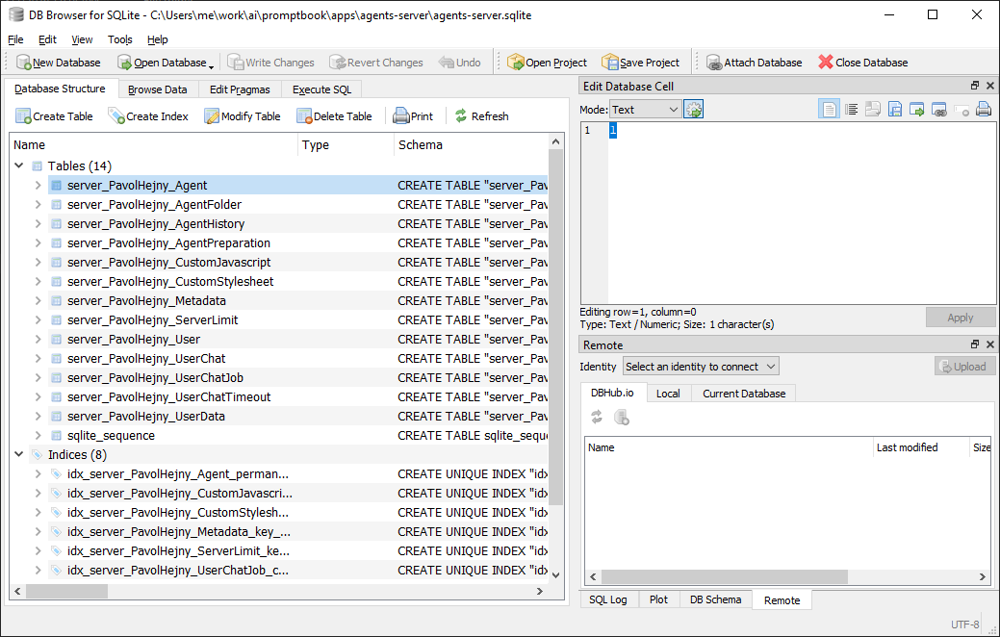

[?] !!!!!!

[✨🤫] Agents server SQlite tables should not be prefixed

```bash
@@@

npm install ptbk

ptbk agents-server start --agent github-copilot --model gpt-5.4 --thinking-level xhigh
```

-   @@@
-   _(@@@ After VPS server is working)_
-   Keep in mind the DRY _(don't repeat yourself)_ principle.
-   Do a proper analysis of the current functionality of `ptbk agents-server` and related functionality before you start implementing.
-   You are working with [`ptbk agents-server`](src/cli/cli-commands/agents-server/run.ts)
-   The server with SQLite is setuped [auto installation script](vps/install.sh)
-   Add the changes into the [changelog](changelog/_current-preversion.md)



---

[-]

[✨🤫] foo

```bash
@@@

npm install ptbk

ptbk agents-server start --agent github-copilot --model gpt-5.4 --thinking-level xhigh
```

-   @@@
-   Keep in mind the DRY _(don't repeat yourself)_ principle.
-   Do a proper analysis of the current functionality of `ptbk agents-server` and related functionality before you start implementing.
-   You are working with [`ptbk agents-server`](src/cli/cli-commands/agents-server/run.ts)
-   Add the changes into the [changelog](changelog/_current-preversion.md)

---

[-]

[✨🤫] foo

```bash
@@@

npm install ptbk

ptbk agents-server start --agent github-copilot --model gpt-5.4 --thinking-level xhigh
```

-   @@@
-   Keep in mind the DRY _(don't repeat yourself)_ principle.
-   Do a proper analysis of the current functionality of `ptbk agents-server` and related functionality before you start implementing.
-   You are working with [`ptbk agents-server`](src/cli/cli-commands/agents-server/run.ts)
-   Add the changes into the [changelog](changelog/_current-preversion.md)

---

[-]

[✨🤫] foo

```bash
@@@

npm install ptbk

ptbk agents-server start --agent github-copilot --model gpt-5.4 --thinking-level xhigh
```

-   @@@
-   Keep in mind the DRY _(don't repeat yourself)_ principle.
-   Do a proper analysis of the current functionality of `ptbk agents-server` and related functionality before you start implementing.
-   You are working with [`ptbk agents-server`](src/cli/cli-commands/agents-server/run.ts)
-   Add the changes into the [changelog](changelog/_current-preversion.md)
