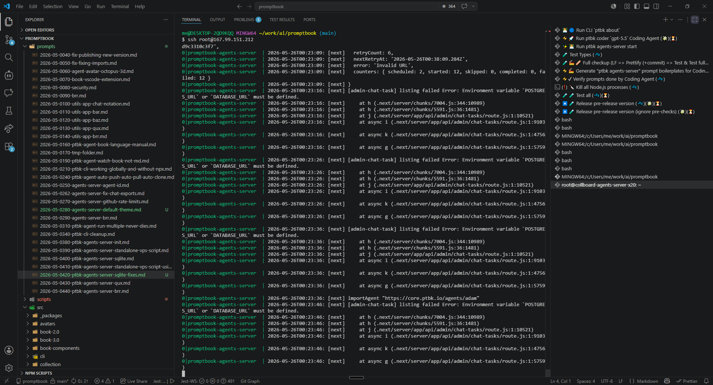
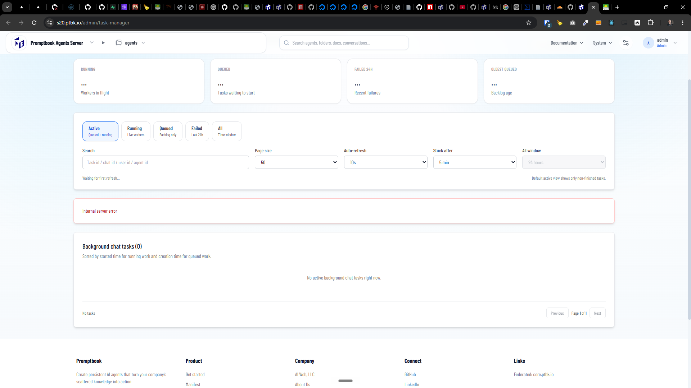

[x] (2 attempts) ~$0.00 43 minutes by GitHub Copilot `gpt-5.4`

[✨🔭] Fix "Internal server error" on `/admin/task-manager`

-   You have added support for SQLite in the Agents Server, but there are some issues with it
-   For example the `/admin/task-manager` page is not working and shows "Internal server error" because it is trying to connect to Postgres, but the server is using SQLite, so you need to fix it to work with SQLite
-   The tasks itself are working, but the admin page is just showing "Internal server error"
-   Keep in mind the DRY _(don't repeat yourself)_ principle.
-   Do a proper analysis of the current functionality of `ptbk agents-server`, Agents server and related functionality before you start implementing.
-   You are working with [`ptbk agents-server`](src/cli/cli-commands/agents-server/run.ts)
-   You are working with the [Agents Server](apps/agents-server)

```bash
0|promptbook-agents-server  | 2026-05-26T00:23:46: [next]     at async g (.next/server/app/api/admin/chat-tasks/route.js:1:5759)
0|promptbook-agents-server  | 2026-05-26T00:23:56: [next] [admin-chat-task] listing failed Error: Environment variable `POSTGRES_URL` or `DATABASE_URL` must be defined.
0|promptbook-agents-server  | 2026-05-26T00:23:56: [next]     at h (.next/server/chunks/7004.js:344:10989)
0|promptbook-agents-server  | 2026-05-26T00:23:56: [next]     at h (.next/server/chunks/5591.js:36:1481)
0|promptbook-agents-server  | 2026-05-26T00:23:56: [next]     at j (.next/server/app/api/admin/chat-tasks/route.js:1:10521)
0|promptbook-agents-server  | 2026-05-26T00:23:56: [next]     at async i (.next/server/app/api/admin/chat-tasks/route.js:1:9103)
0|promptbook-agents-server  | 2026-05-26T00:23:56: [next]     at async k (.next/server/app/api/admin/chat-tasks/route.js:1:4756)
0|promptbook-agents-server  | 2026-05-26T00:23:56: [next]     at async g (.next/server/app/api/admin/chat-tasks/route.js:1:5759)
0|promptbook-agents-server  | 2026-05-26T00:24:06: [next] [admin-chat-task] listing failed Error: Environment variable `POSTGRES_URL` or `DATABASE_URL` must be defined.
0|promptbook-agents-server  | 2026-05-26T00:24:06: [next]     at h (.next/server/chunks/7004.js:344:10989)
0|promptbook-agents-server  | 2026-05-26T00:24:06: [next]     at h (.next/server/chunks/5591.js:36:1481)
0|promptbook-agents-server  | 2026-05-26T00:24:06: [next]     at j (.next/server/app/api/admin/chat-tasks/route.js:1:10521)
0|promptbook-agents-server  | 2026-05-26T00:24:06: [next]     at async i (.next/server/app/api/admin/chat-tasks/route.js:1:9103)
0|promptbook-agents-server  | 2026-05-26T00:24:06: [next]     at async k (.next/server/app/api/admin/chat-tasks/route.js:1:4756)
0|promptbook-agents-server  | 2026-05-26T00:24:06: [next]     at async g (.next/server/app/api/admin/chat-tasks/route.js:1:5759)
0|promptbook-agents-server  | 2026-05-26T00:24:09: [next] importAgent "https://core.ptbk.io/agents/adam"
0|promptbook-agents-server  | 2026-05-26T00:24:11: [next] [admin-chat-task] listing failed Error: Environment variable `POSTGRES_URL` or `DATABASE_URL` must be defined.
0|promptbook-agents-server  | 2026-05-26T00:24:11: [next]     at h (.next/server/chunks/7004.js:344:10989)
0|promptbook-agents-server  | 2026-05-26T00:24:11: [next]     at h (.next/server/chunks/5591.js:36:1481)
0|promptbook-agents-server  | 2026-05-26T00:24:11: [next]     at j (.next/server/app/api/admin/chat-tasks/route.js:1:10521)
0|promptbook-agents-server  | 2026-05-26T00:24:11: [next]     at async i (.next/server/app/api/admin/chat-tasks/route.js:1:9103)
0|promptbook-agents-server  | 2026-05-26T00:24:11: [next]     at async k (.next/server/app/api/admin/chat-tasks/route.js:1:4756)
0|promptbook-agents-server  | 2026-05-26T00:24:11: [next]     at async g (.next/server/app/api/admin/chat-tasks/route.js:1:5759)
```




