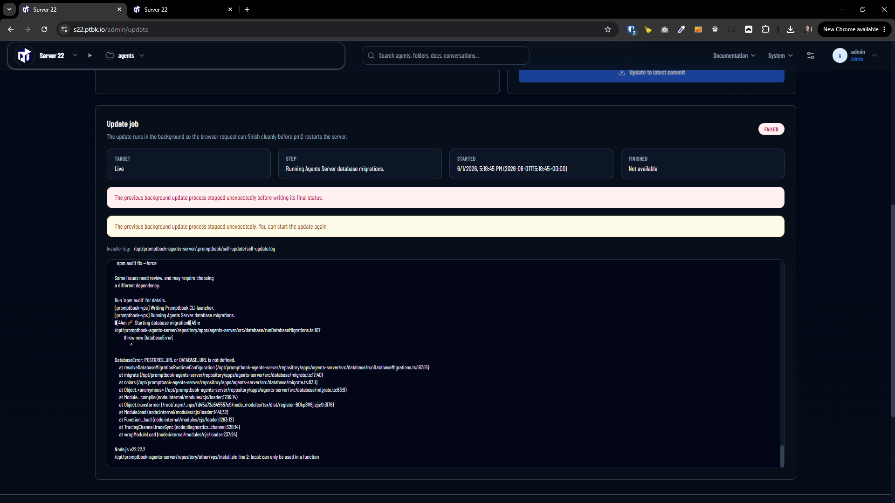

[x] ~$0.00 2 hours by GitHub Copilot `gpt-5.4`

[✨⬆] Add build in self-update into Agents server for super `admin`

```bash
root@collboard-agents-server-x21:~# sudo curl -fsSL https://raw.githubusercontent.com/webgptorg/promptbook/refs/heads/main/other/vps/install.sh | bash
```

-   Use the git repository of the Promptbook to implement the self-update functionality
-   The update is always done against 4 different environmets:
    1. Live environment, which is the `main` branch of the repository
    2. `preview` branch of the repository
    3. `production` branch of the repository
    4. `LTS` branch of the repository
-   By default, the server is running on the `production` branch, but the super `admin` can switch to any of the other branches through the UI, and the server will automatically update to the latest commit of that branch, also ask during the installation process which environment the user wants to use, and by default use `production`, but allow them to choose `main`, `preview` or `LTS` if they want to use those environments instead of `production`
-   When there is new commit in the branch which is currently used by the server, the updating page should show that there is a new update available, and allow the super `admin` to do the update with one click
    -   Do everything to make the update process, downloading the new code, installing dependencies, running migrations, restarting the server,... as smooth as possible, so the user just clicks one button and the server is updated to the latest version without any issues
-   Update page should be accessible from the menu "System" -> "Super Admin" -> "Update"
-   There are 3 levels of permissions for the users in the Agents server:
    -   Super `admin` - can access the update page and do the update
    -   Normal `admin` - cannot access the update page and even does not see the "Update" menu item
    -   Normal user - cannot access the update page and even does not see the "Super Admin" menu
-   Keep in mind the DRY _(don't repeat yourself)_ principle
-   The server is initialized by [auto installation script](vps/install.sh)
-   You are working with [auto installation script](vps/install.sh)
-   Add the changes into the [changelog](changelog/_current-preversion.md)

---

[ ] !!!!

[✨⬆] Agents server has ability to self-update, but it is failing, fix it

-   The self-update is implemented, but it is failing with some error after few minutes of the update process, so it is not working properly, fix the issues with the self-update process, so it works smoothly and without any errors, and the server is updated to the latest version with one click from the UI
-   The update process should be as smooth as possible, it should update the code, install the dependencies, run the migrations, restart the server,... all with one click and without any issues, so the user just clicks one button and the server is updated to the latest version without any problems
-   Effectively it should be same as running the installation script again, but it should be done from the UI and with one click and keeping the existing configuration and data
-   Keep in mind the DRY _(don't repeat yourself)_ principle, if possible share code between the install.sh and updating scripts
-   The server is initialized by [auto installation script](vps/install.sh)
-   You are working with [Agents Server](apps/agents-server) initially installed by [auto installation script](vps/install.sh)
-   Auto update is aviable on `/admin/update` for super `admin`
-   Add the changes into the [changelog](changelog/_current-preversion.md)

**This is how the Agents server is installed:**

```bash
root@collboard-agents-server-x21:~# sudo curl -fsSL https://raw.githubusercontent.com/webgptorg/promptbook/refs/heads/main/other/vps/install.sh | bash
```

**This is the result of log on `/admin/update`:**



```log
[promptbook-vps] Installing Promptbook from https://github.com/webgptorg/promptbook.git (main).
From https://github.com/webgptorg/promptbook
 * branch            main       -> FETCH_HEAD
 + d1a0c7d...68589d9 main       -> origin/main  (forced update)
HEAD is now at 68589d9 11:11
[promptbook-vps] Installing Promptbook repository dependencies.
npm warn ERESOLVE overriding peer dependency
npm warn While resolving: react-copy-to-clipboard@5.1.0
npm warn Found: react@19.1.2
npm warn node_modules/react
npm warn   dev react@"19.1.2" from the root project
npm warn   33 more (@dnd-kit/accessibility, @dnd-kit/core, ...)
npm warn
npm warn Could not resolve dependency:
npm warn peer react@"^15.3.0 || 16 || 17 || 18" from react-copy-to-clipboard@5.1.0
npm warn node_modules/swagger-ui-react/node_modules/react-copy-to-clipboard
npm warn   react-copy-to-clipboard@"5.1.0" from swagger-ui-react@5.31.2
npm warn   node_modules/swagger-ui-react
npm warn
npm warn Conflicting peer dependency: react@18.3.1
npm warn node_modules/react
npm warn   peer react@"^15.3.0 || 16 || 17 || 18" from react-copy-to-clipboard@5.1.0
npm warn   node_modules/swagger-ui-react/node_modules/react-copy-to-clipboard
npm warn     react-copy-to-clipboard@"5.1.0" from swagger-ui-react@5.31.2
npm warn     node_modules/swagger-ui-react
npm warn ERESOLVE overriding peer dependency
npm warn While resolving: react-debounce-input@3.3.0
npm warn Found: react@19.1.2
npm warn node_modules/react
npm warn   dev react@"19.1.2" from the root project
npm warn   33 more (@dnd-kit/accessibility, @dnd-kit/core, ...)
npm warn
npm warn Could not resolve dependency:
npm warn peer react@"^15.3.0 || 16 || 17 || 18" from react-debounce-input@3.3.0
npm warn node_modules/swagger-ui-react/node_modules/react-debounce-input
npm warn   react-debounce-input@"=3.3.0" from swagger-ui-react@5.31.2
npm warn   node_modules/swagger-ui-react
npm warn
npm warn Conflicting peer dependency: react@18.3.1
npm warn node_modules/react
npm warn   peer react@"^15.3.0 || 16 || 17 || 18" from react-debounce-input@3.3.0
npm warn   node_modules/swagger-ui-react/node_modules/react-debounce-input
npm warn     react-debounce-input@"=3.3.0" from swagger-ui-react@5.31.2
npm warn     node_modules/swagger-ui-react
npm warn ERESOLVE overriding peer dependency
npm warn While resolving: react-inspector@6.0.2
npm warn Found: react@19.1.2
npm warn node_modules/react
npm warn   dev react@"19.1.2" from the root project
npm warn   33 more (@dnd-kit/accessibility, @dnd-kit/core, ...)
npm warn
npm warn Could not resolve dependency:
npm warn peer react@"^16.8.4 || ^17.0.0 || ^18.0.0" from react-inspector@6.0.2
npm warn node_modules/swagger-ui-react/node_modules/react-inspector
npm warn   react-inspector@"^6.0.1" from swagger-ui-react@5.31.2
npm warn   node_modules/swagger-ui-react
npm warn
npm warn Conflicting peer dependency: react@18.3.1
npm warn node_modules/react
npm warn   peer react@"^16.8.4 || ^17.0.0 || ^18.0.0" from react-inspector@6.0.2
npm warn   node_modules/swagger-ui-react/node_modules/react-inspector
npm warn     react-inspector@"^6.0.1" from swagger-ui-react@5.31.2
npm warn     node_modules/swagger-ui-react
npm warn deprecated crypto@1.0.1: This package is no longer supported. It's now a built-in Node module. If you've depended on crypto, you should switch to the one that's built-in.
npm warn deprecated y-websocket-server@1.0.2: Package no longer supported. Contact Support at https://www.npmjs.com/support for more info.
npm warn deprecated inflight@1.0.6: This module is not supported, and leaks memory. Do not use it. Check out lru-cache if you want a good and tested way to coalesce async requests by a key value, which is much more comprehensive and powerful.
npm warn deprecated stable@0.1.8: Modern JS already guarantees Array#sort() is a stable sort, so this library is deprecated. See the compatibility table on MDN: https://developer.mozilla.org/en-US/docs/Web/JavaScript/Reference/Global_Objects/Array/sort#browser_compatibility
npm warn deprecated lodash.get@4.4.2: This package is deprecated. Use the optional chaining (?.) operator instead.
npm warn deprecated @humanwhocodes/config-array@0.13.0: Use @eslint/config-array instead
npm warn deprecated rimraf@3.0.2: Rimraf versions prior to v4 are no longer supported
npm warn deprecated whatwg-encoding@3.1.1: Use @exodus/bytes instead for a more spec-conformant and faster implementation
npm warn deprecated glob@8.1.0: Old versions of glob are not supported, and contain widely publicized security vulnerabilities, which have been fixed in the current version. Please update. Support for old versions may be purchased (at exorbitant rates) by contacting i@izs.me
npm warn deprecated glob@7.2.3: Old versions of glob are not supported, and contain widely publicized security vulnerabilities, which have been fixed in the current version. Please update. Support for old versions may be purchased (at exorbitant rates) by contacting i@izs.me
npm warn deprecated glob@7.2.3: Old versions of glob are not supported, and contain widely publicized security vulnerabilities, which have been fixed in the current version. Please update. Support for old versions may be purchased (at exorbitant rates) by contacting i@izs.me
npm warn deprecated glob@7.2.3: Old versions of glob are not supported, and contain widely publicized security vulnerabilities, which have been fixed in the current version. Please update. Support for old versions may be purchased (at exorbitant rates) by contacting i@izs.me
npm warn deprecated glob@7.2.3: Old versions of glob are not supported, and contain widely publicized security vulnerabilities, which have been fixed in the current version. Please update. Support for old versions may be purchased (at exorbitant rates) by contacting i@izs.me
npm warn deprecated glob@7.2.3: Old versions of glob are not supported, and contain widely publicized security vulnerabilities, which have been fixed in the current version. Please update. Support for old versions may be purchased (at exorbitant rates) by contacting i@izs.me
npm warn deprecated prebuild-install@7.1.3: No longer maintained. Please contact the author of the relevant native addon; alternatives are available.
npm warn deprecated @humanwhocodes/object-schema@2.0.3: Use @eslint/object-schema instead
npm warn deprecated multer@1.4.5-lts.2: Multer 1.x is impacted by a number of vulnerabilities, which have been patched in 2.x. You should upgrade to the latest 2.x version.
npm warn deprecated node-domexception@1.0.0: Use your platform's native DOMException instead
npm warn deprecated rollup-plugin-visualizer@5.13.1: Contains unintended breaking changes
npm warn deprecated @azure/openai@1.0.0-beta.13: The Azure OpenAI client library for JavaScript beta has been retired. Please migrate to the stable OpenAI SDK for JavaScript using the migration guide: https://github.com/Azure/azure-sdk-for-js/blob/main/sdk/openai/openai/MIGRATION.md.
npm warn deprecated @finom/zod-to-json-schema@3.24.11: Use https://www.npmjs.com/package/zod-v3-to-json-schema instead. See issue comment for details: https://github.com/StefanTerdell/zod-to-json-schema/issues/178#issuecomment-3533122539
npm warn deprecated eslint@8.57.1: This version is no longer supported. Please see https://eslint.org/version-support for other options.

added 2122 packages, and audited 2123 packages in 3m

313 packages are looking for funding
  run `npm fund` for details

82 vulnerabilities (5 low, 47 moderate, 28 high, 2 critical)

To address issues that do not require attention, run:
  npm audit fix

To address all issues possible (including breaking changes), run:
  npm audit fix --force

Some issues need review, and may require choosing
a different dependency.

Run `npm audit` for details.
[promptbook-vps] Writing Promptbook CLI launcher.
[promptbook-vps] Running Agents Server database migrations.
🚀 Starting database migration
/opt/promptbook-agents-server/repository/apps/agents-server/src/database/runDatabaseMigrations.ts:167
        throw new DatabaseError(
              ^

DatabaseError: POSTGRES_URL or DATABASE_URL is not defined.
    at resolveDatabaseMigrationRuntimeConfiguration (/opt/promptbook-agents-server/repository/apps/agents-server/src/database/runDatabaseMigrations.ts:167:15)
    at migrate (/opt/promptbook-agents-server/repository/apps/agents-server/src/database/migrate.ts:17:40)
    at colors (/opt/promptbook-agents-server/repository/apps/agents-server/src/database/migrate.ts:83:1)
    at Object.<anonymous> (/opt/promptbook-agents-server/repository/apps/agents-server/src/database/migrate.ts:83:9)
    at Module._compile (node:internal/modules/cjs/loader:1705:14)
    at Object.transformer (/root/.npm/_npx/fd45a72a545557e9/node_modules/tsx/dist/register-BOkp8V6j.cjs:9:3176)
    at Module.load (node:internal/modules/cjs/loader:1441:32)
    at Function._load (node:internal/modules/cjs/loader:1263:12)
    at TracingChannel.traceSync (node:diagnostics_channel:328:14)
    at wrapModuleLoad (node:internal/modules/cjs/loader:237:24)

Node.js v22.22.2
/opt/promptbook-agents-server/repository/other/vps/install.sh: line 2: local: can only be used in a function
[promptbook-vps] Installing Promptbook from https://github.com/webgptorg/promptbook.git (main).
From https://github.com/webgptorg/promptbook
 * branch            main       -> FETCH_HEAD
 + 68589d9...430eca3 main       -> origin/main  (forced update)
Warning: you are leaving 1 commit behind, not connected to
any of your branches:

  68589d9 11:11

If you want to keep it by creating a new branch, this may be a good time
to do so with:

 git branch <new-branch-name> 68589d9

HEAD is now at 430eca3 Text tweaks to test self-update
[promptbook-vps] Installing Promptbook repository dependencies.
npm warn ERESOLVE overriding peer dependency
npm warn While resolving: react-copy-to-clipboard@5.1.0
npm warn Found: react@19.1.2
npm warn node_modules/react
npm warn   dev react@"19.1.2" from the root project
npm warn   33 more (@dnd-kit/accessibility, @dnd-kit/core, ...)
npm warn
npm warn Could not resolve dependency:
npm warn peer react@"^15.3.0 || 16 || 17 || 18" from react-copy-to-clipboard@5.1.0
npm warn node_modules/swagger-ui-react/node_modules/react-copy-to-clipboard
npm warn   react-copy-to-clipboard@"5.1.0" from swagger-ui-react@5.31.2
npm warn   node_modules/swagger-ui-react
npm warn
npm warn Conflicting peer dependency: react@18.3.1
npm warn node_modules/react
npm warn   peer react@"^15.3.0 || 16 || 17 || 18" from react-copy-to-clipboard@5.1.0
npm warn   node_modules/swagger-ui-react/node_modules/react-copy-to-clipboard
npm warn     react-copy-to-clipboard@"5.1.0" from swagger-ui-react@5.31.2
npm warn     node_modules/swagger-ui-react
npm warn ERESOLVE overriding peer dependency
npm warn While resolving: react-debounce-input@3.3.0
npm warn Found: react@19.1.2
npm warn node_modules/react
npm warn   dev react@"19.1.2" from the root project
npm warn   33 more (@dnd-kit/accessibility, @dnd-kit/core, ...)
npm warn
npm warn Could not resolve dependency:
npm warn peer react@"^15.3.0 || 16 || 17 || 18" from react-debounce-input@3.3.0
npm warn node_modules/swagger-ui-react/node_modules/react-debounce-input
npm warn   react-debounce-input@"=3.3.0" from swagger-ui-react@5.31.2
npm warn   node_modules/swagger-ui-react
npm warn
npm warn Conflicting peer dependency: react@18.3.1
npm warn node_modules/react
npm warn   peer react@"^15.3.0 || 16 || 17 || 18" from react-debounce-input@3.3.0
npm warn   node_modules/swagger-ui-react/node_modules/react-debounce-input
npm warn     react-debounce-input@"=3.3.0" from swagger-ui-react@5.31.2
npm warn     node_modules/swagger-ui-react
npm warn ERESOLVE overriding peer dependency
npm warn While resolving: react-inspector@6.0.2
npm warn Found: react@19.1.2
npm warn node_modules/react
npm warn   dev react@"19.1.2" from the root project
npm warn   33 more (@dnd-kit/accessibility, @dnd-kit/core, ...)
npm warn
npm warn Could not resolve dependency:
npm warn peer react@"^16.8.4 || ^17.0.0 || ^18.0.0" from react-inspector@6.0.2
npm warn node_modules/swagger-ui-react/node_modules/react-inspector
npm warn   react-inspector@"^6.0.1" from swagger-ui-react@5.31.2
npm warn   node_modules/swagger-ui-react
npm warn
npm warn Conflicting peer dependency: react@18.3.1
npm warn node_modules/react
npm warn   peer react@"^16.8.4 || ^17.0.0 || ^18.0.0" from react-inspector@6.0.2
npm warn   node_modules/swagger-ui-react/node_modules/react-inspector
npm warn     react-inspector@"^6.0.1" from swagger-ui-react@5.31.2
npm warn     node_modules/swagger-ui-react
npm warn deprecated crypto@1.0.1: This package is no longer supported. It's now a built-in Node module. If you've depended on crypto, you should switch to the one that's built-in.
npm warn deprecated y-websocket-server@1.0.2: Package no longer supported. Contact Support at https://www.npmjs.com/support for more info.
npm warn deprecated inflight@1.0.6: This module is not supported, and leaks memory. Do not use it. Check out lru-cache if you want a good and tested way to coalesce async requests by a key value, which is much more comprehensive and powerful.
npm warn deprecated stable@0.1.8: Modern JS already guarantees Array#sort() is a stable sort, so this library is deprecated. See the compatibility table on MDN: https://developer.mozilla.org/en-US/docs/Web/JavaScript/Reference/Global_Objects/Array/sort#browser_compatibility
npm warn deprecated lodash.get@4.4.2: This package is deprecated. Use the optional chaining (?.) operator instead.
npm warn deprecated @humanwhocodes/config-array@0.13.0: Use @eslint/config-array instead
npm warn deprecated rimraf@3.0.2: Rimraf versions prior to v4 are no longer supported
npm warn deprecated whatwg-encoding@3.1.1: Use @exodus/bytes instead for a more spec-conformant and faster implementation
npm warn deprecated glob@8.1.0: Old versions of glob are not supported, and contain widely publicized security vulnerabilities, which have been fixed in the current version. Please update. Support for old versions may be purchased (at exorbitant rates) by contacting i@izs.me
npm warn deprecated glob@7.2.3: Old versions of glob are not supported, and contain widely publicized security vulnerabilities, which have been fixed in the current version. Please update. Support for old versions may be purchased (at exorbitant rates) by contacting i@izs.me
npm warn deprecated glob@7.2.3: Old versions of glob are not supported, and contain widely publicized security vulnerabilities, which have been fixed in the current version. Please update. Support for old versions may be purchased (at exorbitant rates) by contacting i@izs.me
npm warn deprecated glob@7.2.3: Old versions of glob are not supported, and contain widely publicized security vulnerabilities, which have been fixed in the current version. Please update. Support for old versions may be purchased (at exorbitant rates) by contacting i@izs.me
npm warn deprecated glob@7.2.3: Old versions of glob are not supported, and contain widely publicized security vulnerabilities, which have been fixed in the current version. Please update. Support for old versions may be purchased (at exorbitant rates) by contacting i@izs.me
npm warn deprecated glob@7.2.3: Old versions of glob are not supported, and contain widely publicized security vulnerabilities, which have been fixed in the current version. Please update. Support for old versions may be purchased (at exorbitant rates) by contacting i@izs.me
npm warn deprecated prebuild-install@7.1.3: No longer maintained. Please contact the author of the relevant native addon; alternatives are available.
npm warn deprecated @humanwhocodes/object-schema@2.0.3: Use @eslint/object-schema instead
npm warn deprecated multer@1.4.5-lts.2: Multer 1.x is impacted by a number of vulnerabilities, which have been patched in 2.x. You should upgrade to the latest 2.x version.
npm warn deprecated node-domexception@1.0.0: Use your platform's native DOMException instead
npm warn deprecated rollup-plugin-visualizer@5.13.1: Contains unintended breaking changes
npm warn deprecated @azure/openai@1.0.0-beta.13: The Azure OpenAI client library for JavaScript beta has been retired. Please migrate to the stable OpenAI SDK for JavaScript using the migration guide: https://github.com/Azure/azure-sdk-for-js/blob/main/sdk/openai/openai/MIGRATION.md.
npm warn deprecated @finom/zod-to-json-schema@3.24.11: Use https://www.npmjs.com/package/zod-v3-to-json-schema instead. See issue comment for details: https://github.com/StefanTerdell/zod-to-json-schema/issues/178#issuecomment-3533122539
npm warn deprecated eslint@8.57.1: This version is no longer supported. Please see https://eslint.org/version-support for other options.

added 2122 packages, and audited 2123 packages in 2m

313 packages are looking for funding
  run `npm fund` for details

82 vulnerabilities (5 low, 47 moderate, 28 high, 2 critical)

To address issues that do not require attention, run:
  npm audit fix

To address all issues possible (including breaking changes), run:
  npm audit fix --force

Some issues need review, and may require choosing
a different dependency.

Run `npm audit` for details.
[promptbook-vps] Writing Promptbook CLI launcher.
[promptbook-vps] Running Agents Server database migrations.
🚀 Starting database migration
/opt/promptbook-agents-server/repository/apps/agents-server/src/database/runDatabaseMigrations.ts:167
        throw new DatabaseError(
              ^

DatabaseError: POSTGRES_URL or DATABASE_URL is not defined.
    at resolveDatabaseMigrationRuntimeConfiguration (/opt/promptbook-agents-server/repository/apps/agents-server/src/database/runDatabaseMigrations.ts:167:15)
    at migrate (/opt/promptbook-agents-server/repository/apps/agents-server/src/database/migrate.ts:17:40)
    at colors (/opt/promptbook-agents-server/repository/apps/agents-server/src/database/migrate.ts:83:1)
    at Object.<anonymous> (/opt/promptbook-agents-server/repository/apps/agents-server/src/database/migrate.ts:83:9)
    at Module._compile (node:internal/modules/cjs/loader:1705:14)
    at Object.transformer (/root/.npm/_npx/fd45a72a545557e9/node_modules/tsx/dist/register-BOkp8V6j.cjs:9:3176)
    at Module.load (node:internal/modules/cjs/loader:1441:32)
    at Function._load (node:internal/modules/cjs/loader:1263:12)
    at TracingChannel.traceSync (node:diagnostics_channel:328:14)
    at wrapModuleLoad (node:internal/modules/cjs/loader:237:24)

Node.js v22.22.2
/opt/promptbook-agents-server/repository/other/vps/install.sh: line 2: local: can only be used in a function
```
