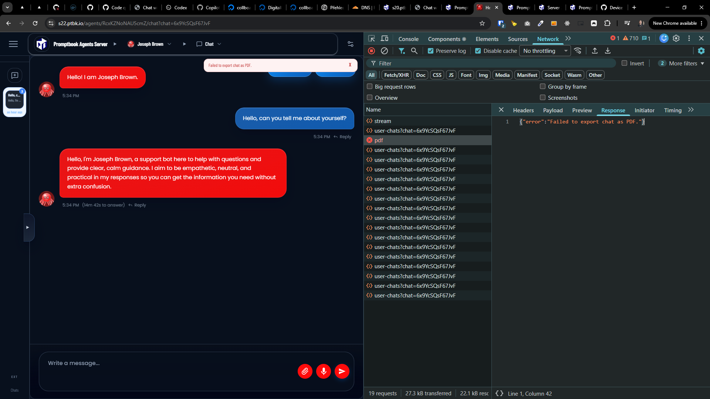

[x] ~$0.00 an hour by GitHub Copilot `gpt-5.4`

[✨🟡] Fix export to PDF from chat

-   Now the PDF is just blank and broken
-   Use headless browser to render the PDF on the server side, from html
-   Use playwright and chrome
-   Theese should be installed on the server by the auto installation script
-   Also install any other dependencies needed for the PDF export like fonts and so on
-   In future the browser can be used for other purposes so do not worry about installing it and taking some space on the server, it is a good investment for the future features and improvements
-   Keep in mind the DRY _(don't repeat yourself)_ principle.
-   Do a proper analysis of the current functionality before you start implementing.
-   You are working with the [Agents Server](apps/agents-server)
-   Add the changes into the [changelog](changelog/_current-preversion.md)

---

[x] ~$0.3879 an hour by OpenAI Codex `gpt-5.5` - commiting manually

[✨🟡] Fix export to PDF from chat, now it fails on "Failed to export chat as PDF."

-   Now the PDF export of chat fails with 500 `/api/chat/export/pdf` `{"error":"Failed to export chat as PDF."}`
-   Use headless browser to render the PDF on the server side, from html
-   Use playwright and chrome
-   Keep in mind the DRY _(don't repeat yourself)_ principle.
-   Do a proper analysis of the current functionality before you start implementing.
-   You are working with the [Agents Server](apps/agents-server)
-   Add the changes into the [changelog](changelog/_current-preversion.md)

---

[-]

[✨🟡] foo

-   @@@
-   Keep in mind the DRY _(don't repeat yourself)_ principle.
-   Do a proper analysis of the current functionality before you start implementing.
-   You are working with the [Agents Server](apps/agents-server)
-   If you need to do the database migration, do it
-   Add the changes into the [changelog](changelog/_current-preversion.md)

---

[-]

[✨🟡] foo

-   @@@
-   Keep in mind the DRY _(don't repeat yourself)_ principle.
-   Do a proper analysis of the current functionality before you start implementing.
-   You are working with the [Agents Server](apps/agents-server)
-   If you need to do the database migration, do it
-   Add the changes into the [changelog](changelog/_current-preversion.md)

