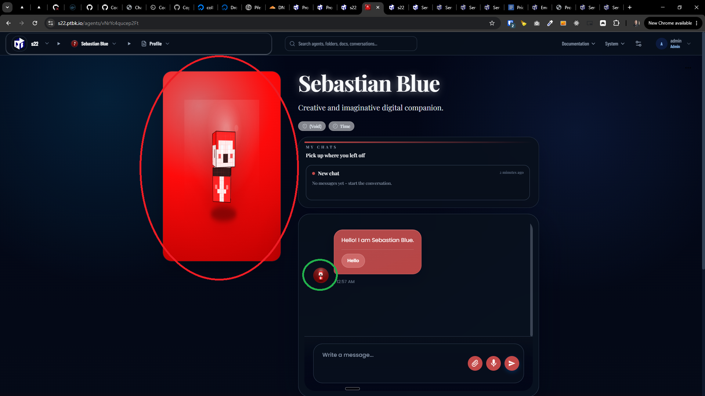
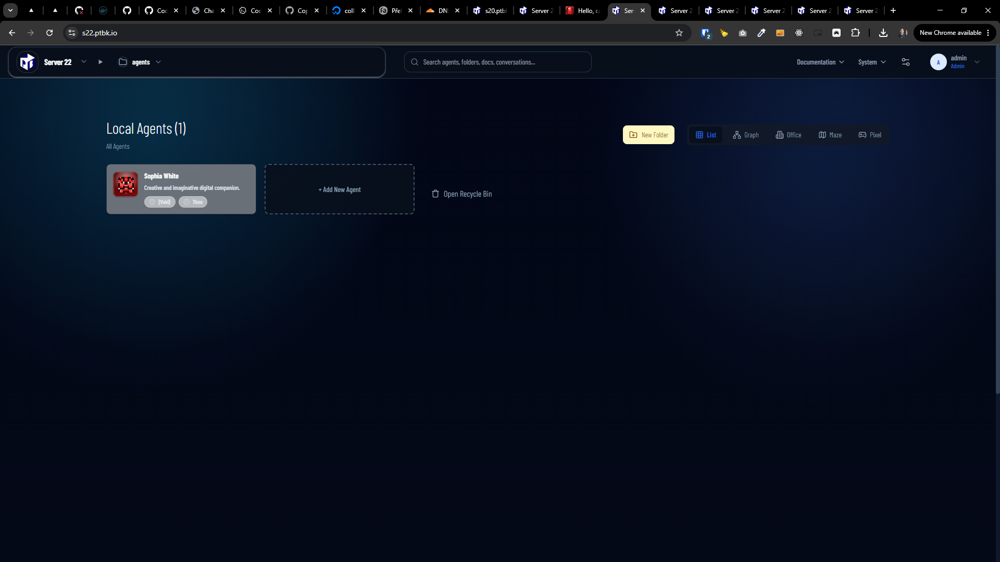
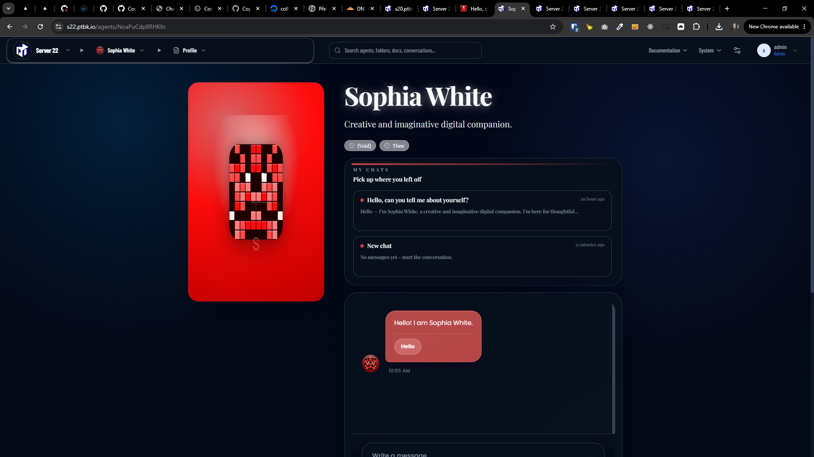

[x] ~$0.2575 34 minutes by OpenAI Codex `gpt-5.5`

---

[ ] !!!

[✨😷] Agent avatars are not in correct aspect ration on agent profile pages

-   The agent avarar when shown in 1:1 aspect ratio container _(for example the circles in chat)_, it looks correct
-   But when it is shown in tall ratio container _(for example in agent profile page)_, it looks stretched and broken, it seems that the avatar image is behaving as `fill` instead of `contain`, so it fills the whole container and gets stretched, instead of keeping its aspect ratio and fitting inside the container
-   You are working with the [Agents Server](apps/agents-server)
-   The container should retain its size and aspect ratio, just the avatar image/interactive animation should behave as `contain` _(currently it behaves as `fill`)_

