[ ] !!

[✨🍄] Finish the dark mode of Agents server

-   Do a proper analysis of the current functionality before you start implementing.
-   You are working with the [Agents Server](apps/agents-server) finishing the dark mode
-   The light mode should stay intact, you are just funishing and polishing the dark mode, fixing the remaining issues
-   Look at the attached screenshots:

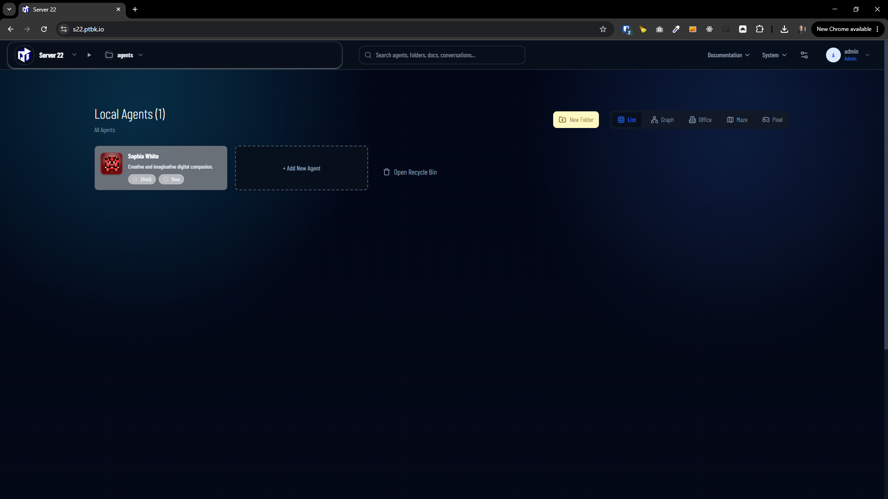
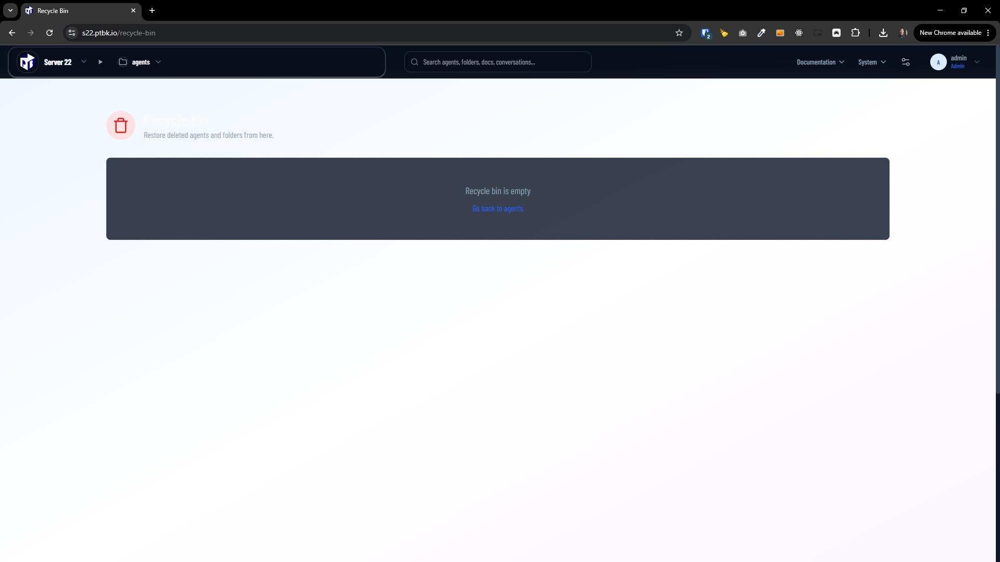
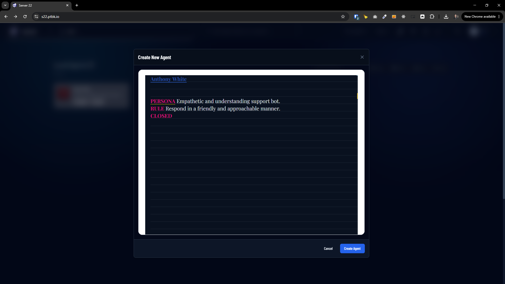
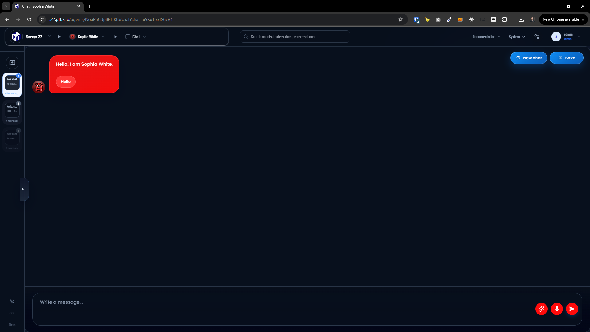
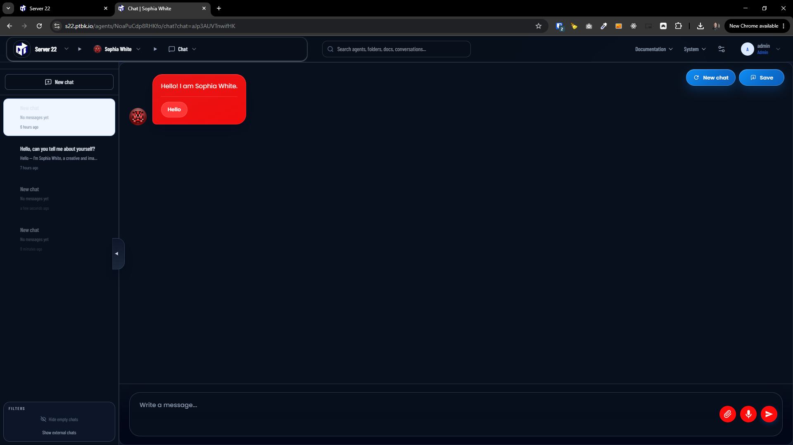
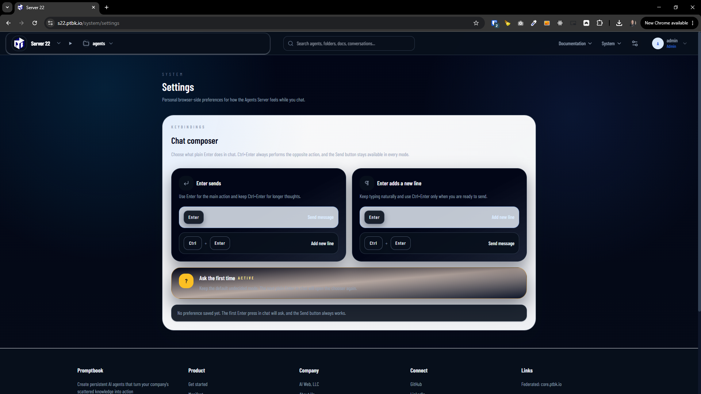
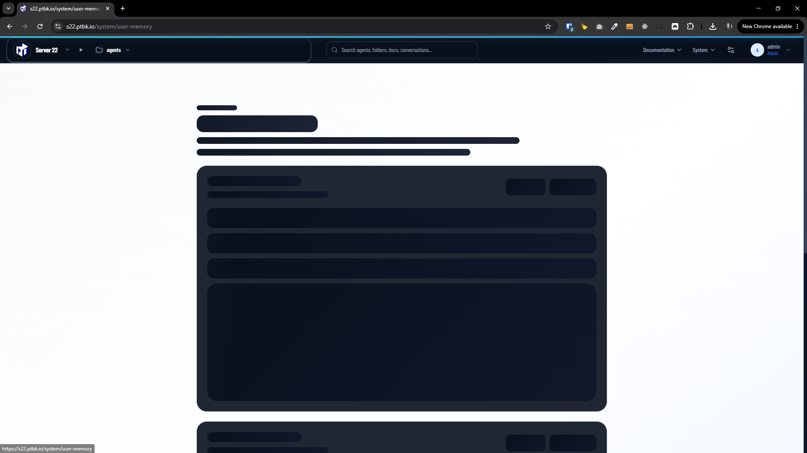
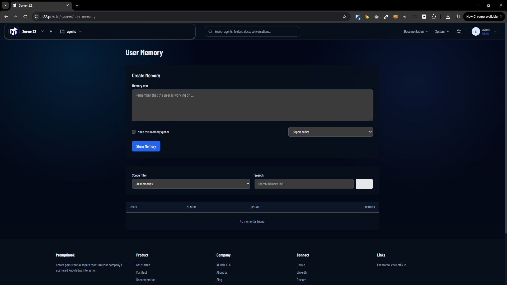
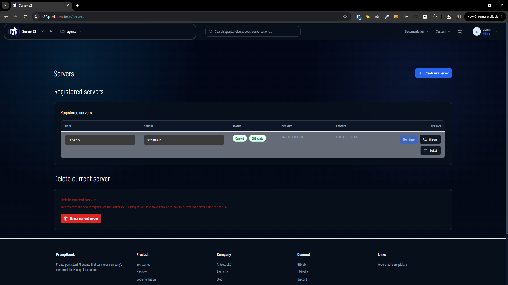
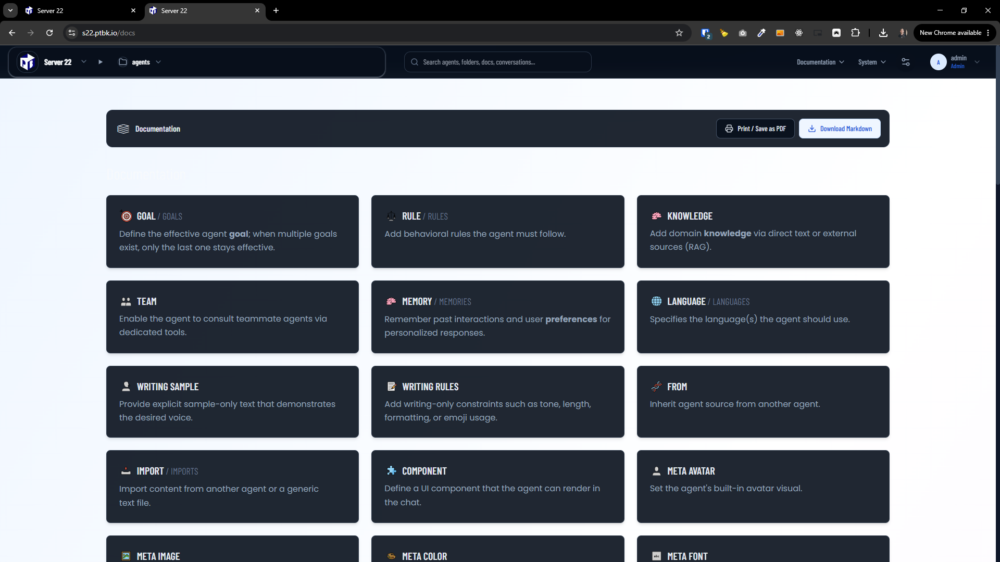
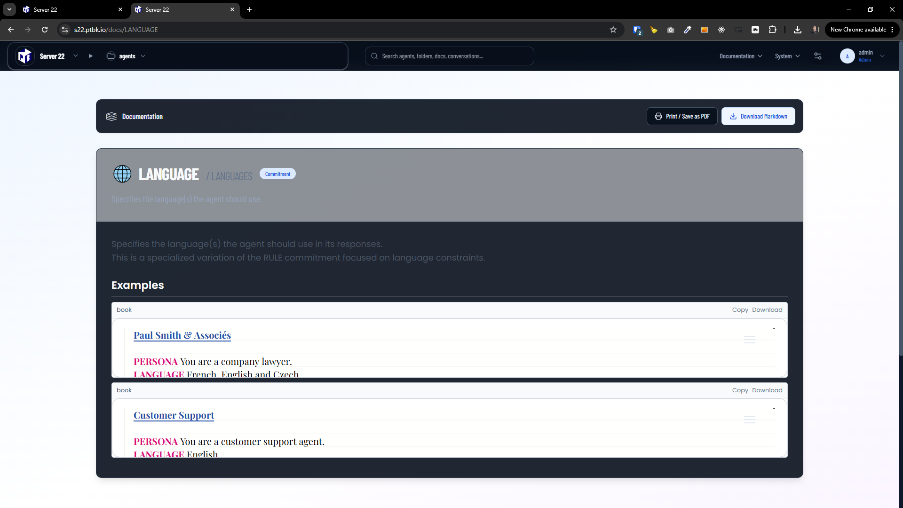
