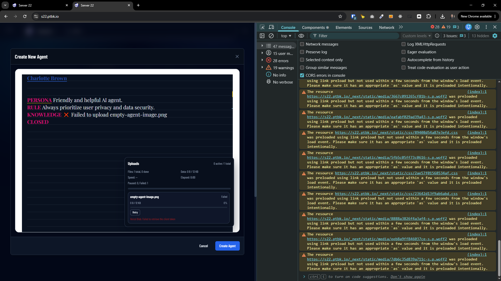
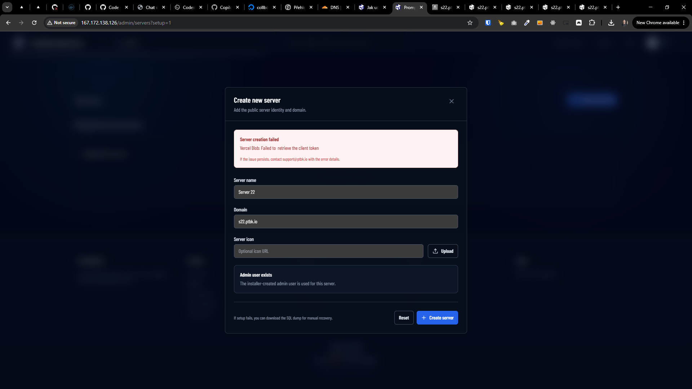
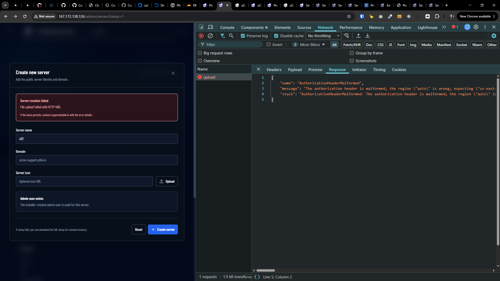
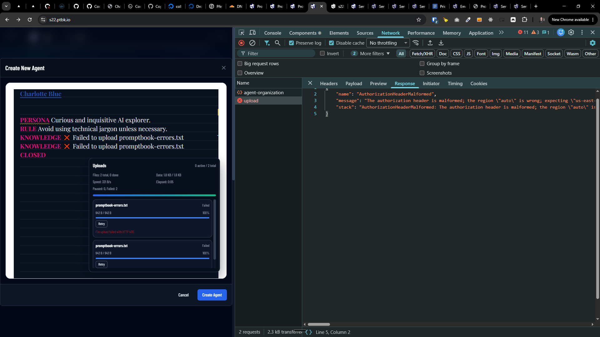
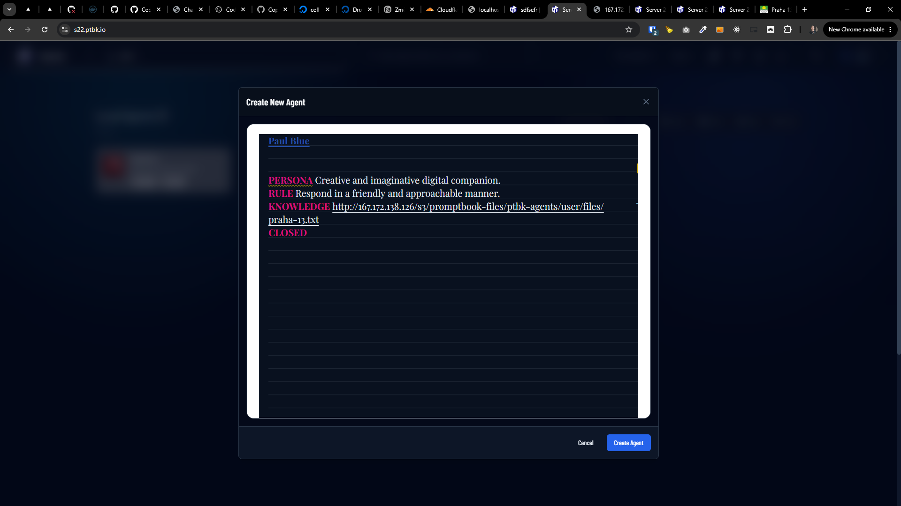
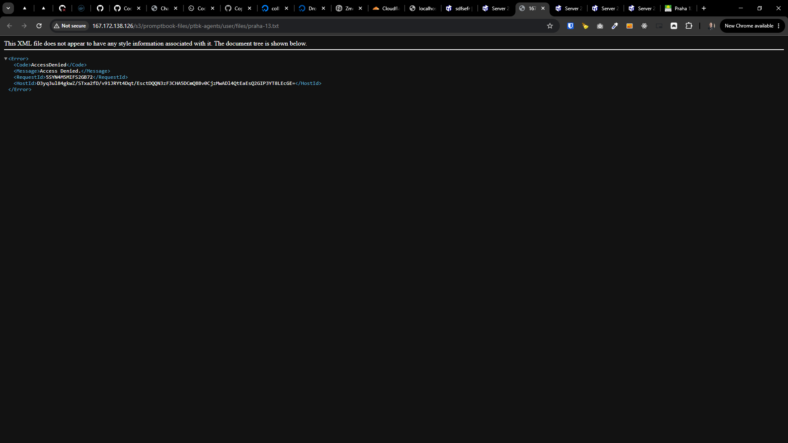

[x] ~$0.7449 2 hours by OpenAI Codex `gpt-5.5`

[✨→] Installed server should contain self-contained S3 storage for files

-   It should be still possible to use external S3 storage, but if the user doesn't have it or doesn't want to use it, there should be a self-contained S3 storage included in the installation that can be used out of the box without any additional configuration
-   Use VersityGW for self-contained S3 storage, it is a lightweight and easy to use S3 compatible storage that can be easily installed and configured on the server, it provides all the features of a normal S3 storage and can be used as a drop-in replacement for any S3 compatible storage, so it is a good choice for our self-contained S3 storage solution
-   The folder to store the files for the self-contained S3 storage should be configurable, so the user can choose where they want to store the files on their server, but by default it should be stored in `/var/lib/promptbook-agents-server/s3`
-   Keep all the things like ids and prefixes same as for the external S3 storage, the consumer, the Agents server app should not care if it is using the self-contained S3 storage or the external S3 storage, it should work in the same way and use the same API for both storages, so it is easy to switch between them if needed
-   During the installation process, the user should be asked if they want to use the self-contained S3 storage or if they want to configure their own external S3 storage, if they choose the self-contained S3 storage, it should be automatically configured and set up during the installation process, so the user can start using it immediately after the installation is complete
-   The self-contained should be the default option, so if the user doesn't choose anything, it should be used by default
-   Keep in mind the DRY _(don't repeat yourself)_ principle.
-   Do a proper analysis of the current functionality before you start implementing.
-   You are working with the [Agents Server](apps/agents-server)
-   Add the changes into the [changelog](changelog/_current-preversion.md)

**This is how the Agents server is installed:**

```bash
root@collboard-agents-server-x21:~# sudo curl -fsSL https://raw.githubusercontent.com/webgptorg/promptbook/refs/heads/main/other/vps/install.sh | bash
```




---

[x] ~$0.6066 37 minutes by OpenAI Codex `gpt-5.5`

[✨→] Fix self-contained S3 storage for files

-   It should be still possible to use external S3 storage, but if the user doesn't have it or doesn't want to use it, there should be a self-contained S3 storage included in the installation that can be used out of the box without any additional configuration
-   Use VersityGW for self-contained S3 storage, it is a lightweight and easy to use S3 compatible storage that can be easily installed and configured on the server, it provides all the features of a normal S3 storage and can be used as a drop-in replacement for any S3 compatible storage, so it is a good choice for our self-contained S3 storage solution
-   The folder to store the files for the self-contained S3 storage should be configurable, so the user can choose where they want to store the files on their server, but by default it should be stored in `/opt/promptbook-agents-server/data/s3`
-   Keep all the things like ids and prefixes same as for the external S3 storage, the consumer, the Agents server app should not care if it is using the self-contained S3 storage or the external S3 storage, it should work in the same way and use the same API for both storages, so it is easy to switch between them if needed
-   During the installation process, the user should be asked if they want to use the self-contained S3 storage or if they want to configure their own external S3 storage, if they choose the self-contained S3 storage, it should be automatically configured and set up during the installation process, so the user can start using it immediately after the installation is complete
-   The self-contained should be the default option, so if the user doesn't choose anything, it should be used by default
-   Keep in mind the DRY _(don't repeat yourself)_ principle.
-   Do a proper analysis of the current functionality before you start implementing.
-   You are working with the [Agents Server](apps/agents-server)
-   Add the changes into the [changelog](changelog/_current-preversion.md)

**This is how the Agents server is installed:**

```bash
root@collboard-agents-server-x21:~# sudo curl -fsSL https://raw.githubusercontent.com/webgptorg/promptbook/refs/heads/main/other/vps/install.sh | bash
```

**But this is the error it produces:**

```
installHook.js:1 File upload failed for file.docx: Error: File upload failed with HTTP 400.
```

```json
{
    "name": "AuthorizationHeaderMalformed",
    "message": "The authorization header is malformed; the region \"auto\" is wrong; expecting \"us-east-1\"",
    "stack": "AuthorizationHeaderMalformed: The authorization header is malformed; the region \"auto\" is wrong; expecting \"us-east-1\"\n    at ProtocolLib.getErrorSchemaOrThrowBaseException (/opt/promptbook-agents-server/repository/node_modules/@aws-sdk/core/dist-cjs/submodules/protocols/index.js:69:67)\n    at AwsRestXmlProtocol.handleError (/opt/promptbook-agents-server/repository/node_modules/@aws-sdk/core/dist-cjs/submodules/protocols/index.js:1610:65)\n    at AwsRestXmlProtocol.deserializeResponse (/opt/promptbook-agents-server/repository/node_modules/@smithy/core/dist-cjs/submodules/protocols/index.js:309:24)\n    at process.processTicksAndRejections (node:internal/process/task_queues:103:5)\n    at async /opt/promptbook-agents-server/repository/node_modules/@smithy/core/dist-cjs/submodules/schema/index.js:26:24\n    at async /opt/promptbook-agents-server/repository/node_modules/@aws-sdk/middleware-sdk-s3/dist-cjs/index.js:386:20\n    at async /opt/promptbook-agents-server/repository/node_modules/@smithy/middleware-retry/dist-cjs/index.js:254:46\n    at async /opt/promptbook-agents-server/repository/node_modules/@aws-sdk/middleware-flexible-checksums/dist-cjs/index.js:247:20\n    at async /opt/promptbook-agents-server/repository/node_modules/@aws-sdk/middleware-sdk-s3/dist-cjs/index.js:63:28\n    at async /opt/promptbook-agents-server/repository/node_modules/@aws-sdk/middleware-sdk-s3/dist-cjs/index.js:90:20"
}
```

```json
{
    "name": "AuthorizationHeaderMalformed",
    "message": "The authorization header is malformed; the region \"auto\" is wrong; expecting \"us-east-1\"",
    "stack": "AuthorizationHeaderMalformed: The authorization header is malformed; the region \"auto\" is wrong; expecting \"us-east-1\"\n    at ProtocolLib.getErrorSchemaOrThrowBaseException (/opt/promptbook-agents-server/repository/node_modules/@aws-sdk/core/dist-cjs/submodules/protocols/index.js:69:67)\n    at AwsRestXmlProtocol.handleError (/opt/promptbook-agents-server/repository/node_modules/@aws-sdk/core/dist-cjs/submodules/protocols/index.js:1610:65)\n    at AwsRestXmlProtocol.deserializeResponse (/opt/promptbook-agents-server/repository/node_modules/@smithy/core/dist-cjs/submodules/protocols/index.js:309:24)\n    at process.processTicksAndRejections (node:internal/process/task_queues:103:5)\n    at async /opt/promptbook-agents-server/repository/node_modules/@smithy/core/dist-cjs/submodules/schema/index.js:26:24\n    at async /opt/promptbook-agents-server/repository/node_modules/@aws-sdk/middleware-sdk-s3/dist-cjs/index.js:386:20\n    at async /opt/promptbook-agents-server/repository/node_modules/@smithy/middleware-retry/dist-cjs/index.js:254:46\n    at async /opt/promptbook-agents-server/repository/node_modules/@aws-sdk/middleware-flexible-checksums/dist-cjs/index.js:247:20\n    at async /opt/promptbook-agents-server/repository/node_modules/@aws-sdk/middleware-sdk-s3/dist-cjs/index.js:63:28\n    at async /opt/promptbook-agents-server/repository/node_modules/@aws-sdk/middleware-sdk-s3/dist-cjs/index.js:90:20"
}
```




---

[x] ~$1.45 2 hours by OpenAI Codex `gpt-5.5`

[✨→] Fix self-contained S3 storage for domains

-   One installed VPS droplet can have multiple domains / servers installed on it, each server should serve the files for its own domain, so if there are 2 servers installed on the same droplet, each server should serve the files for its own domain, not through the IP address of the droplet
-   Before the first server / domain is created it is possible to access the admin dashboard through the IP address of the droplet, but it should not be possible to upload the files because we dont know yet for which domain the files should be served, add this information to the areas where the files are normally uploaded, so the user knows that they need to create the first server / domain before they can upload the files, and also add some message to the user that they need to create the first server / domain before they can upload the files, so it is more clear for the user what they need to do
-   Not `http://167.172.138.126/s3/promptbook-files/ptbk-agents/user/files/praha-13.txt` but `https://s22.ptbk.io/s3/promptbook-files/ptbk-agents/user/files/praha-13.txt`
-   Uploaded files for each server must appear in Files gallery `/admin/files`




---

[ ] !

[✨→] Secure the uploaded files

-   @@@
-   Each file on the public URL must contain seacret id in the URL, look how the external S3 storage works, the public URL contains the secret id, so it is not possible to access the files without the secret id, so do the same for the self-contained S3 storage, so it is more secure and consistent with the external S3 storage
-   This seacret id should be generated for each uploaded file because the seacret to access the file is the URL

