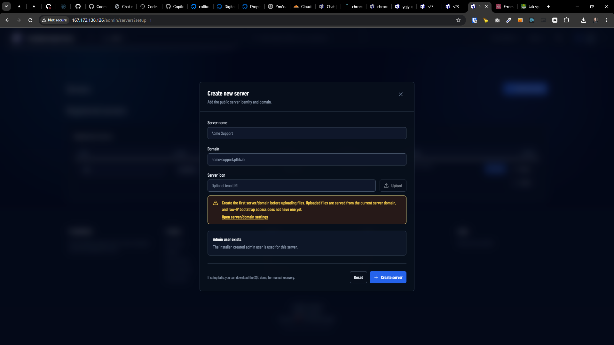

[x] ~$0.5664 an hour by OpenAI Codex `gpt-5.5`
[x] ~$0.3218 42 minutes by OpenAI Codex `gpt-5.5`

---

[x] ~$0.6473 3 hours by OpenAI Codex `gpt-5.5`

[✨🌗] When creating new Agents server via install script it should contain default agents

-   When the server is installed via the auto installation script it should contain palette of default agents, so the user can start using the server and testing it immediately after the installation without the need to create agents from scratch or import them, this will make the onboarding experience much better and smoother for the users, and also will allow them to see how the agents work and what they can do right after the installation, so they can start experimenting with them and creating their own agents based on the default ones
-   The default agents should be sourced from folder `agents/default` in this repository, each `*.book` file should correspond to agent.
    -   For now, theese agents are there:
        -   aktualizator-prezentaci.book
        -   chat-na-webu.book
        -   chat-nad-firemnimi-dokumenty.book
        -   chat-v-cestine.book
        -   copywriter.book
        -   firemni-pravnik.book
        -   generic-chatter.book
        -   obecny-chat-s-firemnimi-pravidly.book
        -   product-manager.book
        -   social-media-manager.book
        -   spravce-kalendare.book
        -   webmaster.book
-   This seems to be implemented already, but it is **not working and despite** confirmation during the installation process, the default agents are not created and available in the server after the installation is complete
-   During the installation process, ask the user if they want to install the default agents, if they choose yes, then the agents from `agents/default` should be installed and created in the Agents server, so the user can start using them immediately after the installation is complete, if they choose no, then no agents should be created and the user can create their own agents from scratch or import them later _(this is working)_
-   By default the default agents are created
-   When updating a server that already has agents, the default agents should not be created again
-   Keep in mind the DRY _(don't repeat yourself)_ principle.
-   Do a proper analysis of the current functionality before you start implementing.
-   You are working with the [Agents Server](apps/agents-server)
-   If you need to do the database migration, do it
-   Add the changes into the [changelog](changelog/_current-preversion.md)

**This is how the Agents server is installed:**

```bash
root@collboard-agents-server-x21:~# sudo curl -fsSL https://raw.githubusercontent.com/webgptorg/promptbook/refs/heads/main/other/vps/install.sh | bash
```

---

[ ] !!

[✨🌗] When creating new Agents server via `/admin/servers`

-   When the server is created via admin it should contain palette of default agents, so the user can start using the server and testing it immediately after the server creation without the need to create agents from scratch or import them, this will make the onboarding experience much better and smoother for the users, and also will allow them to see how the agents work and what they can do right after the installation, so they can start experimenting with them and creating their own agents based on the default ones
-   This is already implemented when creating server via the bash install script, but it is not implemented when creating server via the admin page, so it should be implemented in both places, and the code should be shared between these two implementations as much as possible
-   The default agents should be sourced from folder `agents/default` in this repository, each `*.book` file should correspond to agent.
-   In the "Create new server" allow to check "Install default agents" checkbox, which will install the default agents from `agents/default` folder, so the user can start using them immediately after the server is created, if they choose not to check it, then no agents should be created and the user can create their own agents from scratch or import them later, by default the checkbox should be checked, so the default agents are created by default
-   Keep in mind the DRY _(don't repeat yourself)_ principle, especially if you are implementing both the installation script and the admin server creation, try to reuse as much code as possible between these two implementations, so you don't have to maintain two separate implementations of the same functionality, and also to ensure that the default agents are created in the same way and with the same data in both cases, so there are no discrepancies between the two implementations
-   Do a proper analysis of the current functionality before you start implementing.
-   You are working with the [Agents Server](apps/agents-server)


