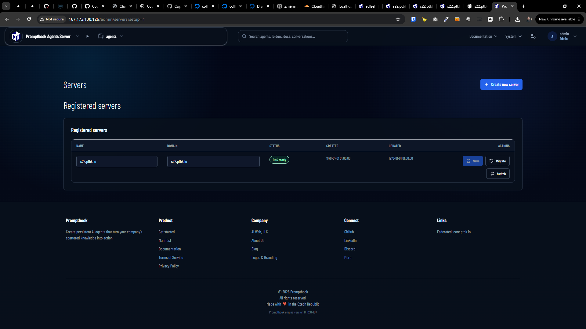
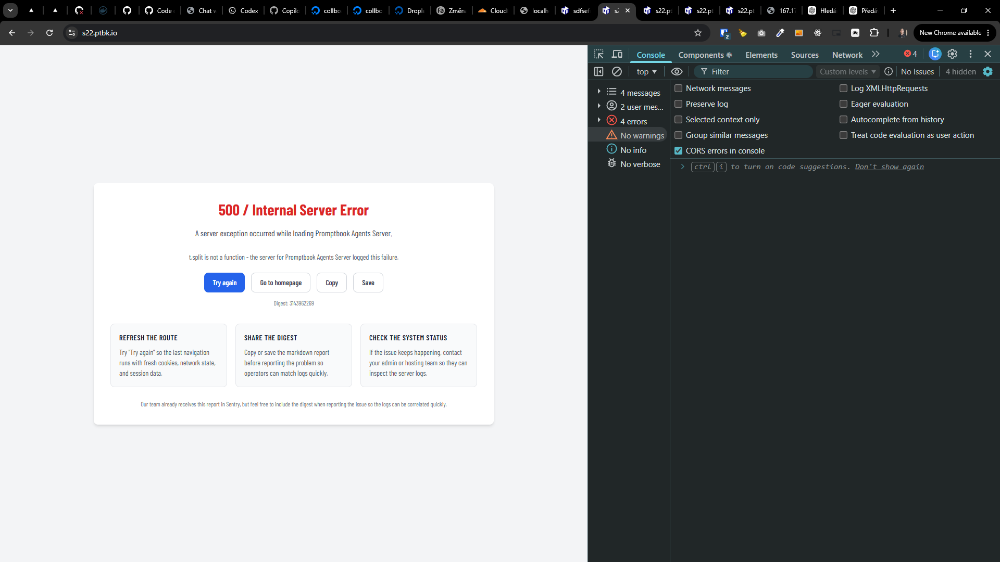

[ ] !!

[✨🚔] Fix the agents server

-   You can look at https://s22.ptbk.io/ or ssh to s22.ptbk.io to see the error
-   The server is installed on VPS, but after the installation, it fails
-   Keep in mind the DRY _(don't repeat yourself)_ principle.
-   Do a proper analysis of the current functionality before you start implementing.
-   You are working with the [Agents Server](apps/agents-server) installed on VPS




**This is how the Agents server is installed:**

```bash
root@collboard-agents-server-x21:~# sudo curl -fsSL https://raw.githubusercontent.com/webgptorg/promptbook/refs/heads/main/other/vps/install.sh | bash
```

```logs
0|promptbook-agents-server  | 2026-06-07T14:30:07: [next]  ⨯ TypeError: a.split is not a function
0|promptbook-agents-server  | 2026-06-07T14:30:07: [next]     at bh (.next/server/chunks/9664.js:130:54002) {
0|promptbook-agents-server  | 2026-06-07T14:30:07: [next]   digest: '3901190974'
0|promptbook-agents-server  | 2026-06-07T14:30:07: [next] }
0|promptbook-agents-server  | 2026-06-07T14:30:08: [next] Failed to forward application error report to Sentry. Error: Missing Sentry DSN. Configure SENTRY_DSN or NEXT_PUBLIC_SENTRY_DSN.
0|promptbook-agents-server  | 2026-06-07T14:30:08: [next]     at <unknown> (.next/server/app/api/error-reports/application/route.js:1:4188)
0|promptbook-agents-server  | 2026-06-07T14:30:08: [next]     at v (.next/server/app/api/error-reports/application/route.js:1:4274)
0|promptbook-agents-server  | 2026-06-07T14:30:08: [next]     at y (.next/server/app/api/error-reports/application/route.js:1:5552)
0|promptbook-agents-server  | 2026-06-07T14:30:08: [next]     at async k (.next/server/app/api/error-reports/application/route.js:1:8552)
0|promptbook-agents-server  | 2026-06-07T14:30:08: [next]     at async g (.next/server/app/api/error-reports/application/route.js:1:9555)
0|promptbook-agents-server  | 2026-06-07T14:30:08: [next]     at async E (.next/server/app/api/error-reports/application/route.js:1:10677)
```

# Application Error Report

## Human Summary

A server exception occurred while loading Promptbook Agents Server.

t.split is not a function - the server for Promptbook Agents Server logged this failure.

## Correlation

-   Server: `Promptbook Agents Server`
-   Variant: `advanced`
-   Digest: `3143962269`
-   Next.js digest: `_Unavailable_`
-   Reported at (UTC): `2026-06-07T14:32:48.571Z`

## Request Context

-   Page URL: `https://s22.ptbk.io/`

## Exception

-   Name: `TypeError`

### Message

```text
t.split is not a function
```

### Stack Trace

```text
TypeError: t.split is not a function
    at tk (https://s22.ptbk.io/_next/static/chunks/app/layout-608953b5f903bddd.js:1:90823)
    at l9 (https://s22.ptbk.io/_next/static/chunks/87c73c54-3c195070c5cbb22b.js:1:51105)
    at oT (https://s22.ptbk.io/_next/static/chunks/87c73c54-3c195070c5cbb22b.js:1:70689)
    at oW (https://s22.ptbk.io/_next/static/chunks/87c73c54-3c195070c5cbb22b.js:1:81789)
    at ib (https://s22.ptbk.io/_next/static/chunks/87c73c54-3c195070c5cbb22b.js:1:114388)
    at https://s22.ptbk.io/_next/static/chunks/87c73c54-3c195070c5cbb22b.js:1:114233
    at iv (https://s22.ptbk.io/_next/static/chunks/87c73c54-3c195070c5cbb22b.js:1:114241)
    at io (https://s22.ptbk.io/_next/static/chunks/87c73c54-3c195070c5cbb22b.js:1:111324)
    at iY (https://s22.ptbk.io/_next/static/chunks/87c73c54-3c195070c5cbb22b.js:1:132640)
    at MessagePort.w (https://s22.ptbk.io/_next/static/chunks/1902-525a296c674c4d89.js:1:100574)
```

## Raw Report Payload

```json
{
    "variant": "advanced",
    "serverName": "Promptbook Agents Server",
    "digest": "3143962269",
    "errorName": "TypeError",
    "errorMessage": "t.split is not a function",
    "errorStack": "TypeError: t.split is not a function\n    at tk (https://s22.ptbk.io/_next/static/chunks/app/layout-608953b5f903bddd.js:1:90823)\n    at l9 (https://s22.ptbk.io/_next/static/chunks/87c73c54-3c195070c5cbb22b.js:1:51105)\n    at oT (https://s22.ptbk.io/_next/static/chunks/87c73c54-3c195070c5cbb22b.js:1:70689)\n    at oW (https://s22.ptbk.io/_next/static/chunks/87c73c54-3c195070c5cbb22b.js:1:81789)\n    at ib (https://s22.ptbk.io/_next/static/chunks/87c73c54-3c195070c5cbb22b.js:1:114388)\n    at https://s22.ptbk.io/_next/static/chunks/87c73c54-3c195070c5cbb22b.js:1:114233\n    at iv (https://s22.ptbk.io/_next/static/chunks/87c73c54-3c195070c5cbb22b.js:1:114241)\n    at io (https://s22.ptbk.io/_next/static/chunks/87c73c54-3c195070c5cbb22b.js:1:111324)\n    at iY (https://s22.ptbk.io/_next/static/chunks/87c73c54-3c195070c5cbb22b.js:1:132640)\n    at MessagePort.w (https://s22.ptbk.io/_next/static/chunks/1902-525a296c674c4d89.js:1:100574)",
    "pageUrl": "https://s22.ptbk.io/",
    "reportedAt": "2026-06-07T14:32:48.571Z"
}
```
