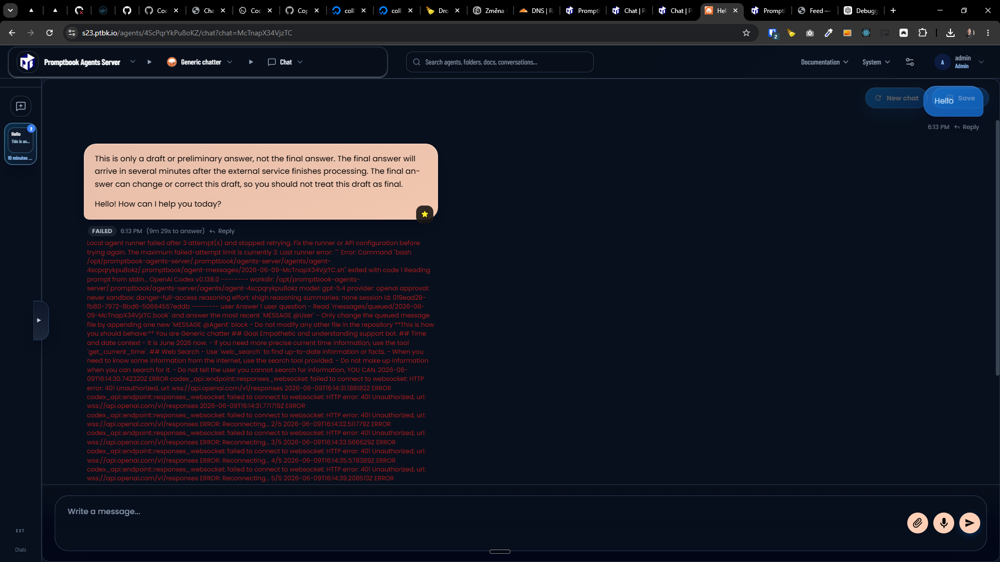

[x] ~$0.00 an hour by OpenAI Codex `gpt-5.5`

---

[x] ~$0.3120 38 minutes by OpenAI Codex `gpt-5.5`

[✨🐄] Use openai-coder with api key as configured agent runner

-   This is already mid-way implemented, but it is not working, when the user enters the OpenAI API key during the installation process, then the openai-coder runner should be configured with that API key, so the user can start using it immediately after the installation is complete without the need to setup the login in interactive mode, and also without the need to create a new agent and configure it to use openai-coder runner with that API key, this will make the onboarding experience much better and smoother for the users, and also will allow them to start using the openai-coder runner with their OpenAI API key right after the installation is complete, so they can start experimenting with it and creating their own agents based on it
-   If the user enters the OpenAI API key during the installation process, then the openai-coder runner should be configured with that API key
-   All of the runners should be available, just the default behavior should be that if the user enters the OpenAI API key during the installation process, then the openai-coder runner should be configured with that API key instead of asking in interactive mode to setup the login

**This is how the Agents server is installed:**

```bash
root@collboard-agents-server-x21:~# sudo curl -fsSL https://raw.githubusercontent.com/webgptorg/promptbook/refs/heads/main/other/vps/install.sh | bash
```

This is the fail when server is set by OpenAI API key:

```bash
0|promptbook-agents-server  | 2026-06-08T15:03:45: Reading prompt from stdin...
0|promptbook-agents-server  | 2026-06-08T15:03:45: Not inside a trusted directory and --skip-git-repo-check was not specified.
0|promptbook-agents-server  | 2026-06-08T15:03:45:     at ChildProcess.handleExit (/opt/promptbook-agents-server/bin/8a90018/scripts/run-codex-prompts/common/runGoScript/runScriptUntilMarkerIdle.ts:170:56)
0|promptbook-agents-server  | 2026-06-08T15:03:45:     at ChildProcess.emit (node:events:519:28)
0|promptbook-agents-server  | 2026-06-08T15:03:45:     at ChildProcess.emit (node:domain:489:12)
0|promptbook-agents-server  | 2026-06-08T15:03:45:     at Process.ChildProcess._handle.onexit (node:internal/child_process:293:12)
0|promptbook-agents-server  | 2026-06-08T15:03:45: Logged recoverable watcher failure to /opt/promptbook-agents-server/.logs/ptbk-agent-error-2026-06-08T15-03-44-999Z.log. Continuing to watch...
0|promptbook-agents-server  | 2026-06-08T15:03:45: Processing agent-caarx8bc6ihppa with Lucy Gray.
0|promptbook-agents-server  | 2026-06-08T15:03:45: OpenAI Codex credit spending is disabled. Use `--allow-credits` to explicitly opt in.
0|promptbook-agents-server  | 2026-06-08T15:03:45: Processing messages/queued/2026-06-08-4hHKAdvpRxtbta.book
0|promptbook-agents-server  | 2026-06-08T15:03:45: /opt/promptbook-agents-server/.promptbook/agents-server/agents/agent-caarx8bc6ihppa/.promptbook/agent-messages/2026-06-08-4hHKAdvpRxtbta.sh: line 42: warning: here-document at line 25 delimited by end-of-file (wanted `CODEX_PROMPT')
0|promptbook-agents-server  | 2026-06-08T15:03:45:
0|promptbook-agents-server  | 2026-06-08T15:03:45: Reading prompt from stdin...
0|promptbook-agents-server  | 2026-06-08T15:03:45:
0|promptbook-agents-server  | 2026-06-08T15:03:45: Not inside a trusted directory and --skip-git-repo-check was not specified.
0|promptbook-agents-server  | 2026-06-08T15:03:45:
0|promptbook-agents-server  | 2026-06-08T15:03:45: Error: Command "bash /opt/promptbook-agents-server/.promptbook/agents-server/agents/agent-caarx8bc6ihppa/.promptbook/agent-messages/2026-06-08-4hHKAdvpRxtbta.sh" exited with code 1
0|promptbook-agents-server  | 2026-06-08T15:03:45:
0|promptbook-agents-server  | 2026-06-08T15:03:45: /opt/promptbook-agents-server/.promptbook/agents-server/agents/agent-caarx8bc6ihppa/.promptbook/agent-messages/2026-06-08-4hHKAdvpRxtbta.sh: line 42: warning: here-document at line 25 delimited by end-of-file (wanted `CODEX_PROMPT')
0|promptbook-agents-server  | 2026-06-08T15:03:45: Reading prompt from stdin...
0|promptbook-agents-server  | 2026-06-08T15:03:45: Not inside a trusted directory and --skip-git-repo-check was not specified.
0|promptbook-agents-server  | 2026-06-08T15:03:45:     at ChildProcess.handleExit (/opt/promptbook-agents-server/bin/8a90018/scripts/run-codex-prompts/common/runGoScript/runScriptUntilMarkerIdle.ts:170:56)
0|promptbook-agents-server  | 2026-06-08T15:03:45:     at ChildProcess.emit (node:events:519:28)
0|promptbook-agents-server  | 2026-06-08T15:03:45:     at ChildProcess.emit (node:domain:489:12)
0|promptbook-agents-server  | 2026-06-08T15:03:45:     at Process.ChildProcess._handle.onexit (node:internal/child_process:293:12)
0|promptbook-agents-server  | 2026-06-08T15:03:45: Logged recoverable watcher failure to /opt/promptbook-agents-server/.logs/ptbk-agent-error-2026-06-08T15-03-45-223Z.log. Continuing to watch...
0|promptbook-agents-server  | 2026-06-08T15:03:45: Moved messages/queued/2026-06-08-4hHKAdvpRxtbta.book to messages/failed after 3 failed attempt(s).
```


---

[ ] !!!

[✨🐄] Use openai-coder with api key as configured agent runner

-   This is already mid-way implemented, but it is not working, when the user enters the OpenAI API key during the installation process, then the openai-coder runner should be configured with that API key, so the user can start using it immediately after the installation is complete without the need to setup the login in interactive mode, and also without the need to create a new agent and configure it to use openai-coder runner with that API key, this will make the onboarding experience much better and smoother for the users, and also will allow them to start using the openai-coder runner with their OpenAI API key right after the installation is complete, so they can start experimenting with it and creating their own agents based on it
-   If the user enters the OpenAI API key during the installation process, then the openai-coder runner should be configured with that API key

**This is how the Agents server is installed:**

```bash
root@collboard-agents-server-x21:~# sudo curl -fsSL https://raw.githubusercontent.com/webgptorg/promptbook/refs/heads/main/other/vps/install.sh | bash
```

During this installation `openai-codex` (the default ) is picked and the OpenAI api key is set up

The draft or preliminary answers are working - the api key is working but the code runner fails.

**This is the fail when server is set by OpenAI API key:**

> Local agent runner failed after 3 attempt(s) and stopped retrying. Fix the runner or API configuration before trying again. The maximum failed-attempt limit is currently 3. Last runner error: `` Error: Command "bash /opt/promptbook-agents-server/.promptbook/agents-server/agents/agent-4scpqrykpu8okz/.promptbook/agent-messages/2026-06-09-McTnapX34VjzTC.sh" exited with code 1 Reading prompt from stdin... OpenAI Codex v0.138.0 -------- workdir: /opt/promptbook-agents-server/.promptbook/agents-server/agents/agent-4scpqrykpu8okz model: gpt-5.4 provider: openai approval: never sandbox: danger-full-access reasoning effort: xhigh reasoning summaries: none session id: 019ead29-fb80-7972-8bd6-50664557eddb -------- user Answer 1 user question - Read `messages/queued/2026-06-09-McTnapX34VjzTC.book` and answer the most recent `MESSAGE @User` - Only change the queued message file by appending one new `MESSAGE @Agent` block - Do not modify any other file in the repository **This is how you should behave:** You are Generic chatter ## Goal Empathetic and understanding support bot. ## Time and date context - It is June 2026 now. - If you need more precise current time information, use the tool `get_current_time`. ## Web Search - Use `web_search` to find up-to-date information or facts. - When you need to know some information from the internet, use the search tool provided. - Do not make up information when you can search for it. - Do not tell the user you cannot search for information, YOU CAN. 2026-06-09T16:14:30.742320Z ERROR codex_api::endpoint::responses_websocket: failed to connect to websocket: HTTP error: 401 Unauthorized, url: wss://api.openai.com/v1/responses 2026-06-09T16:14:31.188182Z ERROR codex_api::endpoint::responses_websocket: failed to connect to websocket: HTTP error: 401 Unauthorized, url: wss://api.openai.com/v1/responses 2026-06-09T16:14:31.771719Z ERROR codex_api::endpoint::responses_websocket: failed to connect to websocket: HTTP error: 401 Unauthorized, url: wss://api.openai.com/v1/responses ERROR: Reconnecting... 2/5 2026-06-09T16:14:32.511779Z ERROR codex_api::endpoint::responses_websocket: failed to connect to websocket: HTTP error: 401 Unauthorized, url: wss://api.openai.com/v1/responses ERROR: Reconnecting... 3/5 2026-06-09T16:14:33.566629Z ERROR codex_api::endpoint::responses_websocket: failed to connect to websocket: HTTP error: 401 Unauthorized, url: wss://api.openai.com/v1/responses ERROR: Reconnecting... 4/5 2026-06-09T16:14:35.578389Z ERROR codex_api::endpoint::responses_websocket: failed to connect to websocket: HTTP error: 401 Unauthorized, url: wss://api.openai.com/v1/responses ERROR: Reconnecting... 5/5 2026-06-09T16:14:39.208513Z ERROR codex_api::endpoint::responses_websocket: failed to connect to websocket: HTTP error: 401 Unauthorized, url: wss://api.openai.com/v1/responses ERROR: Reconnecting... 1/5 ERROR: Reconnecting... 2/5 ERROR: Reconnecting... 3/5 ERROR: Reconnecting... 4/5 ERROR: Reconnecting... 5/5 ERROR: unexpected status 401 Unauthorized: Missing bearer or basic authentication in header, url: https://api.openai.com/v1/responses, cf-ray: a0916e6a4c634601-EWR, request id: req_f6dcf20fcfc9437c99f9fe819a64c9a6 ERROR: unexpected status 401 Unauthorized: Missing bearer or basic authentication in header, url: https://api.openai.com/v1/responses, cf-ray: a0916e6a4c634601-EWR, request id: req_f6dcf20fcfc9437c99f9fe819a64c9a6 at ChildProcess.handleExit (/opt/promptbook-agents-server/bin/433b05f/scripts/run-codex-prompts/common/runGoScript/runScriptUntilMarkerIdle.ts:170:56) at ChildProcess.emit (node:events:519:28) at ChildProcess.emit (node:domain:489:12) at Process.ChildProcess._handle.onexit (node:internal/child_process:293:12) ``


