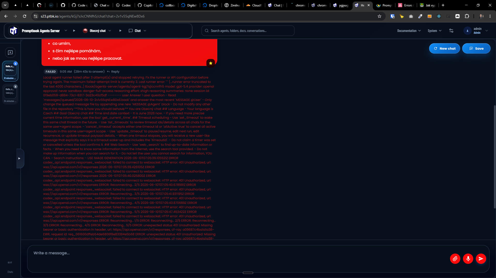
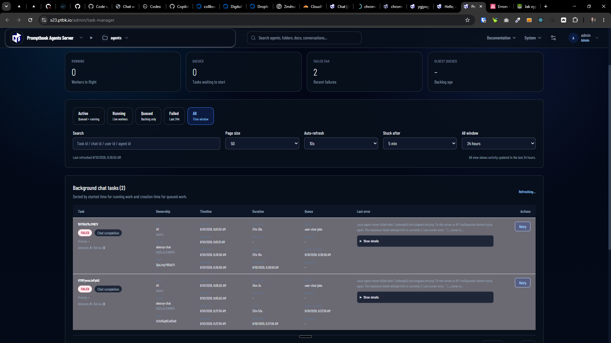

[ ]

[✨🐄] When `openai-codex` picked during the installation and also entered api key, it should be enouugh to work, but it fails, fix it

-   This is already mid-way implemented, but it is not working, when the user enters the OpenAI API key during the installation process, then the `openai-codex` runner should be configured with that API key, so the user can start using it immediately after the installation is complete without the need to setup the login in interactive mode, and also without the need to create a new agent and configure it to use openai-codex runner with that API key, this will make the onboarding experience much better and smoother for the users, and also will allow them to start using the openai-codex runner with their OpenAI API key right after the installation is complete, so they can start experimenting with it and creating their own agents based on it
-   If the user enters the OpenAI API key during the installation process, then the openai-codex runner should be configured with that API key
-   You can ssh to s23.ptbk.io to see the error

**This is how the Agents server is installed:**

```bash
root@collboard-agents-server-x22:~# sudo curl -fsSL https://raw.githubusercontent.com/webgptorg/promptbook/refs/heads/main/other/vps/install.sh | bash
[promptbook-vps] Warning: This installer is meant for a fresh VPS with no existing Promptbook data or server configuration to preserve.
[promptbook-vps] Warning: Running it on a non-fresh VPS can overwrite existing data or configuration and cause data loss or service disruption.
Continue installation only if this is a fresh VPS without existing data or configuration to preserve? [no]: y
[promptbook-vps] Checking VPS resources.
[promptbook-vps] Resources OK: 8.0 GiB memory and 56.6 GiB free disk.
Coding runner [openai-codex]: <- Confirmed
Runner model [gpt-5.4]:
Runner thinking level [xhigh]:
Deployment environment (production/main/preview/LTS) [main]:
Agents Server port [4440]:
...
OpenAI API key (optional) [keep existing]: <- The correct api key was set
...
```

**This is the fail when server is using `openai-codex` with correct OpenAI API key:**

````json
{
    "summary": "Local agent runner failed after 3 attempt(s) and stopped retrying.\n\nFix the runner or API configuration before trying again. The maximum failed-attempt limit is currently 3.\n\nLast runner error:\n```\n        [...runner error truncated to the last 4000 characters...]\n        tbook/agents-server/agents/agent-kgj7sjiccnnfh5\nmodel: gpt-5.4\nprovider: openai\napproval: never\nsandbox: danger-full-access\nreasoning effort: xhigh\nreasoning summaries: none\nsession id: 019eb056-a0cd-7833-bd20-c6746b680aca\n--------\nuser\n\nAnswer 1 user question\n\n-   Read `messages/queued/2026-06-10-XjoLchyYi65oFH.book` and answer the most recent `MESSAGE @User`\n-   Only change the queued message file by appending one new `MESSAGE @Agent` block\n-   Do not modify any other file in the repository\n\n**This is how you should behave:**\n\nYou are Obecný chat\n\n## Language\n\n-   Your language is Czech\n\n## Goal\n\nObecný chat\n\n## Time and date context\n\n-   It is June 2026 now.\n-   If you need more precise current time information, use the tool `get_current_time`.\n\n## Timeout scheduling\n\n-   Use `set_timeout` to wake this same chat thread in the future.\n-   Use `list_timeouts` to review timeout ids/details across all chats for the same user+agent scope.\n-   `cancel_timeout` accepts either one timeout id or `allActive: true` to cancel all active timeouts in this same user+agent scope.\n-   Use `update_timeout` to pause/resume, edit next run, edit recurrence, or update timeout payload details.\n-   When one timeout elapses, you will receive a new user-like message that explicitly says it is a timeout wake-up and includes the `timeoutId`.\n-   Do not claim a timer was set or cancelled unless the tool confirms it.\n\n## Web Search\n\n-   Use `web_search` to find up-to-date information or facts.\n-   When you need to know some information from the internet, use the search tool provided.\n-   Do not make up information when you can search for it.\n-   Do not tell the user you cannot search for information, YOU CAN.\n- Search instructions:\n    - USE IMAGE GENERATION\n\n\n2026-06-10T07:02:08.257581Z ERROR codex_api::endpoint::responses_websocket: failed to connect to websocket: HTTP error: 401 Unauthorized, url: wss://api.openai.com/v1/responses\n2026-06-10T07:02:08.943401Z ERROR codex_api::endpoint::responses_websocket: failed to connect to websocket: HTTP error: 401 Unauthorized, url: wss://api.openai.com/v1/responses\n2026-06-10T07:02:09.475898Z ERROR codex_api::endpoint::responses_websocket: failed to connect to websocket: HTTP error: 401 Unauthorized, url: wss://api.openai.com/v1/responses\nERROR: Reconnecting... 2/5\n2026-06-10T07:02:10.190053Z ERROR codex_api::endpoint::responses_websocket: failed to connect to websocket: HTTP error: 401 Unauthorized, url: wss://api.openai.com/v1/responses\nERROR: Reconnecting... 3/5\n2026-06-10T07:02:11.199332Z ERROR codex_api::endpoint::responses_websocket: failed to connect to websocket: HTTP error: 401 Unauthorized, url: wss://api.openai.com/v1/responses\nERROR: Reconnecting... 4/5\n2026-06-10T07:02:13.102011Z ERROR codex_api::endpoint::responses_websocket: failed to connect to websocket: HTTP error: 401 Unauthorized, url: wss://api.openai.com/v1/responses\nERROR: Reconnecting... 5/5\n2026-06-10T07:02:16.671436Z ERROR codex_api::endpoint::responses_websocket: failed to connect to websocket: HTTP error: 401 Unauthorized, url: wss://api.openai.com/v1/responses\nERROR: Reconnecting... 1/5\nERROR: Reconnecting... 2/5\nERROR: Reconnecting... 3/5\nERROR: Reconnecting... 4/5\nERROR: Reconnecting... 5/5\nERROR: unexpected status 401 Unauthorized: Missing bearer or basic authentication in header, url: https://api.openai.com/v1/responses, cf-ray: a096829e7be3862e-EWR, request id: req_83fd7146513f4a4eadec35d7f8a5ed9f\nERROR: unexpected status 401 Unauthorized: Missing bearer or basic authentication in header, url: https://api.openai.com/v1/responses, cf-ray: a096829e7be3862e-EWR, request id: req_83fd7146513f4a4eadec35d7f8a5ed9f\n    at ChildProcess.handleExit (/opt/promptbook-agents-server/bin/1a41b06/scripts/run-codex-prompts/common/runGoScript/runScriptUntilMarkerIdle.ts:170:56)\n    at ChildProcess.emit (node:events:519:28)\n    at ChildProcess.emit (node:domain:489:12)\n    at Process.ChildProcess._handle.onexit (node:internal/child_process:293:12)\n```",
    "source": "localRunnerFailedFile",
    "recordedAt": "2026-06-10T07:39:30.151Z",
    "provider": "local-agent-runner",
    "generationDurationMs": null,
    "error": null,
    "diagnostics": null,
    "job": {
        "id": "1UFi1Ud7kJVNCV",
        "status": "FAILED",
        "userId": 1,
        "agentPermanentId": "kGj7sJicCNNfh5",
        "chatId": "XjoLchyYi65oFH",
        "userMessageId": "fM4ZDeQF7q25JR",
        "assistantMessageId": "dLfCuVc6adaqhu",
        "clientMessageId": "nqrkEPwKcXfdpsMGV7",
        "attemptCount": 1,
        "queuedAt": "2026-06-10T07:01:30.158Z",
        "startedAt": "2026-06-10T07:01:31.706Z",
        "updatedAt": "2026-06-10T07:39:23.304Z",
        "lastHeartbeatAt": "2026-06-10T07:39:23.304Z",
        "leaseExpiresAt": "2026-06-10T07:39:23.304Z"
    }
}
````




