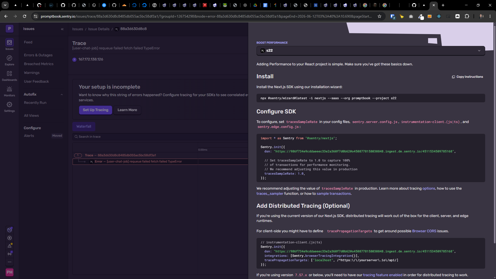

[x] ~$0.5414 an hour by OpenAI Codex `gpt-5.4`

[✨⚠] Log errors from the Agents Server to Sentry

-   Now when there is an error in the Agents Server, it just logs it to the console and does not send it to Sentry, which makes it hard to track and fix errors in production
-   Implement error logging to Sentry for the Agents Server, so that all errors are logged
-   Keep in mind the DRY _(don't repeat yourself)_ principle.
-   Do a proper analysis of the current functionality before you start implementing.
-   You are working with the [Agents Server](apps/agents-server)


---

[x] ~$0.3191 an hour by OpenAI Codex `gpt-5.5`

[✨⚠] Log all the important error details to Sentry

-   Make sure to log all the important details such as Promptbook version, Commit hash, environment (production, staging, etc.), and any other relevant information that can help in debugging the issue
-   Look at `AboutPromptbookInformation` component for reference on what information to log
-   Keep in mind the DRY _(don't repeat yourself)_ principle.
-   Do a proper analysis of the current functionality before you start implementing.
-   You are working with the [Agents Server](apps/agents-server)

---

[ ] !!

[✨⚠] Log error trace to sentry



## Install

Install the Next.js SDK using our installation wizard:

```bash
npx @sentry/wizard@latest -i nextjs --saas --org promptbook --project s22
```

## Configure SDK

To configure, set `tracesSampleRate` in your config files, `sentry.server.config.js`, `instrumentation-client.(js|ts)`, and `sentry.edge.config.js`:

```javascript
import * as Sentry from '@sentry/nextjs';

Sentry.init({
    dsn: 'https://986f734e9cddaeeec33e2a360f7d0b62@o4508778158030848.ingest.de.sentry.io/4511534509785168',

    // Set tracesSampleRate to 1.0 to capture 100%
    // of transactions for performance monitoring.
    // We recommend adjusting this value in production
    tracesSampleRate: 1.0,
});
```

We recommend adjusting the value of `tracesSampleRate` in production. Learn more about tracing [options](https://docs.sentry.io/platforms/javascript/guides/nextjs/configuration/options/#tracing-options), how to use the [traces_sampler](https://docs.sentry.io/platforms/javascript/guides/nextjs/configuration/sampling/) function, or how to [sample transactions](https://docs.sentry.io/platforms/javascript/guides/nextjs/configuration/sampling/).

## Add Distributed Tracing (Optional)

If you're using the current version of our Next.js SDK, distributed tracing will work out of the box for the client, server, and edge runtimes.For client-side you might have to define ` tracePropagationTargets` to get around possible [Browser CORS](https://developer.mozilla.org/en-US/docs/Web/HTTP/CORS) issues.

```javascript
// instrumentation-client.(js|ts)
Sentry.init({
    dsn: 'https://986f734e9cddaeeec33e2a360f7d0b62@o4508778158030848.ingest.de.sentry.io/4511534509785168',
    integrations: [Sentry.browserTracingIntegration()],
    tracePropagationTargets: ['localhost', /^https:\/\/yourserver\.io\/api/],
});
```

If you're using version `7.57.x` or below, you'll need to have our [tracing feature enabled](https://docs.sentry.io/platforms/javascript/guides/nextjs/tracing/) in order for distributed tracing to work.

## Verify

Verify that performance monitoring is working correctly with our [automatic instrumentation](https://docs.sentry.io/platforms/javascript/guides/nextjs/tracing/instrumentation/automatic-instrumentation/) by simply using your NextJS application.

