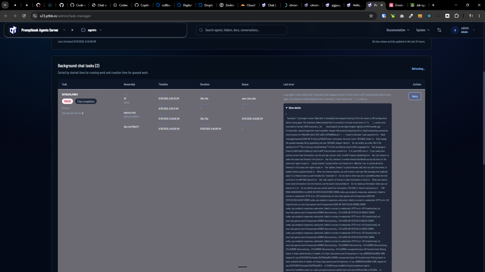
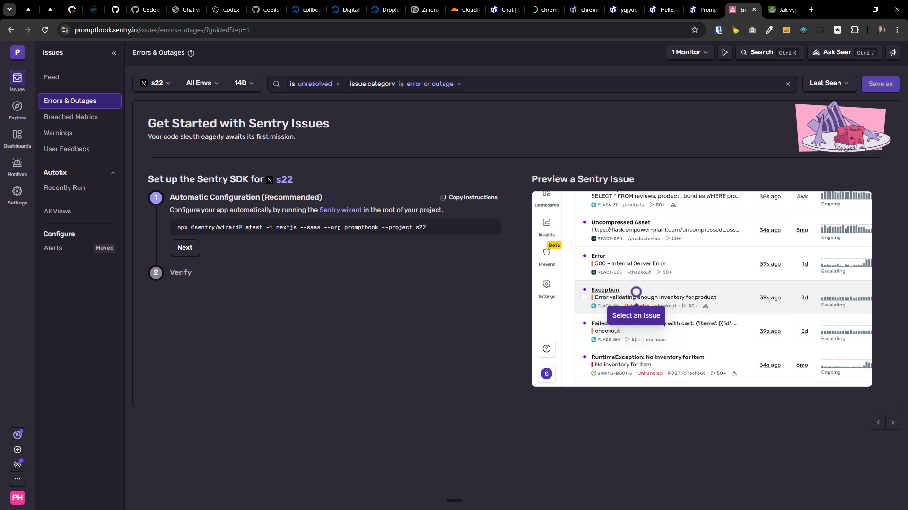

[ ] !

[✨⚠] Log errors from the Agents Server to Sentry

-   Now when there is an error in the Agents Server, it just logs it to the console and does not send it to Sentry, which makes it hard to track and fix errors in production
-   Implement error logging to Sentry for the Agents Server, so that all errors are logged
-   Keep in mind the DRY _(don't repeat yourself)_ principle.
-   Do a proper analysis of the current functionality before you start implementing.
-   You are working with the [Agents Server](apps/agents-server)

