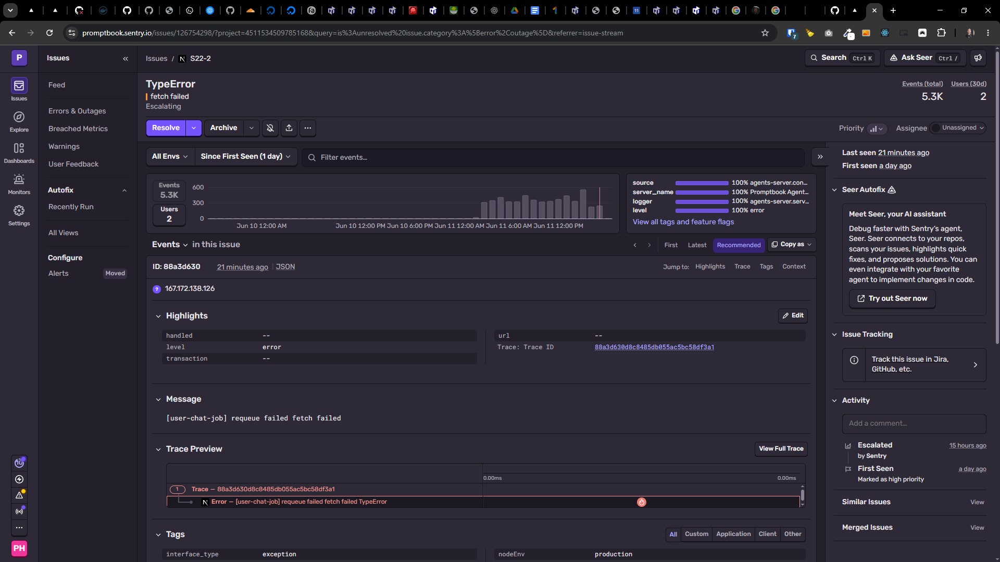

[ ] !!

[✨🐙] Fix Agents server

-   Do a proper analysis of the current functionality before you start implementing.
-   You are working with the [Agents Server](apps/agents-server)

**Raw copy from Sentry:**

Skip to main content
Issues

S22-2

Search
Ctrl
K

Ask Seer
Ctrl
/

TypeError
Events (total)
Users (30d)
Level: Error
fetch failed
5.3K
2
Escalating

Resolve

Archive

Priority
High
Assignee

Unassigned

All Envs

Since First Seen (1 day)
Filter events…

Events
5.3K

Users
2
server_name
100%
Promptbook Agents Server
logger
100%
agents-server.server-error
nextRuntime
100%
nodejs
nodeEnv
100%
production
View all tags and feature flags

Events
in this issue
First
Latest
Recommended

Copy as
ID: 88a3d630
23 minutes ago
|
JSON
Jump to:
Highlights
Trace
Tags
Context
167.172.138.126

Highlights

Edit
handled
handled
--
level
level
error
transaction
transaction
--
url
url
--
Trace: Trace ID
88a3d630d8c8485db055ac5bc58df3a1

Message
[user-chat-job] requeue failed fetch failed

Trace Preview
View Full Trace
0.00ms0.00ms0s0s0s0s0s0s0s0s0s0s0s0s0s0s0s0s0s0s0s0s0s0s0s0s0s0s0s0s0s0s0s0s0s0s0s0s0s0s0s0s0s0s0s0s0s0s0s0s0s0s0s0s0s0s0s0s0s0s

1
Trace
—
88a3d630d8c8485db055ac5bc58df3a1

Error
—
[user-chat-job] requeue failed fetch failed TypeError

Tags

interface_type
interface_type
exception
level
level
error
logger
logger
agents-server.server-error
nextRuntime
nextRuntime
nodejs
nodeEnv
nodeEnv
production
server_name
server_name
Promptbook Agents Server
source
source
agents-server.console-error
user
user
ip:167.172.138.126

Contexts
User
Geography
North Bergen, United States (US)
IP Address
167.172.138.126
Trace Details
Span ID
88a3d630d8c8485d
Status
unknown
Trace ID
88a3d630d8c8485db055ac5bc58df3a1

Additional Data

consoleArguments

[
[user-chat-job] requeue failed,
TypeError: fetch failed
at async e (.next/server/chunks/10.js:25:1104) {
[cause]: [Error: read ECONNRESET] { errno: -104, code: 'ECONNRESET', syscall: 'read' }
}
]
errorStack
TypeError: fetch failed
at node:internal/deps/undici/undici:14976:13
at async e (/opt/promptbook-agents-server/bin/ababbdc/apps/agents-server/.next/server/chunks/10.js:25:1104)
at async t (/opt/promptbook-agents-server/bin/ababbdc/node_modules/next/dist/compiled/next-server/app-route.runtime.prod.js:1:110415)
at async a (/opt/promptbook-agents-server/bin/ababbdc/node_modules/next/dist/compiled/next-server/app-route.runtime.prod.js:1:14567)

Event Grouping Information
Last seen
23 minutes ago
First seen
a day ago

Seer Autofix
Meet Seer, your AI assistant
Debug faster with Sentry’s agent, Seer. Seer connects to your repos, scans your issues, highlights quick fixes, and proposes solutions. You can even integrate with your favorite agent to implement changes in code.
Try out Seer now

Issue Tracking
Track this issue in Jira, GitHub, etc.

Activity

Add a comment…
Escalated
15 hours ago
by Sentry
First Seen
a day ago
Marked as high priority
Similar Issues
View
Merged Issues
View

Filter events…
