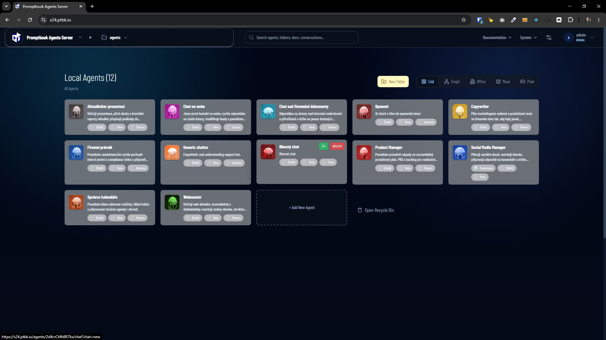

[!] failed after 15 minutes by Claude Code

[✨🔱] Optimize animated avatars

-   Now the animated avatars are very slow in the browser, and the performance is very bad
-   Espetially when there are multiple animated avatars on the page, the performance is very bad and the fps drops to 1-2 fps, which is not good for production
-   Do a proper analysis of the current functionality before you start implementing.
-   You are working with the [Agents Server](apps/agents-server)

