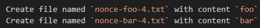

[x] $0.1137 a minute by Claude Code

[✨📳] Create some files at root of the project

- All the files should be created at the root of the project:
-   Create file named `nonce-1.txt` which summarizes the README of the project
-   Create file named `nonce-2.txt` with content of of output of `date +%s`
-   Create file named `nonce-3.txt` with content from 
-   This task is just to test the coding agent functionality
- Do not do some deep analysis of the project, just do theese 3 files, and do not create any other files, do not modify any other files, do not delete any other files, do not move any other files, do not rename

---

[-]

[✨📳] foo

Create some files at root of the project

-   Create file named `tmp/nonce-1.txt` which summarizes the README of the project
-   Create file named `tmp/nonce-2.txt` with content of of output of `date +%s`
-   Create file named `tmp/nonce-3.txt` with content from 
-   This task is just to test the coding agent functionality

---

[-]

[✨📳] foo

Create some files at root of the project

-   Create file named `tmp/nonce-1.txt` which summarizes the README of the project
-   Create file named `tmp/nonce-2.txt` with content of of output of `date +%s`
-   Create file named `tmp/nonce-3.txt` with content from 
-   This task is just to test the coding agent functionality

---

[-]

[✨📳] foo

Create some files at root of the project

-   Create file named `tmp/nonce-1.txt` which summarizes the README of the project
-   Create file named `tmp/nonce-2.txt` with content of of output of `date +%s`
-   Create file named `tmp/nonce-3.txt` with content from 
-   This task is just to test the coding agent functionality

