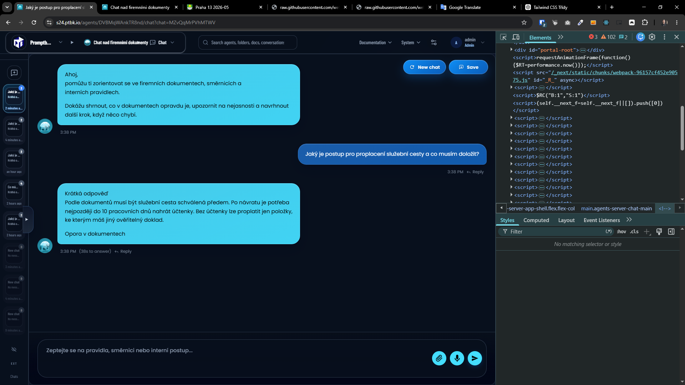
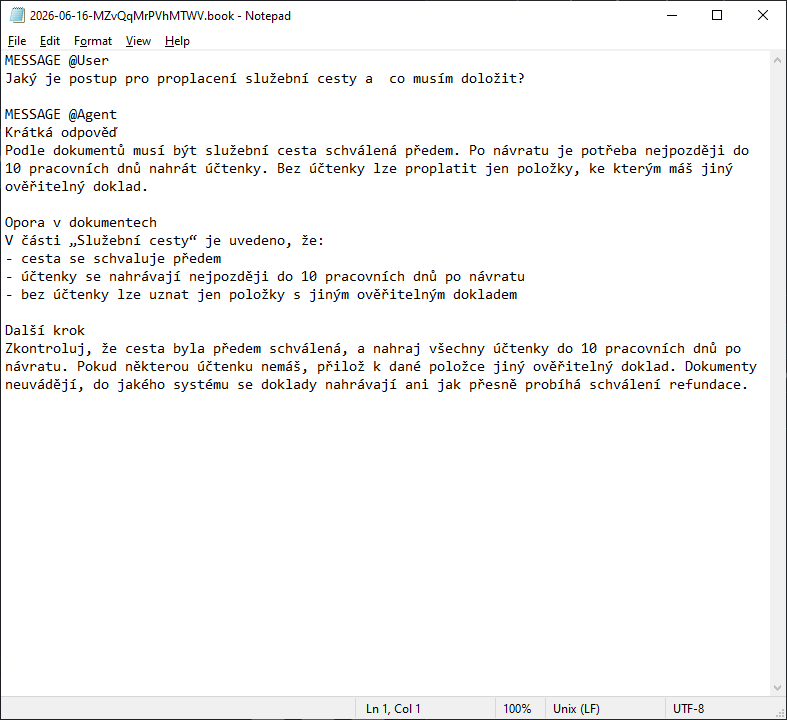

[!] failed after 4 minutes by Claude Code

[✨🔕] The message in chat isnt shown full but its cropped

-   Do a proper analysis of the current functionality before you start implementing.
-   You are working with the [Agents Server](apps/agents-server)

**The chat book file completed by runner looks like:**

```
MESSAGE @User
Jaký je postup pro proplacení služební cesty a  co musím doložit?

MESSAGE @Agent
Krátká odpověď
Podle dokumentů musí být služební cesta schválená předem. Po návratu je potřeba nejpozději do 10 pracovních dnů nahrát účtenky. Bez účtenky lze proplatit jen položky, ke kterým máš jiný ověřitelný doklad.

Opora v dokumentech
V části „Služební cesty“ je uvedeno, že:
- cesta se schvaluje předem
- účtenky se nahrávají nejpozději do 10 pracovních dnů po návratu
- bez účtenky lze uznat jen položky s jiným ověřitelným dokladem

Další krok
Zkontroluj, že cesta byla předem schválená, a nahraj všechny účtenky do 10 pracovních dnů po návratu. Pokud některou účtenku nemáš, přilož k dané položce jiný ověřitelný doklad. Dokumenty neuvádějí, do jakého systému se doklady nahrávají ani jak přesně probíhá schválení refundace.

```

**The message in UI looks like:**

```
Krátká odpověď
Podle dokumentů musí být služební cesta schválená předem. Po návratu je potřeba nejpozději do 10 pracovních dnů nahrát účtenky. Bez účtenky lze proplatit jen položky, ke kterým máš jiný ověřitelný doklad.

Opora v dokumentech
```

-   The message is cropped and the user cannot see the full message




