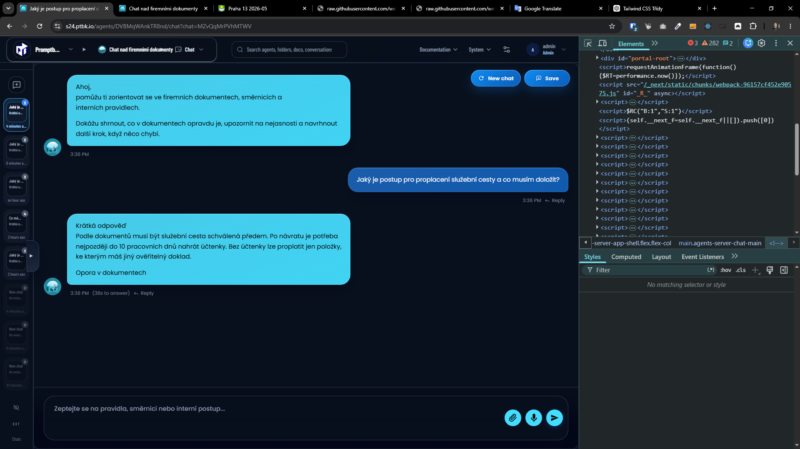
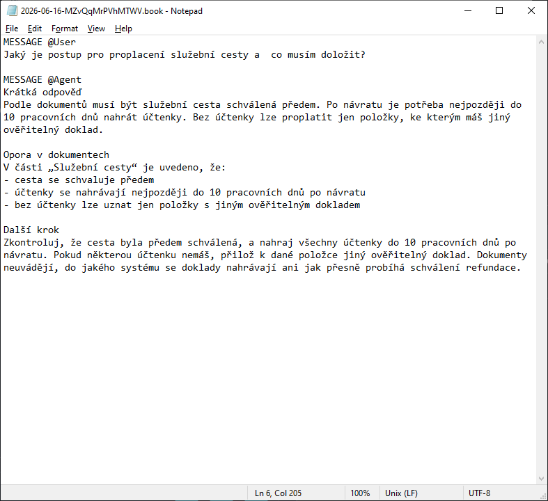

[x] (2 attempts) $0.1974 an hour by Claude Code

---

[x] $2.33 2 hours by OpenAI Codex `gpt-5.5`

[✨⚔️] When the chat runner gets the chat for answering, it should contain also the initial message in the chat thread

-   Do a proper analysis of the current functionality before you start implementing.
-   You are working with the [Agents Server](apps/agents-server)




**Now the book file for agent runner looks like:**

```
MESSAGE @Agent
...
```

**But it should contain initial agent message:**

```
MESSAGE @Agent
...


MESSAGE @User
...
```

