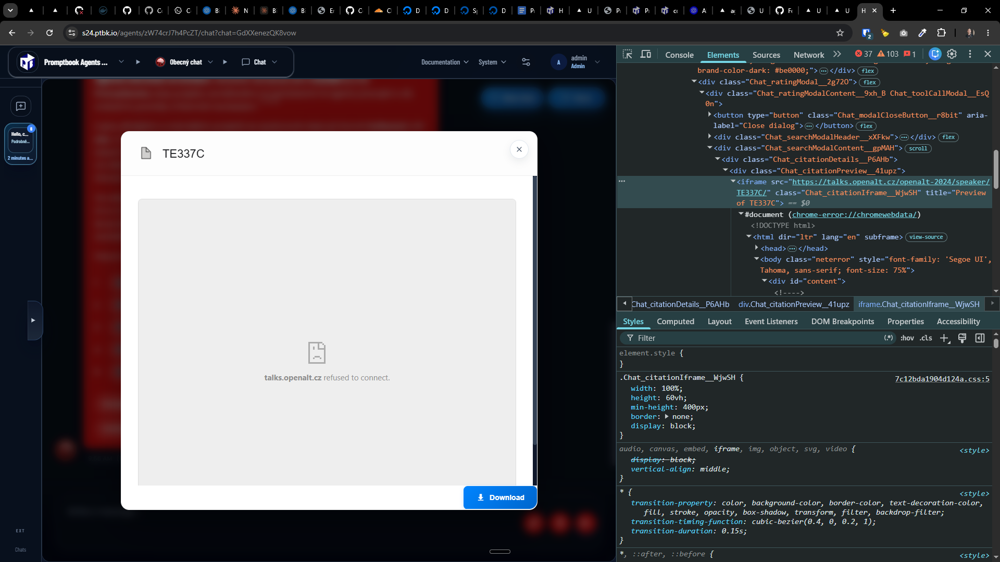

[ ]

[✨🏣] When showing a source in chat the source page isnt controlled by us and can have disallowed showing in iframe, fix it

> Refused to display 'https://talks.openalt.cz/' in a frame because it set multiple 'X-Frame-Options' headers with conflicting values ('DENY, SAMEORIGIN'). Falling back to 'deny'.

-   Before rendering iframe, check if the source page allows it, and if not, show a printscreen of the source from the browser on the server and the link to open the source in a new tab, instead of showing the iframe
-   Keep in mind the DRY _(don't repeat yourself)_ principle.
-   Do a proper analysis of the current functionality before you start implementing.
-   You are working with the [Agents Server](apps/agents-server)

