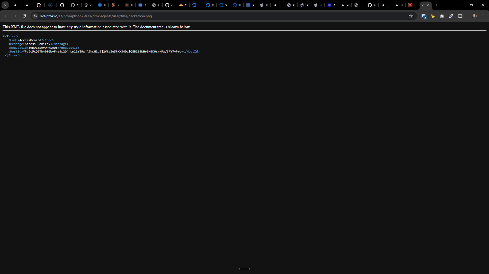

[x] $3.59 an hour by Claude Code

[✨😂] Images uploades to internal S3 must be publicly accessible but with unguessable URL

-   The URL should not be `https://s24.ptbk.io/s3/promptbook-files/ptbk-agents/user/files/hackathon.png` but instad `https://s24.ptbk.io/s3/e/9/e994e149d97c191193400a03b799bf23d43a236b889b188754ac9c9a07d72b57/hackathon.png`
-   It must contain some unique identifier and also do not expose the internal S3 structure and buckets
-   Keep in mind the DRY _(don't repeat yourself)_ principle.
-   Do a proper analysis of the current functionality before you start implementing.
-   You are working with the [Agents Server](apps/agents-server)



**This is how the Agents server is installed:**

The internal S3 is picked

```bash
root@collboard-agents-server-x21:~# sudo curl -fsSL https://raw.githubusercontent.com/webgptorg/promptbook/refs/heads/main/other/vps/install.sh | bash
```

