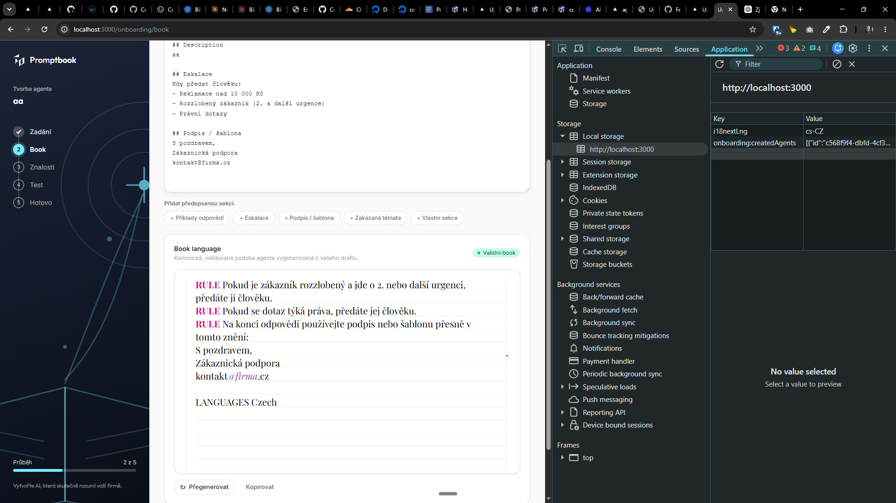

[x] $1.10 an hour by Claude Code

[✨🔆] The book editor should not have hardcoded commitments but highlite anything UPPERCASE on new line

```book
Agent name

COMMITMENT Contents of the commitment
COMMITMENT Another commitment

Which can have multiple lines

COMMITMENT
FOOBARCOMMITMENT

COMMITMENT CONTAINING MULTIPLE WORDS But from here on, it is the content of the commitment

- NOT A COMMITMENT because it starts with a dash

```

-   The first non empty line is the agent name and not a commitment
-   Any line that starts with UPPERCASE word is a commitment, and the rest of the line is the content of the commitment
-   Commitment must have all UPPERCASE letters and words, and the content of the commitment can have any case
-   Now the commitments are enumerated, but they should not be enumerated, just highlite based on the UPPERCASE word(s) at the beginning of the line
-   Keep in mind the DRY _(don't repeat yourself)_ principle.
-   Do a proper analysis of the current functionality before you start implementing.
-   You are working with the [`<BookEditor/>` component](src/book-components/BookEditor/BookEditor.tsx)



