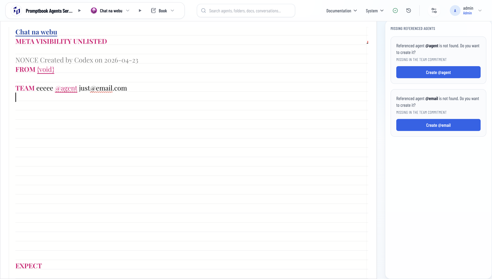

[x] $0.6043 28 minutes by Claude Code

---

[x] ~$0.3133 an hour by OpenAI Codex `gpt-5.5`

[✨🔆] The referenced agents in the syntax highlite should not highlite `team@foo.bar`

```book

Agent

TEAM @Paul and {Erik Smith} with email team@foo.bar

```

-   The `@Paul` is a reference to the agent `Paul` and should be highlited
-   The `{Erik Smith}` is a reference to the agent `Erik Smith`
-   The `team@foo.bar` is just a text and should **not be highlited as a reference to an agent**
-   The `@` references must have whitespace before
-   Keep in mind the DRY _(don't repeat yourself)_ principle.
-   Do a proper analysis of the current functionality before you start implementing.
-   You are working with the [`<BookEditor/>` component](src/book-components/BookEditor/BookEditor.tsx)


---


[ ] 

[✨🔆] The referenced agents should not parse `just@email.com `


```book
Agent

TEAM @Teammate just@email.com 
```

- @@@@@@@@@@@
-   The `@Paul` is a reference to the agent `Paul` and should be highlited
-   The `{Erik Smith}` is a reference to the agent `Erik Smith`
-   The `team@foo.bar` is just a text and should **not be highlited as a reference to an agent**
-   The `@` references must have whitespace before
-   Keep in mind the DRY _(don't repeat yourself)_ principle.
-   Do a proper analysis of the current functionality before you start implementing.



