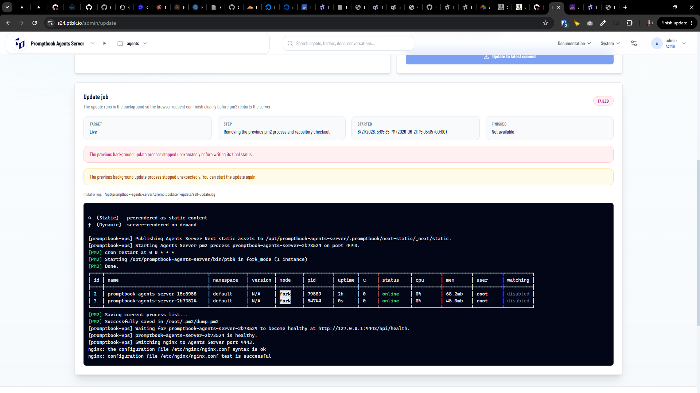

[x] $8.25 36 minutes by Claude Code

[✨🧐] The self-update of the Agents server should show more info

-   On `/admin/update` of Agents server you can trigger the self-update of the server
-   Show information how many commits behind and and how much time behind the server is from the latest version
-   Also allow to update to any arbitrary commit, not just the 4 predefined releases
    -   But warn the user if they try to update to a commit that is not a release, because it might be unstable and not properly tested
-   Format the dates in human-readable format, for example "2 days ago" instead of "2026-06-01T12:00:00Z", use moment.js which is already used in the project for date formatting, the localization should be according to the active language of the UI
-   Order of the target environments should be: Live / `main`, Preview / `preview`, Production / `production`, LTS / `lts`, Custom
-   Allow to set origin repository, by default it is `https://github.com/webgptorg/promptbook` but allow the superadmin change it to any other repository which is forked from the original one, so that the server can be updated from any other repository, not just the original one
    But this feature is for advanced users, so it should be hidden by default and only shown when the user clicks on "Advanced" or "Custom" or something like that
-   When picking from custom show the graph of the git tree, allow to pick by commit hash, filter by message, contents of the commit message, author, date, tag, branch, etc.
-   This picking should be shown only after the user clicks on "Custom" and should be hidden by default, because it is an advanced feature
-   Keep in mind the DRY _(don't repeat yourself)_ principle.
-   Do a proper analysis of the current functionality before you start implementing.
-   You are working with the [Agents Server](apps/agents-server)

---

[ ]

[✨🧐] The self-update of the Agents server should show more info

-   On `/admin/update` of Agents server you can trigger the self-update of the server
-   Show information how many commits behind and and how much time behind the server is from the latest version
-   On all commits show commit subject, hash and date
-   Show also how many commits and time are we behind the current version,
-   Keep in mind the DRY _(don't repeat yourself)_ principle.
-   Do a proper analysis of the current functionality before you start implementing.
-   You are working with the [Agents Server](apps/agents-server)
