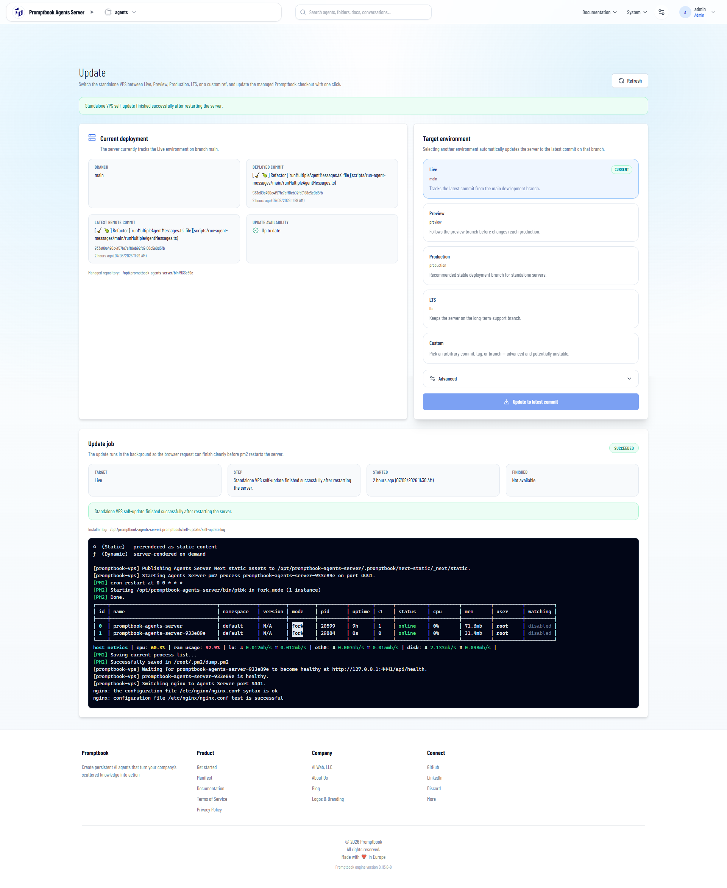

[x] ~$0.7086 2 hours by OpenAI Codex `gpt-5.5`

[✨🧐] The self-update of the Agents server should run automatically

-   On `/admin/update` of Agents server you can trigger the self-update of the server, it works propperly
-   But the server must be able to self-update automatically without the need of a user to trigger the update manually.
-   The server is on one of the following branches: `main`, `preview`, `production`, `lts`. The server should be able to self-update automatically when its branch is updated to a new version. The server should be able to self-update automatically when its branch is updated to a new version.
-   The toggle if the server should self-update automatically should be configured in the `.env` file of the server as well as the current branch and the interval as a cron job. The default interval should be `0 0 * * *` (every day at midnight).
-   The env can be already changed from the UI (`/admin/environment`) but for this purpose allow theese 3 env variables to be changed directly in the `/admin/update`
    -   The `/admin/environment` will stay as it is, but the `/admin/update` will have a new option for the self-update configuration.
    -   Share the code for updating the env variables between the `/admin/environment` and `/admin/update` so that the code is not repeated.
-   Keep the zero downtime principle in mind, the server should be able to self-update without downtime - updating is happening during the server is running and serving requests. Then after the update is finished, the server is switched to the new version and continues serving requests without downtime.
-   When the self-update is happening, it should show the process in `/admin/update` and also `/admin/task-manager`, just distinguish between the self-update and the manual update triggered by a user.
-   Keep in mind the DRY _(don't repeat yourself)_ principle.
-   Do a proper analysis of the current functionality before you start implementing.
-   You are working with the [Agents Server](apps/agents-server)

