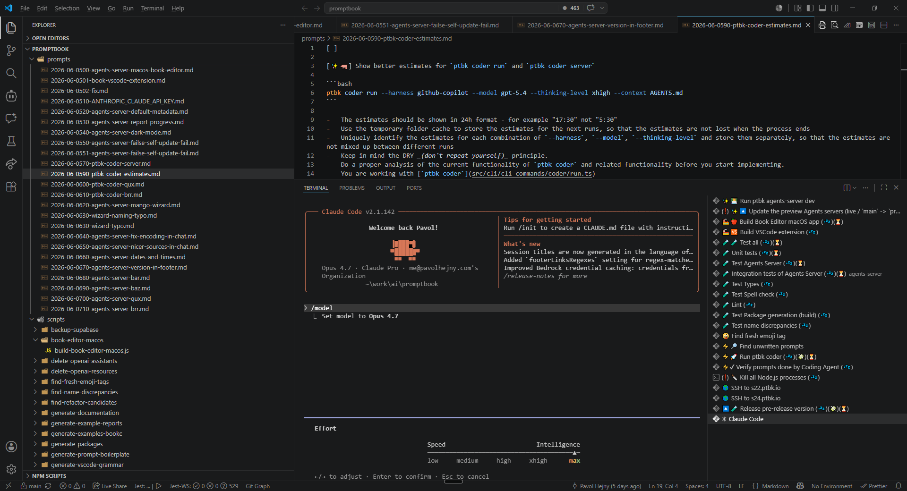

[ ]

[✨🐩] Allow to pass `--thinking-level` to the `ptbk` cli commands when using `--harness claude-code`

**For example:**

```bash
ptbk coder run --harness claude-code --model claude-opus-4.8 --thinking-level xhigh --context AGENTS.md
ptbk coder server --harness claude-code --model claude-opus-4.8 --thinking-level max --context AGENTS.md
...
```

-   There is no `--thinking-level` option for the Claude code BUT there is equivalent "effort" parameter that can be passed to the harness
-   Look at the claude code documentation
-   Keep in mind the DRY _(don't repeat yourself)_ principle.
-   Do a proper analysis of the current functionality of `ptbk` and related functionality before you start implementing.
-   You are working with [`ptbk`](src/cli/cli-commands/)
-   Add the changes into the [changelog](changelog/_current-preversion.md)
-   Look at [terminals.json](.vscode/terminals.json) and update the usage of the coder


