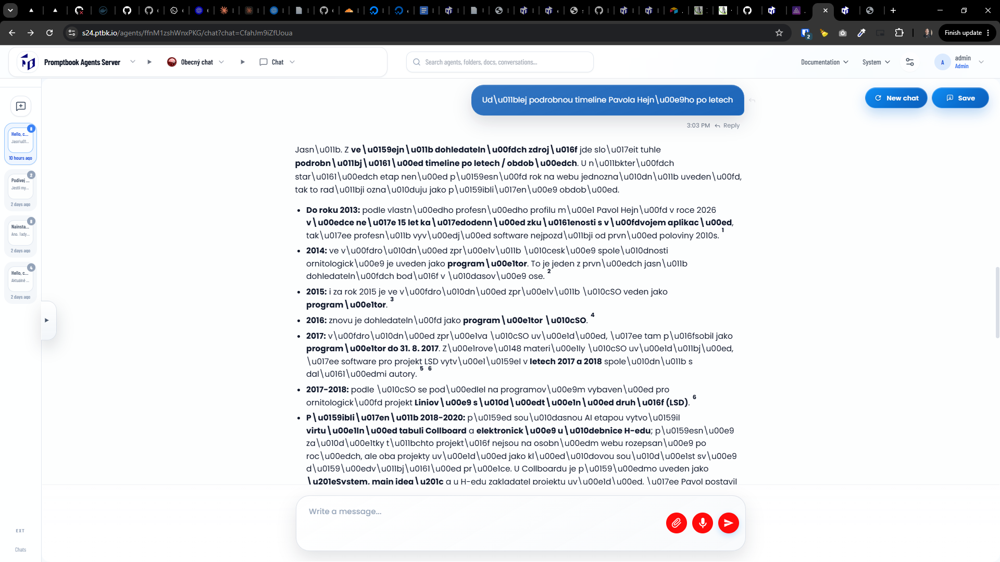

[x] ~$0.6080 an hour by OpenAI Codex `gpt-5.5`

[✨🏴] In the chat there are shown chars as "dohledateln\u00fdch zdroj\u"

```
Jasn\u011b. Z ve\u0159ejn\u011b dohledateln\u00fdch zdroj\u016f jde slo\u017eit tuhle podrobn\u011bj\u0161\u00ed timeline po letech / obdob\u00edch. U n\u011bkter\u00fdch star\u0161\u00edch etap nen\u00ed p\u0159esn\u00fd rok na webu jednozna\u010dn\u011b uveden\u00fd, tak to rad\u011bji ozna\u010duju jako p\u0159ibli\u017en\u00e9 obdob\u00ed.

Do roku 2013: podle vlastn\u00edho profesn\u00edho profilu m\u00e1 Pavol Hejn\u00fd v roce 2026 v\u00edce ne\u017e 15 let ka\u017edodenn\u00ed zku\u0161enosti s v\u00fdvojem aplikac\u00ed, tak\u017ee profesn\u011b vyv\u00edj\u00ed software nejpozd\u011bji od prvn\u00ed poloviny 2010s. 1
2014: ve v\u00fdro\u010dn\u00ed zpr\u00e1v\u011b \u010cesk\u00e9 spole\u010dnosti ornitologick\u00e9 je uveden jako program\u00e1tor. To je jeden z prvn\u00edch jasn\u011b dohledateln\u00fdch bod\u016f v \u010dasov\u00e9 ose. 2
2015: i za rok 2015 je ve v\u00fdro\u010dn\u00ed zpr\u00e1v\u011b \u010cSO veden jako program\u00e1tor. 3
2016: znovu je dohledateln\u00fd jako program\u00e1tor \u010cSO. 4
2017: v\u00fdro\u010dn\u00ed zpr\u00e1va \u010cSO uv\u00e1d\u00ed, \u017ee tam p\u016fsobil jako program\u00e1tor do 31. 8. 2017. Z\u00e1rove\u0148 materi\u00e1ly \u010cSO uv\u00e1d\u011bj\u00ed, \u017ee software pro projekt LSD vytv\u00e1\u0159el v letech 2017 a 2018 spole\u010dn\u011b s dal\u0161\u00edmi autory. 56
2017-2018: podle \u010cSO se pod\u00edlel na programov\u00e9m vybaven\u00ed pro ornitologick\u00fd projekt Liniov\u00e9 s\u010d\u00edt\u00e1n\u00ed druh\u016f (LSD). 6
```

-   It should show the correct encoding of the chars in the chat, for example "dohledatelných zdrojů" instead of "dohledateln\u00fdch zdroj\u016f"
-   Analyze the reason why the encoding is wrong and do the proper fix, Do a proper analysis of the current functionality before you start implementing.
-   You are working with the [Agents Server](apps/agents-server)



