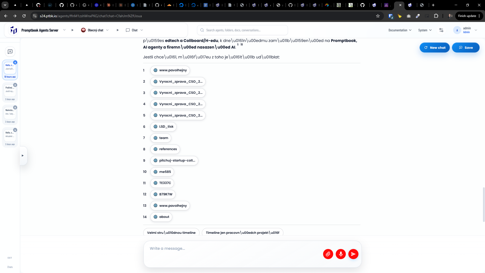

[x] by OpenAI Codex `gpt-5.5` *(commited manually)*

[✨♐️] When showing the sources in the chat, show them in a nicer way

**Now the sources are shown like:**

```
1

🌐
www.pavolhejny
2

🌐
Vyrocni_zprava_CSO_2...
3

🌐
Vyrocni_zprava_CSO_2...
4

🌐
Vyrocni_zprava_CSO_2...
5

🌐
Vyrocni_zprava_CSO_2...
6

🌐
LSD_tisk
7

🌐
team
8

🌐
references
9

🌐
pitchuj-startup-coll...
```

-   Instead of raw text from the url show the title of the pag or heading of the document, for example "Výroční zpráva ČSO 2020" instead of "https://www.cso.cz/documents/10180/20551765/Vyrocni_zprava_CSO_2020.pdf"
-   Keep in mind the DRY _(don't repeat yourself)_ principle.
-   Do a proper analysis of the current functionality before you start implementing.
-   You are working with the [Agents Server](apps/agents-server)
-   Add the changes into the [changelog](changelog/_current-preversion.md)


