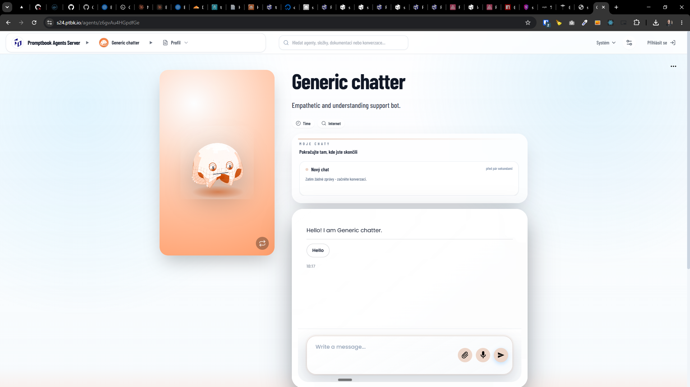
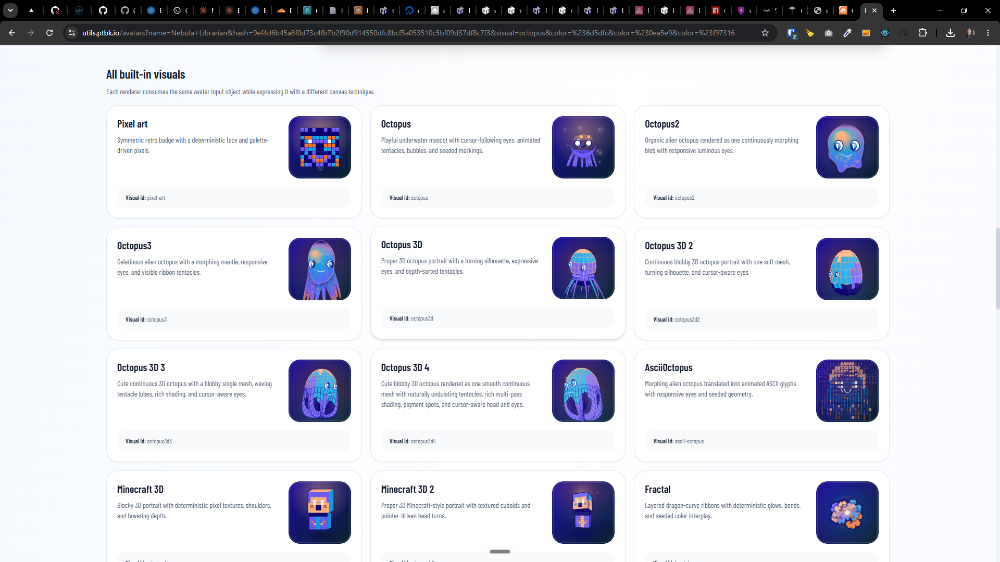

[x] (2 attempts) $2.44 6 hours by Claude Code `fable`

[✨🟣] When `--agent` present in `ptbk coder`, show the visual as ASCII

```bash
me@DESKTOP-2QD9KQQ MINGW64 ~/work/ai/promptbook (main)
$ npx ts-node ./src/cli/test/ptbk.ts coder server --harness openai-codex --model gpt-5.5 --thinking-level xhigh --agent agents/coding/developer.book --context AGENTS.md --priority 0 --test npm run test-for-ptbk-coder
Starting prompt runner in server (keep-alive) mode…

                               ▄▄▄▄ ▄▄▄▄▄▄ ▄▄▄▄  ▄▄ ▄▄   ▄▄  ▄▄▄
                               ██▄█▀  ██   ██▄██ ██▄█▀   ██ ██▀██
                               ██     ██   ██▄█▀ ██ ██ ▄ ██ ▀███▀

┌ Session ─────────────────────────────────────────────────────────────────────────────────────┐
│ State     PAUSED  Paused before checking the git working tree                                │
│ Runner   codex  ·  gpt-5.5  ·  thinking xhigh                                                │
│ Context  AGENTS.md                                                                           │
│ Server   http://localhost:4441                                                               │
│ Test     npm run test-for-ptbk-coder                                                         │
│ This run Task 3/3  ·  2 done  ·  1 left                                                      │
│ Backlog  Repo 610 total                                                                      │
│ Scope    Priority ≥0  ·  Write 100 prompts first                                             │
│ Timing   Elapsed 2h 48m  ·  Total 4h 12m  ·  ETA Today 19:25                                 │
│ Progress ████████████████████████████████████████░░░░░░░░░░░░░░░░░░░ 67% complete (2/3 done) │
└──────────────────────────────────────────────────────────────────────────────────────────────┘
┌ Current task ────────────────────────────────────────────────────────────────────────────────┐
│ prompts/2026-06-0870-ptbk-coder-npx-vs-no-npx.md#1                                           │
│ Attempt 1/3  ·  Paused before checking the git working tree                                  │
└──────────────────────────────────────────────────────────────────────────────────────────────┘
┌ Live output ─────────────────────────────────────────────────────────────────────────────────┐
│ ›    - Local:        http://localhost:4440                                                   │
│ ›    - Network:      http://192.168.56.1:4440                                                │
│ ›  ✓ Starting...                                                                             │
│ ›  ✓ Ready in 2.9s                                                                           │
│ › (node:8176) [DEP0040] DeprecationWarning: The `punycode` module is deprecated. Please u... │
│ › (Use `node --trace-deprecation ...` to show where the warning was created)                 │
│ › Prerendered home page and saved to C:\Users\me\work\ai\promptbook\apps\agents-server\.n... │
│ › 🎉 All tests passed!                                                                       │
└──────────────────────────────────────────────────────────────────────────────────────────────┘
┌ Controls ────────────────────────────────────────────────────────────────────────────────────┐
│  P  Resume   CTRL+C  Exit                                                                    │
└──────────────────────────────────────────────────────────────────────────────────────────────┘
```

-   Agents has visuals on website
-   But on the terminal, there is only ugly ASCII text "PTBK.IO"
-   When `--agent` present in `ptbk coder`, show the visual as ASCII
-   Make some universal function / technique to convert the actual visuals into ASCII for the terminal dynamically
-   Keep in mind the DRY _(don't repeat yourself)_ principle.
-   Do a proper analysis of the current functionality of `ptbk coder` and related functionality before you start implementing.
-   You are working with [`ptbk coder`](src/cli/cli-commands/coder/run.ts)
-   Add the changes into the [changelog](changelog/_current-preversion.md)




---

[ ]

[✨🟣] Enhance visual representation when `--agent` present in `ptbk coder`

-   Agents has visuals on website which is in the 1:1 aspect ratio rectangle with background color
-   But on the terminal there should be variant with horizontal rectangle and backgroundless
-   This is relevant when `--agent` present in `ptbk coder`
-   Keep in mind the DRY _(don't repeat yourself)_ principle, the visual representation should be same for web and terminal, just different aspect ratio and background, but reuse the code which generates the visual representation
-   Also in the terminal UI the visual representation should be animated in a same way as on the web
-   Do a proper analysis of the current functionality of `ptbk coder`, agent avatars and related functionality before you start implementing.
-   You are working with [`ptbk coder`](src/cli/cli-commands/coder/run.ts)
-   Add the changes into the [changelog](changelog/_current-preversion.md)


