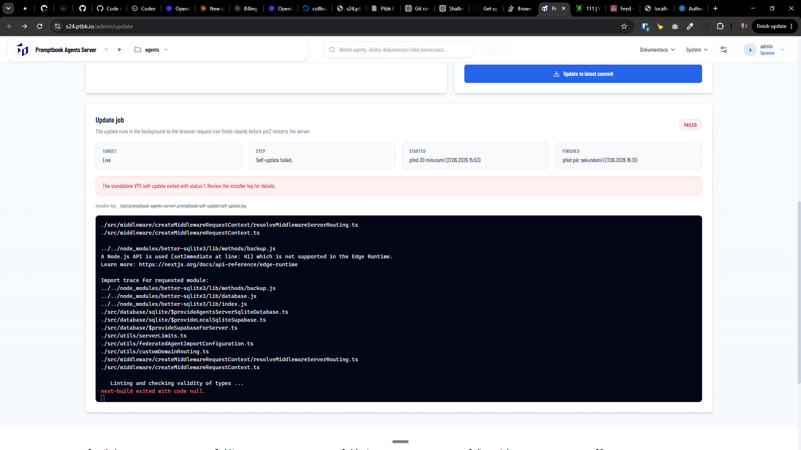

[ ] !!!!!

[✨🌧] Fix the update of the Agents server

-   On `/admin/update` of Agents server you can trigger the self-update of the server
-   This update is failing with the following error:
-   Look at the [log file](prompts/2026-06-0930-agents-server-fix-update.log)
-   You can look at testing server https://s24.ptbk.io/ or ssh into the VPS `s24.ptbk.io` and check the logs
-   Keep in mind the DRY _(don't repeat yourself)_ principle.
-   Do a proper analysis of the current functionality before you start fixing.
-   You are working with the [Agents Server](apps/agents-server)
-   If you need to do the database migration, do it

