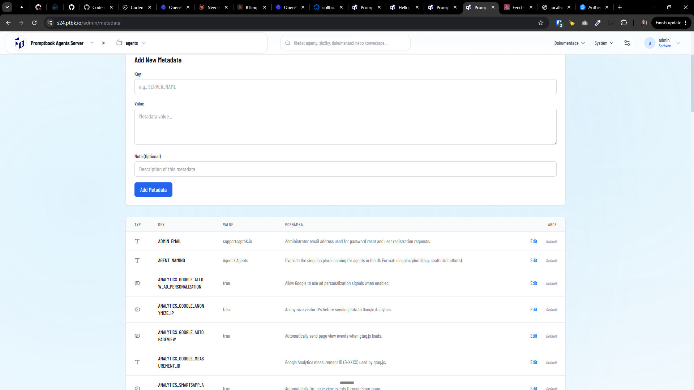

[ ] !!!

[✨🐺] Allow to import and export the metadata of the server

-   On page `/admin/metadata` should be button to export / import all the metadata
- Export should be JSON looking like:

{
    "promptbookVersion": "...",
    "metadata": [
        {
            key: "FOO",
            value: "...",
            "note": "..."
        }
    ]
}

- Do not export values which are default
- Do not export note where it is default
- Exporting from configured server and importing to fresh server should effectively recreate the metadata confifuration
- File name of the export should be name-of-the-server.metadata.json
-   Keep in mind the DRY _(don't repeat yourself)_ principle.
-   Do a proper analysis of the current functionality before you start implementing.
-   You are working with the [Agents Server](apps/agents-server) with `/admin/metadata`
-   This isnt replacing the export / backup of the data of entire server
    - But you can reuse the code
-   Add the changes into the [changelog](changelog/_current-preversion.md)

