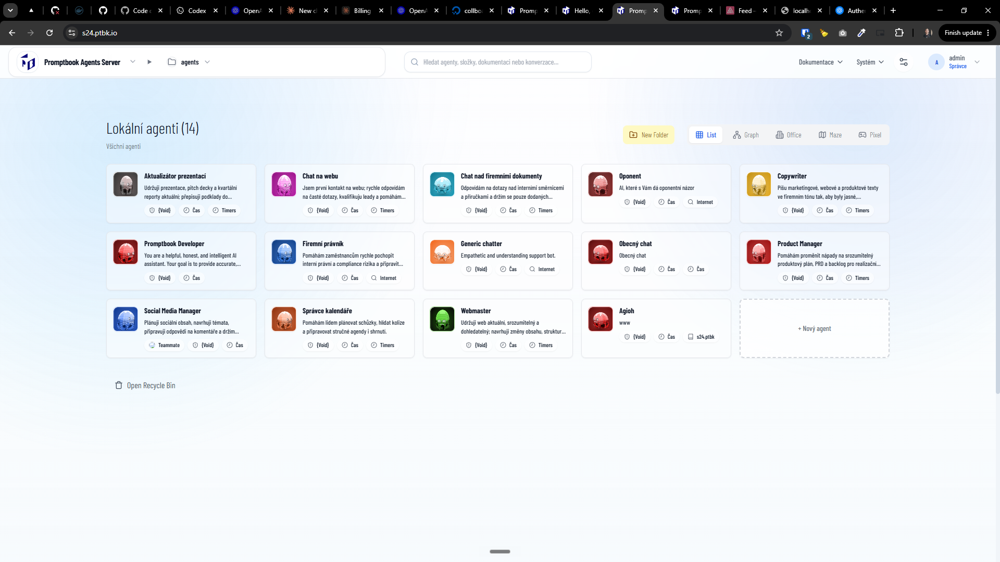

[x] ~$0.9210 2 hours by OpenAI Codex `gpt-5.5`

[✨🚕] Allow to download (export) and drop the agents of the server

-   Export should be zip file with books in folder structure
-   Exporting add the agents and dropping them to the fresh server should effectively recreate agents from that server
-   If there is duplicite agent with same book, do not care
-   If there is duplicite agent with different book, ask user what to do
-   Allow to drop both individual book files or zip files with books
-   If the zip contains other file then book, just warn the user if he wants to proceed
-   If the user drops zip file inside a folder, embed the structure inside this folder
-   For now, Do not care about external files and links
-   File name of the export should be name-of-the-server.agents.zip
-   Keep in mind the DRY _(don't repeat yourself)_ principle.
-   Do a proper analysis of the current functionality before you start implementing.
-   You are working with the [Agents Server](apps/agents-server) with agent lising
-   This isnt replacing the export / backup of the data of entire server
    -   But you can reuse the code
-   Add the changes into the [changelog](changelog/_current-preversion.md)

---

[x] ~$0.4584 2 hours by OpenAI Codex `gpt-5.5`

[✨🚕] Modify import / export of the agents

-   Remove the "import" button _(you can drag/drop so no need for the button)_ and rename "export" to "download"
-   If the user drops zip file inside a folder, put agents inside this folder
-   If user exports from folder, export only the agents from this folder, not all the agents of the server
-   Keep in mind the DRY _(don't repeat yourself)_ principle.
-   Do a proper analysis of the current functionality before you start implementing.
-   You are working with the [Agents Server](apps/agents-server) with agent lising
-   Add the changes into the [changelog](changelog/_current-preversion.md)

---

[x] $3.72 28 minutes by Claude Code

[✨🚕] Modify import of the agents

-   If the user drops zip file inside a folder on the agents server, put the imported agents inside this folder
    -   For example `https://s24.ptbk.io/?folder=xxx` drops a zip file with agents, the agents should be imported into the folder `xxx`
-   Do a proper analysis of the current functionality before you start implementing.
-   You are working with the [Agents Server](apps/agents-server) with agent lising

