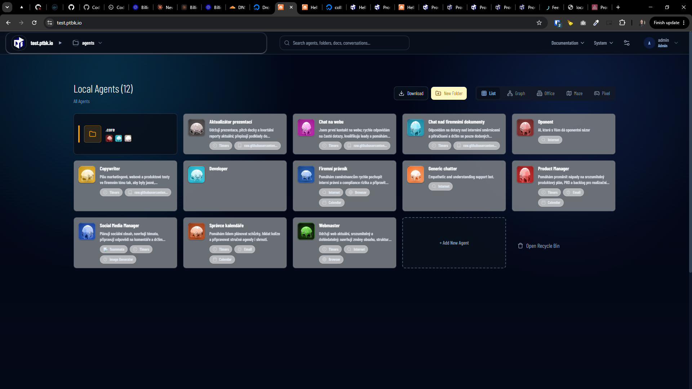
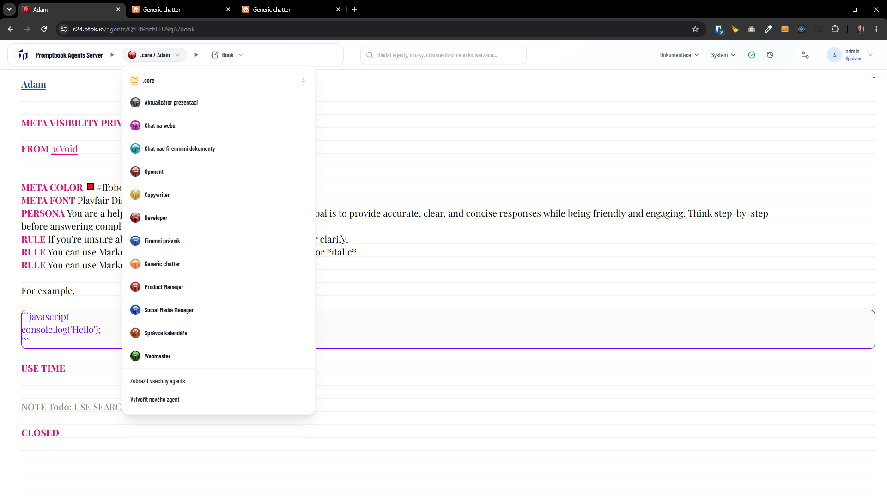

[x] $15.13 an hour by Claude Code

[✨🥲] Cancel the core server and create `.core` folder instad

-   Common agents are now taken from the remote core server but should be taken from the local folder `.core` on the current agents server, so that the agents server can run without the core server

-   Purpose of this change is to allow the agents server to run without any external dependencies, so that it can be used in isolated environments or in situations where the core server is not available, unresponsive, etc.
-   The core agents should be copied from `agents/default/.core`, Adam agent is in `agents/default/.core/adam.book`
-   The `CORE_AGENTS_SERVER` shouldnt be here
-   Keep in mind the DRY _(don't repeat yourself)_ principle.
-   Do a proper analysis of the current functionality before you start implementing.
-   You are working with the [Agents Server](apps/agents-server)
-   It doesnt matter what visibility the Adam agent have, it should be automatically used in all agents
-   If there is no .core folder on agents server or/and no well-known agents Adam or/and teacher, auto-create them
    Reuse the same mechanism as creating the default agents on the server start
-   Keep the option for federated servers
    -   but by default, the agents server has no federated server
    -   And there is no special core federated server, all federated servers are equal, so the core agents should be taken from the local `.core` folder
-   Add the changes into the [changelog](changelog/_current-preversion.md)

---

[x] $6.43 2 hours by Claude Code

[✨🥲] Listing of the `.` agent folders should be hidden by default

-   Add toggle to show/hide the `.` folders in the agents server
-   This is relevant for all folders starting with `.` like `.core` folder
-   Keep in mind the DRY _(don't repeat yourself)_ principle.
-   Do a proper analysis of the current functionality before you start implementing.
-   You are working with the [Agents Server](apps/agents-server)



---

[x] ~$0.5769 an hour by OpenAI Codex `gpt-5.5`

[✨🥲] Listing of the `.` agent folders should be hidden in the header menu

-   This is relevant for all folders starting with `.` like `.core` folder
-   Keep in mind the DRY _(don't repeat yourself)_ principle.
-   Do a proper analysis of the current functionality before you start implementing.
-   You are working with the [Agents Server](apps/agents-server)



---

[!] failed after 38 minutes by Claude Code `fable`

---

[x] ~$1.87 3 hours by OpenAI Codex `gpt-5.5`

[✨🥲] Make inheritance of agents working

-   When `FROM` commitment is used in the agent book, the agent should inherit from referenced agent
-   When the `FROM` commitment is not used, inherit from the `Adam` agent
-   When the `FROM @Void` / `FROM {Void}` is used, the agent should not inherit from any agent
-   But now it always behaves as if `FROM @Void` is used, so the agent does not inherit from any agent, and this is not correct
-   Keep in mind the DRY _(don't repeat yourself)_ principle.
-   Do a proper analysis of the current functionality before you start implementing.
-   You are working with the [Agents Server](apps/agents-server)

```book
Generic chatter

FROM @Basic

GOAL Empathetic and understanding support bot.

CLOSED

```

