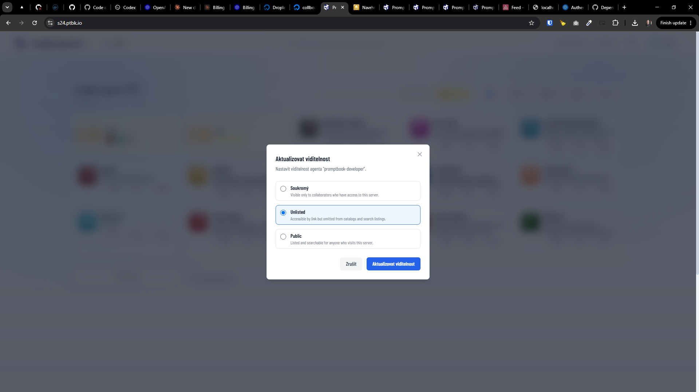

[x] ~$0.00 2 hours by OpenAI Codex `gpt-5.5`

[✨⏱] Create new commitment `META VISIBILITY`

```book
Some agent

GOAL Be helpful and friendly
META VISIBILITY PUBLIC
```

-   Now the visibility of the agents is stored in the database, you can keep it there BUT the primary source of truth should be in the agent book
-   Preserve the option to change the visibility of the agent from the menu, this should update the agent book
    -   
-   The `META VISIBILITY` should have just 3 values `PUBLIC`, `PRIVATE`, and `UNLISTED`
    -   Whitespace or case does not matter, it should be normalized to uppercase and trimmed
-   Keep in mind the DRY _(don't repeat yourself)_ principle.
-   Do a proper analysis of the current functionality before you start implementing.
-   You are working with the [Agents Server](apps/agents-server)
-   Update agents in `agents/default` and make all `PRIVATE` and "Generic chatter" `PUBLIC` _(theese are just default agents loaded during server initialization)_
-   If you need to do the database migration, do it
-   Add the changes into the [changelog](changelog/_current-preversion.md)

---

[x] ~$0.2499 an hour by OpenAI Codex `gpt-5.5`

[✨⏱] When creating initial books, respect `META VISIBILITY`

-   For example, when creating the initial book for the agent "Generic chatter" which has here `META VISIBILITY PUBLIC`, on the server it should be created as `PUBLIC`
-   But on the server the book has `META VISIBILITY UNLISTED`
-   Keep in mind the DRY _(don't repeat yourself)_ principle.
-   Do a proper analysis of the current functionality before you start implementing.
-   You are working with the [Agents Server](apps/agents-server)

