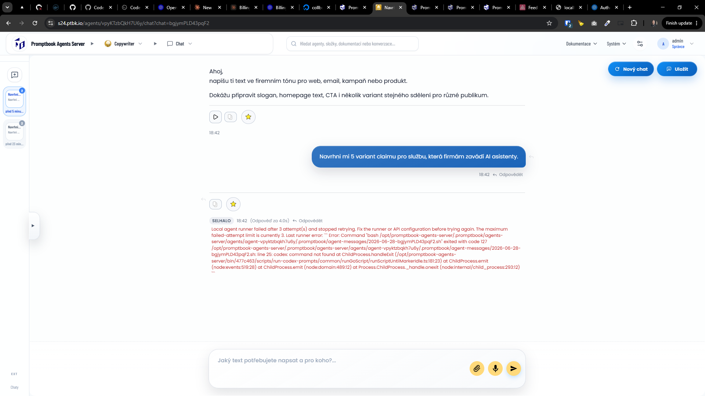

[ ] !!!!

[✨⌚️] Fix the installed server failing on "Local agent runner failed after 3 attempt(s) and stopped retrying. Fix the runner or API configuration before trying again. The maximum failed-attempt limit is currently 3. Last runner error: ``` Error: Command "bash …"

-   Agents are failing
-   Probably because the server is not installed properly, `codex` is missing on the server
-   When openai api key is set either via terminal question or via `--openai-api-key`, the openai codex must be installed and configured
-   Keep in mind the DRY _(don't repeat yourself)_ principle.
-   Do a proper analysis of the current functionality before you start implementing.
-   You are working with the [Agents Server](apps/agents-server)



````json
{
    "summary": "Local agent runner failed after 3 attempt(s) and stopped retrying.\n\nFix the runner or API configuration before trying again. The maximum failed-attempt limit is currently 3.\n\nLast runner error:\n```\nError: Command \"bash /opt/promptbook-agents-server/.promptbook/agents-server/agents/agent-vpyktzbqkh7u6y/.promptbook/agent-messages/2026-06-28-bgjymPLD43pqF2.sh\" exited with code 127\n\n/opt/promptbook-agents-server/.promptbook/agents-server/agents/agent-vpyktzbqkh7u6y/.promptbook/agent-messages/2026-06-28-bgjymPLD43pqF2.sh: line 25: codex: command not found\n    at ChildProcess.handleExit (/opt/promptbook-agents-server/bin/477c463/scripts/run-codex-prompts/common/runGoScript/runScriptUntilMarkerIdle.ts:181:23)\n    at ChildProcess.emit (node:events:519:28)\n    at ChildProcess.emit (node:domain:489:12)\n    at Process.ChildProcess._handle.onexit (node:internal/child_process:293:12)\n```",
    "source": "localRunnerFailedFile",
    "recordedAt": "2026-06-28T16:42:34.282Z",
    "provider": "local-agent-runner",
    "generationDurationMs": null,
    "error": null,
    "diagnostics": null,
    "job": {
        "id": "18677z28bZXgTr",
        "status": "RUNNING",
        "userId": 6,
        "agentPermanentId": "vpyKTzbQkH7U6y",
        "chatId": "bgjymPLD43pqF2",
        "userMessageId": "UB3DhNcdf7xVpS",
        "assistantMessageId": "M5AnvFL9sE5mc4",
        "clientMessageId": "QWt896fnuiyQ5aZ43A",
        "attemptCount": 1,
        "queuedAt": "2026-06-28T16:42:23.604Z",
        "startedAt": "2026-06-28T16:42:30.241Z",
        "updatedAt": "2026-06-28T16:42:30.290Z",
        "lastHeartbeatAt": "2026-06-28T16:42:30.290Z",
        "leaseExpiresAt": null
    }
}
````

```console
0|promptbook-agents-server  | 2026-06-28T16:42:24: [next] }
0|promptbook-agents-server  | 2026-06-28T16:42:31: Processing agent-vpyktzbqkh7u6y with Copywriter.
0|promptbook-agents-server  | 2026-06-28T16:42:31: Processing messages/queued/2026-06-28-bgjymPLD43pqF2.book
0|promptbook-agents-server  | 2026-06-28T16:42:31: /opt/promptbook-agents-server/.promptbook/agents-server/agents/agent-vpyktzbqkh7u6y/.promptbook/agent-messages/2026-06-28-bgjymPLD43pqF2.sh: line 25: codex: command not found
0|promptbook-agents-server  | 2026-06-28T16:42:31:
0|promptbook-agents-server  | 2026-06-28T16:42:31: Error: Command "bash /opt/promptbook-agents-server/.promptbook/agents-server/agents/agent-vpyktzbqkh7u6y/.promptbook/agent-messages/2026-06-28-bgjymPLD43pqF2.sh" exited with code 127
0|promptbook-agents-server  | 2026-06-28T16:42:31:
0|promptbook-agents-server  | 2026-06-28T16:42:31: /opt/promptbook-agents-server/.promptbook/agents-server/agents/agent-vpyktzbqkh7u6y/.promptbook/agent-messages/2026-06-28-bgjymPLD43pqF2.sh: line 25: codex: command not found
0|promptbook-agents-server  | 2026-06-28T16:42:31:     at ChildProcess.handleExit (/opt/promptbook-agents-server/bin/477c463/scripts/run-codex-prompts/common/runGoScript/runScriptUntilMarkerIdle.ts:181:23)
0|promptbook-agents-server  | 2026-06-28T16:42:31:     at ChildProcess.emit (node:events:519:28)
0|promptbook-agents-server  | 2026-06-28T16:42:31:     at ChildProcess.emit (node:domain:489:12)
0|promptbook-agents-server  | 2026-06-28T16:42:31:     at Process.ChildProcess._handle.onexit (node:internal/child_process:293:12)
0|promptbook-agents-server  | 2026-06-28T16:42:31: Logged recoverable watcher failure to /opt/promptbook-agents-server/.logs/ptbk-agent-error-2026-06-28T16-42-31-181Z.log. Continuing to watch...
0|promptbook-agents-server  | 2026-06-28T16:42:31: Processing agent-vpyktzbqkh7u6y with Copywriter.
0|promptbook-agents-server  | 2026-06-28T16:42:31: Processing messages/queued/2026-06-28-bgjymPLD43pqF2.book
0|promptbook-agents-server  | 2026-06-28T16:42:31: /opt/promptbook-agents-server/.promptbook/agents-server/agents/agent-vpyktzbqkh7u6y/.promptbook/agent-messages/2026-06-28-bgjymPLD43pqF2.sh: line 25: codex: command not found
0|promptbook-agents-server  | 2026-06-28T16:42:31:
0|promptbook-agents-server  | 2026-06-28T16:42:31: Error: Command "bash /opt/promptbook-agents-server/.promptbook/agents-server/agents/agent-vpyktzbqkh7u6y/.promptbook/agent-messages/2026-06-28-bgjymPLD43pqF2.sh" exited with code 127
0|promptbook-agents-server  | 2026-06-28T16:42:31:
0|promptbook-agents-server  | 2026-06-28T16:42:31: /opt/promptbook-agents-server/.promptbook/agents-server/agents/agent-vpyktzbqkh7u6y/.promptbook/agent-messages/2026-06-28-bgjymPLD43pqF2.sh: line 25: codex: command not found
0|promptbook-agents-server  | 2026-06-28T16:42:31:     at ChildProcess.handleExit (/opt/promptbook-agents-server/bin/477c463/scripts/run-codex-prompts/common/runGoScript/runScriptUntilMarkerIdle.ts:181:23)
0|promptbook-agents-server  | 2026-06-28T16:42:31:     at ChildProcess.emit (node:events:519:28)
0|promptbook-agents-server  | 2026-06-28T16:42:31:     at ChildProcess.emit (node:domain:489:12)
0|promptbook-agents-server  | 2026-06-28T16:42:31:     at Process.ChildProcess._handle.onexit (node:internal/child_process:293:12)
0|promptbook-agents-server  | 2026-06-28T16:42:31: Logged recoverable watcher failure to /opt/promptbook-agents-server/.logs/ptbk-agent-error-2026-06-28T16-42-31-305Z.log. Continuing to watch...
0|promptbook-agents-server  | 2026-06-28T16:42:31: Processing agent-vpyktzbqkh7u6y with Copywriter.
0|promptbook-agents-server  | 2026-06-28T16:42:31: Processing messages/queued/2026-06-28-bgjymPLD43pqF2.book
0|promptbook-agents-server  | 2026-06-28T16:42:31: /opt/promptbook-agents-server/.promptbook/agents-server/agents/agent-vpyktzbqkh7u6y/.promptbook/agent-messages/2026-06-28-bgjymPLD43pqF2.sh: line 25: codex: command not found
0|promptbook-agents-server  | 2026-06-28T16:42:31:
0|promptbook-agents-server  | 2026-06-28T16:42:31: Error: Command "bash /opt/promptbook-agents-server/.promptbook/agents-server/agents/agent-vpyktzbqkh7u6y/.promptbook/agent-messages/2026-06-28-bgjymPLD43pqF2.sh" exited with code 127
0|promptbook-agents-server  | 2026-06-28T16:42:31:
0|promptbook-agents-server  | 2026-06-28T16:42:31: /opt/promptbook-agents-server/.promptbook/agents-server/agents/agent-vpyktzbqkh7u6y/.promptbook/agent-messages/2026-06-28-bgjymPLD43pqF2.sh: line 25: codex: command not found
0|promptbook-agents-server  | 2026-06-28T16:42:31:     at ChildProcess.handleExit (/opt/promptbook-agents-server/bin/477c463/scripts/run-codex-prompts/common/runGoScript/runScriptUntilMarkerIdle.ts:181:23)
0|promptbook-agents-server  | 2026-06-28T16:42:31:     at ChildProcess.emit (node:events:519:28)
0|promptbook-agents-server  | 2026-06-28T16:42:31:     at ChildProcess.emit (node:domain:489:12)
0|promptbook-agents-server  | 2026-06-28T16:42:31:     at Process.ChildProcess._handle.onexit (node:internal/child_process:293:12)
0|promptbook-agents-server  | 2026-06-28T16:42:31: Logged recoverable watcher failure to /opt/promptbook-agents-server/.logs/ptbk-agent-error-2026-06-28T16-42-31-425Z.log. Continuing to watch...
0|promptbook-agents-server  | 2026-06-28T16:42:31: Moved messages/queued/2026-06-28-bgjymPLD43pqF2.book to messages/failed after 3 failed attempt(s).
0|promptbook-agents-server  | 2026-06-28T16:47:55: [next] importAgent "https://s24.ptbk.io/agents/adam"
0|promptbook-agents-server  | 2026-06-28T16:47:55: [next] importAgent "https://s24.ptbk.io/agents/BW6tCM9C5b7eS8"
0|promptbook-agents-server  | 2026-06-28T16:47:55: [next] importAgent "https://s24.ptbk.io/agents/2TL4RSfpezd4ca"
0|promptbook-agents-server  | 2026-06-28T16:47:56: [next] importAgent "https://s24.ptbk.io/agents/BW6tCM9C5b7eS8"
0|promptbook-agents-server  | 2026-06-28T16:47:56: [next] importAgent "https://s24.ptbk.io/agents/adam"
0|promptbook-agents-server  | 2026-06-28T16:47:56: [next] importAgent "https://s24.ptbk.io/agents/2TL4RSfpezd4ca"
0|promptbook-agents-server  | 2026-06-28T16:47:56: [next] importAgent "https://s24.ptbk.io/agents/BW6tCM9C5b7eS8"
0|promptbook-agents-server  | 2026-06-28T16:47:56: [next] [importAgentWithFallback] Falling back for "https://s24.ptbk.io/agents/BW6tCM9C5b7eS8" after 3 attempts: Error: Failed to import agent from "https://s24.ptbk.io/agents/BW6tCM9C5b7eS8"
0|promptbook-agents-server  | 2026-06-28T16:47:56: [next] undefined: undefined
0|promptbook-agents-server  | 2026-06-28T16:47:56: [next]     at f (.next/server/chunks/6530.js:75:23)
0|promptbook-agents-server  | 2026-06-28T16:47:56: [next]     at <unknown> (.next/server/chunks/5006.js:49:8515)
0|promptbook-agents-server  | 2026-06-28T16:47:56: [next]     at async r (.next/server/chunks/5006.js:53:69)
0|promptbook-agents-server  | 2026-06-28T16:47:56: [next]     at async g (.next/server/chunks/8136.js:66:713)
0|promptbook-agents-server  | 2026-06-28T16:47:56: [next]     at async (.next/server/chunks/5006.js:53:363)
0|promptbook-agents-server  | 2026-06-28T16:47:56: [next]     at async t (.next/server/chunks/5006.js:31:50)
0|promptbook-agents-server  | 2026-06-28T16:47:56: [next]     at async u (.next/server/chunks/5006.js:37:90)
0|promptbook-agents-server  | 2026-06-28T16:47:56: [next]     at async y (.next/server/chunks/5006.js:49:1023)
0|promptbook-agents-server  | 2026-06-28T16:47:56: [next]     at async k (.next/server/chunks/5006.js:58:2741) {
0|promptbook-agents-server  | 2026-06-28T16:47:56: [next]   id: undefined
```
