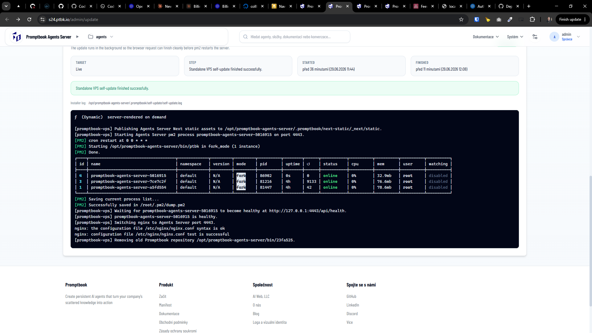

[ ] !!!

[✨😘] Only one instance of `promptbook-agents-server` should run

-   On `/admin/update` of Agents server you can trigger the self-update of the server
-   Sometimes it happens that there are multiple instances of `promptbook-agents-server` running, this should not happen, only one instance should run
    -   This shouldnt happen even if the server update fails, every time just one instance should run
-   You can look at testing server https://s24.ptbk.io/ or ssh into the VPS `s24.ptbk.io` and check the logs
-   When updated, it must leave the `pm2` in state where `reboot` command works and it restarts back into the state of single running instance of `promptbook-agents-server`
-   Keep in mind the DRY _(don't repeat yourself)_ principle.
-   Do a proper analysis of the current functionality before you start implementing.
-   You are working with the [Agents Server](apps/agents-server)
-   If you need to do the database migration, do it
-   Add the changes into the [changelog](changelog/_current-preversion.md)

```console
root@collboard-agents-server-x24:~# pm2 list
┌────┬─────────────────────────────────────┬─────────────┬─────────┬─────────┬──────────┬────────┬──────┬───────────┬──────────┬──────────┬──────────┬──────────┐
│ id │ name                                │ namespace   │ version │ mode    │ pid      │ uptime │ ↺    │ status    │ cpu      │ mem      │ user     │ watching │
├────┼─────────────────────────────────────┼─────────────┼─────────┼─────────┼──────────┼────────┼──────┼───────────┼──────────┼──────────┼──────────┼──────────┤
│ 4  │ promptbook-agents-server-5016915    │ default     │ N/A     │ fork    │ 86902    │ 12m    │ 0    │ online    │ 0%       │ 755.6mb  │ root     │ disabled │
│ 3  │ promptbook-agents-server-7ce7c2f    │ default     │ N/A     │ fork    │ 81216    │ 4h     │ 9133 │ online    │ 0%       │ 116.0mb  │ root     │ disabled │
│ 1  │ promptbook-agents-server-a5fd554    │ default     │ N/A     │ fork    │ 81447    │ 4h     │ 42   │ online    │ 0%       │ 105.7mb  │ root     │ disabled │
└────┴─────────────────────────────────────┴─────────────┴─────────┴─────────┴──────────┴────────┴──────┴───────────┴──────────┴──────────┴──────────┴──────────┘
root@collboard-agents-server-x24:~#
```


