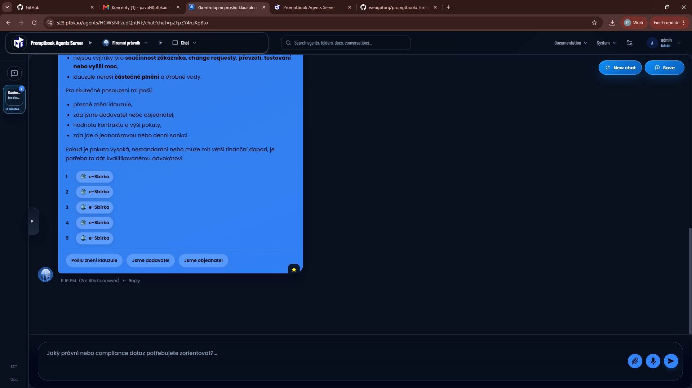
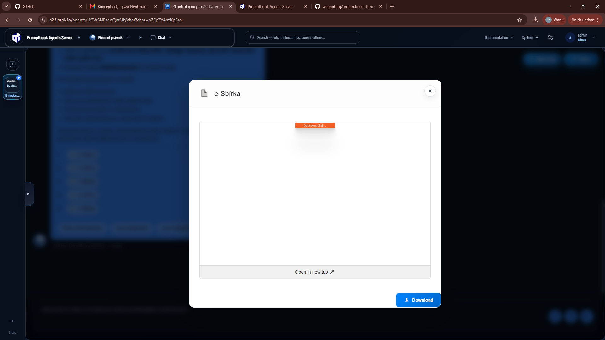

[ ]

[✨☃️] The preview of the knowledge should be interactive not just freezed image

-   The browsern should be livestreaned to the web UI
-   The running browser session should be visible in task manager
-   Keep in mind the DRY _(don't repeat yourself)_ principle.
-   Do a proper analysis of the current functionality before you start implementing.
-   You are working with the [Agents Server](apps/agents-server)
-   If you need to do the database migration, do it
-   Add the changes into the [changelog](changelog/_current-preversion.md)

