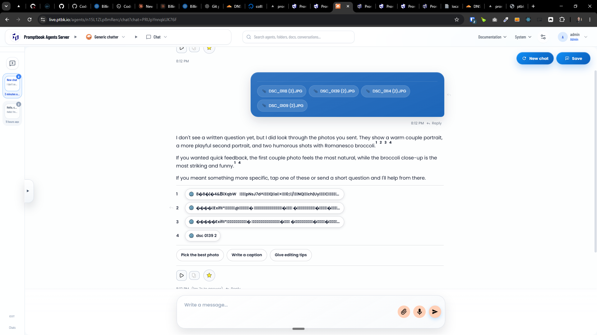
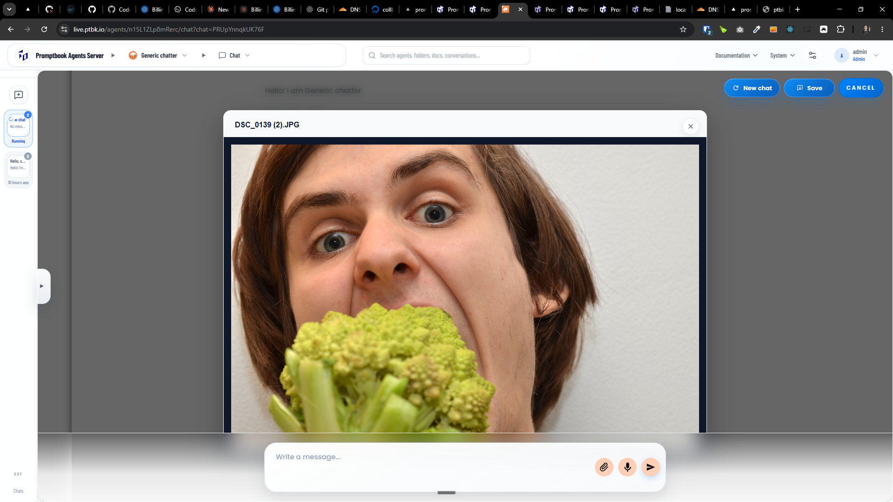
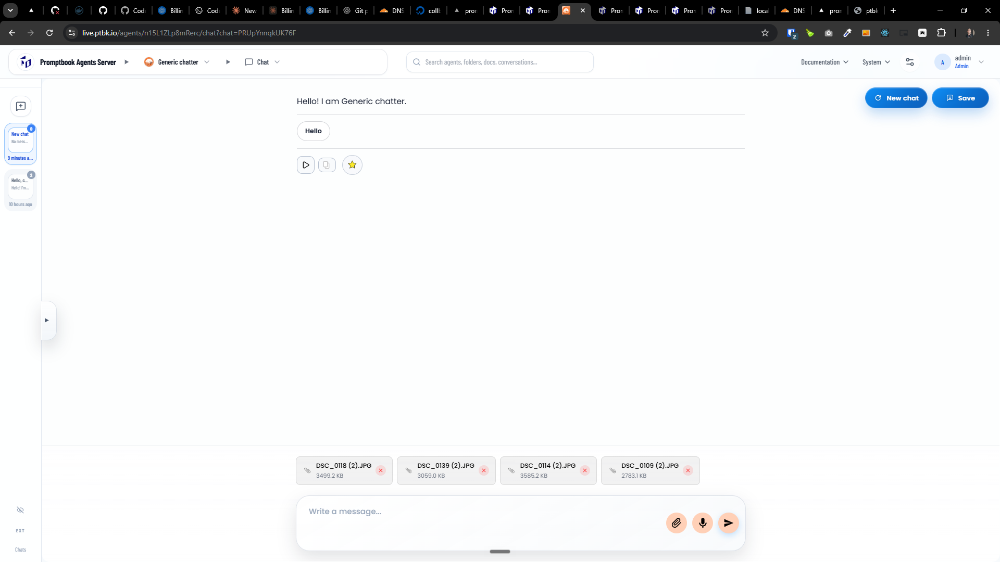
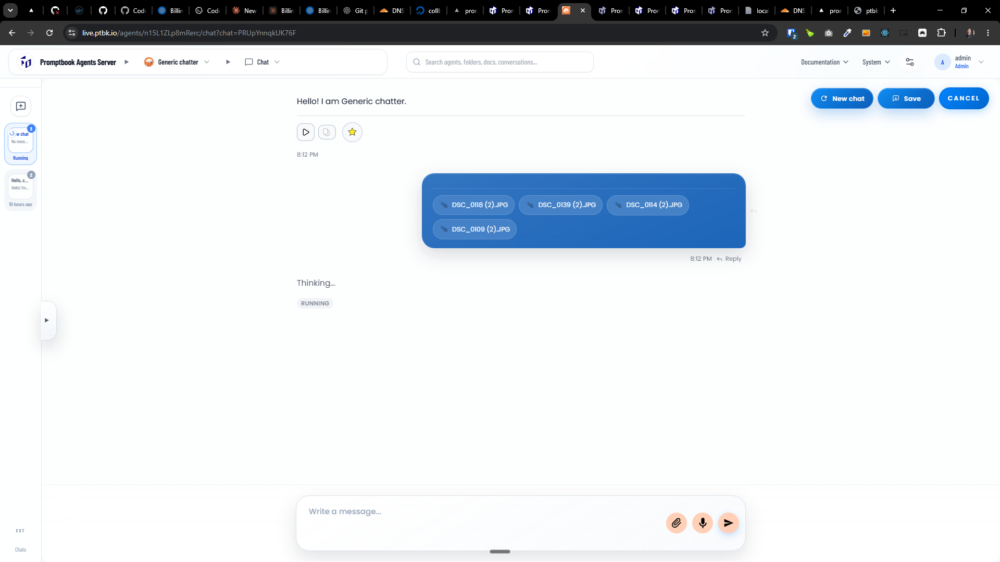

[x] ~$0.00 an hour by OpenAI Codex `gpt-5.5`

[✨✥] Agents must be able to see images and other attached files

-   Do a proper analysis of the current functionality before you start implementing.
-   You are working with the [Agents Server](apps/agents-server)

---

[x] ~$0.9675 an hour by OpenAI Codex `gpt-5.5`

[✨✥] Show attached images in the popup not in the new browser tab

-   Do a proper analysis of the current functionality before you start implementing.
-   You are working with the [Agents Server](apps/agents-server)

---

[x] $11.80 an hour by Claude Code `claude-opus-4-8`

[✨✥] Fix source chip of the attached image in the chat

-   When there is attached image in the chat, the image is used as source and the source chip is shown, but the source chip is broken "8�8�|�4&ВiXqbW �pNsJ7d^—�Q�o�+�0;�/��NQ��ch|Uy��C�����Rd��\|�2�S"
-   Show "DSC_0139 (2).JPG" instead of "8�8�|�4&ВiXqbW �pNsJ7d^—�Q�o�+�0;�/��NQ��ch|Uy��C�����Rd��\|�2�S"
-   Do a proper analysis of the current functionality before you start implementing.
-   You are working with the [Agents Server](apps/agents-server)

---

[x] ~$0.5893 an hour by OpenAI Codex `gpt-5.5`

[✨✥] Fix the layout of the attached image when opened in the popup

-   When there is attached image in the chat, the image is opened in the popup, but the layout of this popup is bit broken, fix it
-   Do a proper analysis of the current functionality before you start implementing.
-   You are working with the [Agents Server](apps/agents-server)

---

[ ] !

[✨✥] Show attached images before the sending the message to the agent

-   When the images are send, they can be opened in the popup by clicking on the chip
-   But before the message is send, the images are not able to be opened in the popup
-   Share the same functionality of the attached images before the message is send to the agent, so that the user can open the attached images in the popup and see them before sending the message to the agent
-   Before sending the message, the attached files in same chips with same popup functionality as after sending the message to the agent
-   Do a proper analysis of the current functionality before you start implementing.
-   You are working with the [Agents Server](apps/agents-server)

