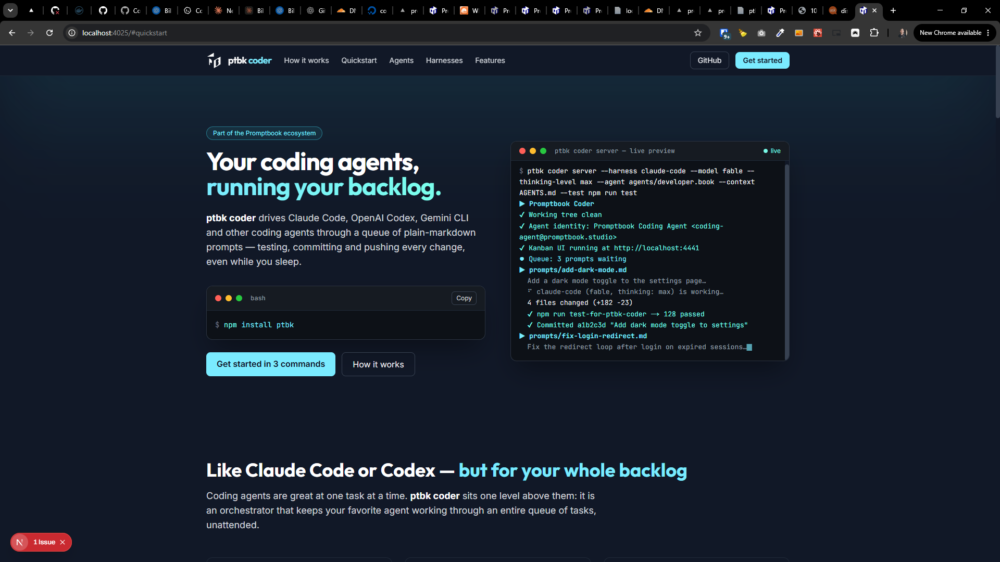
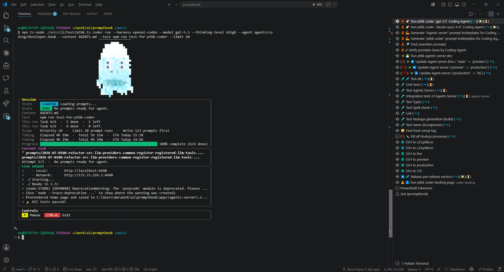
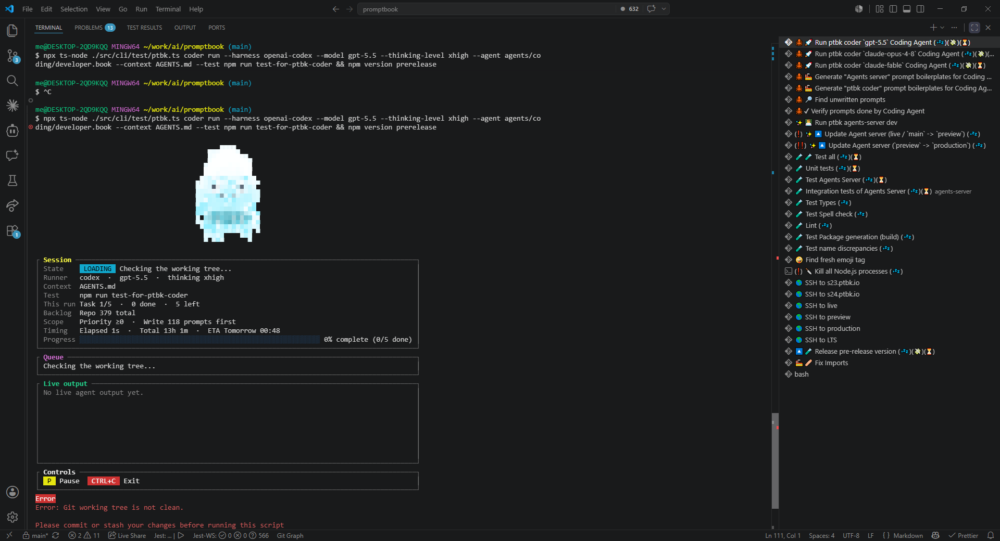
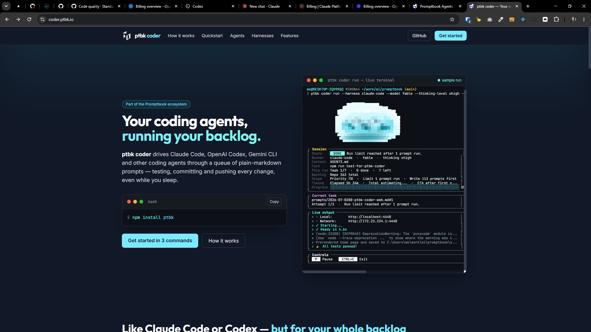
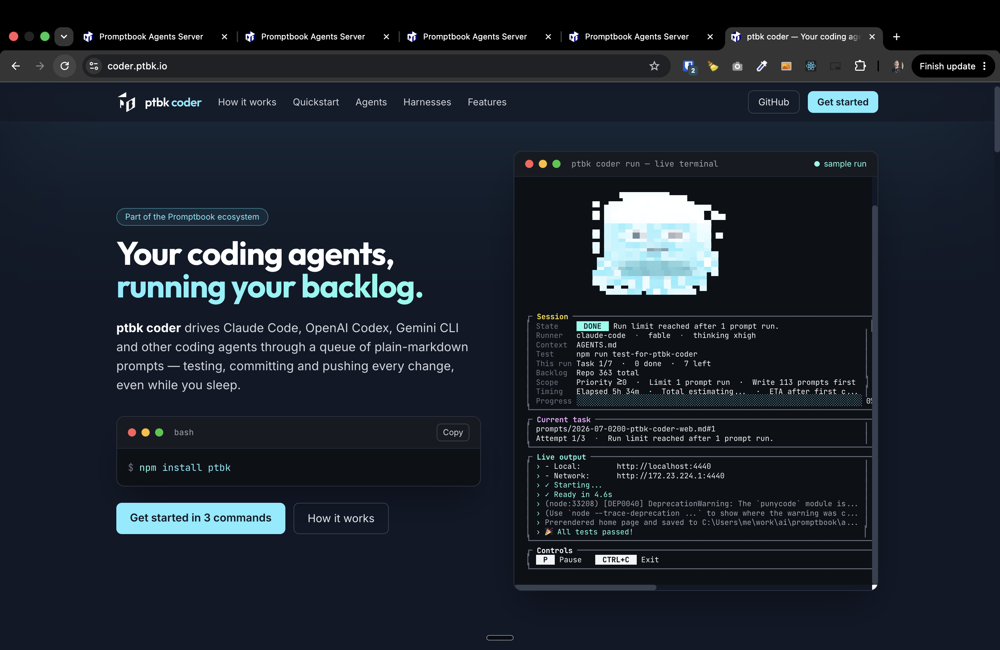
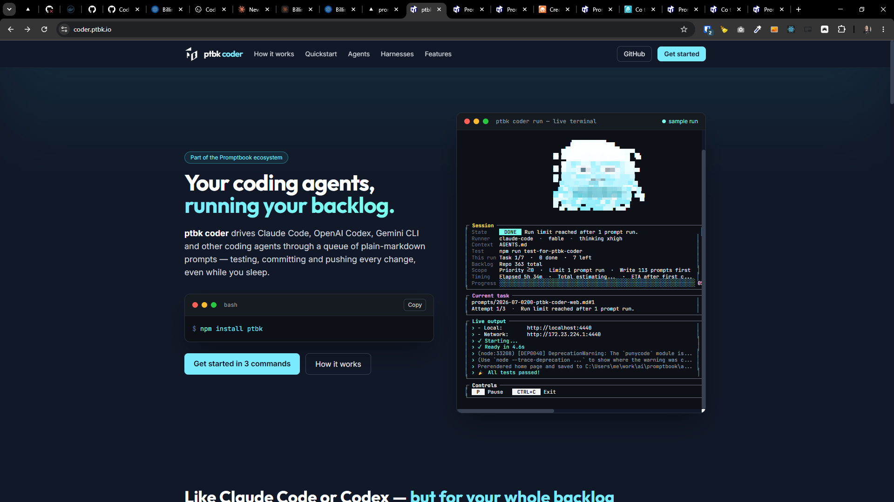

[x] $0.00 6 hours by Claude Code `fable`

[✨🍖] Make a website for `ptbk coder`

-   Purpose of the website is to provide a landing page for `ptbk coder` and its features.
-   Target is to show how the `ptbk coder` is working for person who has no idea about it.
    -   But the person can know about Claude Code and OpenAI Codex
-   Get inspiration in similar pages:
    -   https://opencode.ai/
    -   https://kilo.ai/
    -   https://cline.bot/
    -   https://openai.com/cs-CZ/codex/
    -   https://claude.com/product/claude-code
    -   https://cursor.com/get-started
-   Page should be in English and Dark mode and work both on desktop and mobile
-   Page should show the code to terminal from the installation to the advanced features
-   The typical visitor and user is a developer who wants to use `ptbk coder` to code and develop software with the help of AI agents.
-   Samples in bash should be highlighted and copyable, and look like terminal
-   Also show "live" previrw of the `ptbk coder` in action in fake terminal
-   Show the option to use ptbk coder with `--agent agents/developer.book` and in readonly <BookEditor/> show the developer agent
-   List the harnesses and models that can be used with `ptbk coder` and show the cards with logos and shell samples of all of them
-   Look at footer from `https://www.ptbk.io/en` - it should be similar but adjusted to the `ptbk coder` landing page, ptbk coder is just subproduct of Promptbook, so it should be clear that it is part of Promptbook and not a separate company, but this information should be in the footer and not in the main content of the page
-   Use [Promptbook branding](https://www.ptbk.io/branding)
-   The landing page should be based on Next.js
    -   Look how other apps in `/apps` are made
    -   The app will run on port 4025, look at `apps/README.md` and add it there
-   In the app make the folder `specs` _(I mean `apps/coder-landing/specs`)_
    -   Purpose of the specs is to have a single source of truth for the functionality of the page, so that it can be used for development, testing, and documentation but also for 1:1 replication of the functionality without having the source code of the page
    -   When I take just specs folder it should be possible to implement the same functionality of the page without having the source code of the page
    -   Specs will be created in the `specs/` folder in the root of the repository
    -   Use hierarchy of folders to organize the specs, for example `specs/foo/bar.md`
    -   One markdown file should contain one spec / reponsibility / aspect of the page, so that it can be easily referenced and linked to from other specs
    -   The most important specs and most abstract and core concepts should be in the root of the `specs/` folder, and less important specs should be in subfolders
    -   Interlink the specs via markdown hyperlinks
-   Keep in mind the DRY _(don't repeat yourself)_ principle.
-   Do a proper analysis of the current functionality of `ptbk coder` before you start implementing.
-   You are working with [`ptbk coder`](src/cli/cli-commands/coder/run.ts) but not changing its code, just creating a landing page for it.

```bash
npm install ptbk

ptbk coder init

ptbk coder server --harness claude-code --model fable --thinking-level max --agent agents/coding/developer.book --context AGENTS.md --test npm run test-for-ptbk-coder
```

---

[x] ~$1.08 an hour by OpenAI Codex `gpt-5.5`

[✨🍖] Make the sample in terminal in `ptbk coder` landing website

-   The "Live terminal" sample is not showing what is really happening in the `ptbk coder` when it is running, make the sample in the landing page show what is really happening in the `ptbk coder` when it is running
-   Keep in mind the DRY _(don't repeat yourself)_ principle.
    -   The animation of the Agent visual (the octopus) should share same code in the Agents server, `ptbk coder` and the landing page "live terminal", so that it is consistent and not repeated in multiple places
    -   The terminal must be shown as the text terminal with colors
    -   The terminal should go from entering the command to the final output BUT do not blink or do not reset the terminal
-   Do a proper analysis of the current landing website, the `ptbk coder` and related functionality before you start implementing.
-   You are working with the [`ptbk coder` landing website](apps/coder-landing)
-   You are making page for [`ptbk coder`](src/cli/cli-commands/coder/)
    -   Do not change `ptbk coder` itself, just enhance a landing page for it



**This is how really the `ptbk coder` is working and look like:**



```console

me@DESKTOP-2QD9KQQ MINGW64 ~/work/ai/promptbook (main)
$ npx ts-node ./src/cli/test/ptbk.ts coder run --harness claude-code --model fable --thinking-level xhigh --agent agents/coding/developer.book --context AGENTS.md --test npm run test-for-ptbk-coder --wait-between-prompts 4h --limit 1

┌ Session ─────────────────────────────────────────────────────────────────────────────────────┐
│ State     DONE  Run limit reached after 1 prompt run.                                        │
│ Runner   claude-code  ·  fable  ·  thinking xhigh                                            │
│ Context  AGENTS.md                                                                           │
│ Test     npm run test-for-ptbk-coder                                                         │
│ This run Task 1/7  ·  0 done  ·  7 left                                                      │
│ Backlog  Repo 363 total                                                                      │
│ Scope    Priority ≥0  ·  Limit 1 prompt run  ·  Write 113 prompts first                      │
│ Timing   Elapsed 5h 34m  ·  Total estimating...  ·  ETA after first completion               │
│ Progress ░░░░░░░░░░░░░░░░░░░░░░░░░░░░░░░░░░░░░░░░░░░░░░░░░░░░░░░░░░░░ 0% complete (0/7 done) │
└──────────────────────────────────────────────────────────────────────────────────────────────┘
┌ Current task ────────────────────────────────────────────────────────────────────────────────┐
│ prompts/2026-07-0200-ptbk-coder-web.md#1                                                     │
│ Attempt 1/3  ·  Run limit reached after 1 prompt run.                                        │
└──────────────────────────────────────────────────────────────────────────────────────────────┘
┌ Live output ─────────────────────────────────────────────────────────────────────────────────┐
│ ›    - Local:        http://localhost:4440                                                   │
│ ›    - Network:      http://172.23.224.1:4440                                                │
│ ›  ✓ Starting...                                                                             │
│ ›  ✓ Ready in 4.6s                                                                           │
│ › (node:33208) [DEP0040] DeprecationWarning: The `punycode` module is deprecated. Please ... │
│ › (Use `node --trace-deprecation ...` to show where the warning was created)                 │
│ › Prerendered home page and saved to C:\Users\me\work\ai\promptbook\apps\agents-server\.n... │
│ › 🎉 All tests passed!                                                                       │
└──────────────────────────────────────────────────────────────────────────────────────────────┘
┌ Controls ────────────────────────────────────────────────────────────────────────────────────┐
│  P  Pause   CTRL+C  Exit                                                                     │
└─────────────────────────────────────────────────────────────
```

---

[x] ~$1.44 2 hours by OpenAI Codex `gpt-5.5`

[✨🍖] Make the sample in terminal agent avatar visual (the octopus ) in `ptbk coder` landing website look like the real `ptbk coder`

-   Keep in mind the DRY _(don't repeat yourself)_ principle.
    -   The animation of the Agent visual (the octopus) should share same code in the Agents server, `ptbk coder` and the landing page "live terminal", so that it is consistent and not repeated in multiple places
-   Do a proper analysis of the current landing website, the `ptbk coder` and related functionality before you start implementing.
-   You are working with the [`ptbk coder` landing website](apps/coder-landing)
-   You are making page for [`ptbk coder`](src/cli/cli-commands/coder/)
    -   Do not change `ptbk coder` itself, just enhance a landing page for it




---

[x] ~$0.8985 an hour by OpenAI Codex `gpt-5.5`

---

[ ]

[✨🍖] Make the sample in terminal agent avatar visual (the octopus ) in `ptbk coder` landing website look like the real `ptbk coder`

-   Keep in mind the DRY _(don't repeat yourself)_ principle.
    -   The animation of the Agent visual (the octopus) should share same code in the Agents server, `ptbk coder` and the landing page "live terminal", so that it is consistent and not repeated in multiple places
-   Do a proper analysis of the current landing website, the `ptbk coder` and related functionality before you start implementing.
-   You are working with the [`ptbk coder` landing website](apps/coder-landing)
-   You are making page for [`ptbk coder`](src/cli/cli-commands/coder/)
    -   Do not change `ptbk coder` itself, just enhance a landing page for it




