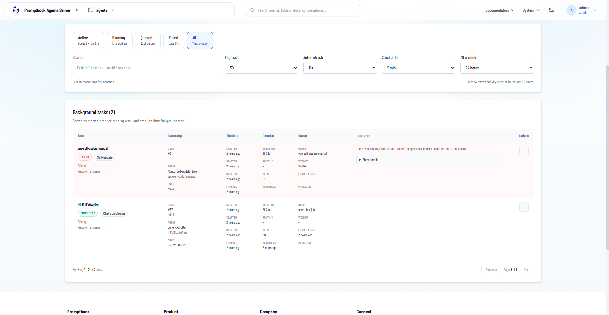

[x] (2 attempts) ~$0.4706 3 hours by OpenAI Codex `gpt-5.5`

[✨💪] When doing self update, preserve all the update tasks in task manager

-   On `/admin/update` of Agents server you can trigger the self-update of the server, the update process is shown in `/admin/update` and also in `/admin/task-manager`, but only as a single task, the update process is not preserved in the task manager, so you cannot see the history of the update tasks.
-   Change the self-update process so that all the update tasks are preserved in the task manager, so you can see the history of the update tasks.
-   Keep in mind the DRY _(don't repeat yourself)_ principle.
-   Do a proper analysis of the current functionality before you start implementing.
-   You are working with the [Agents Server](apps/agents-server)
-   If you need to do the database migration, do it

