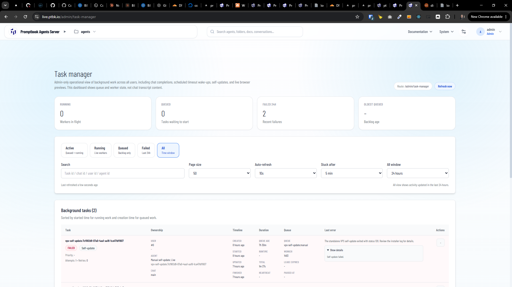
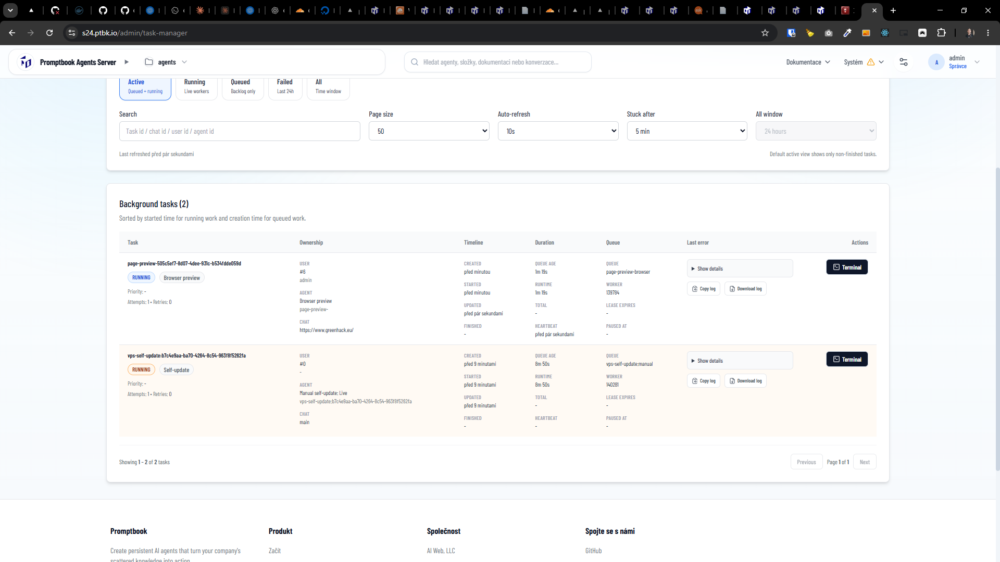
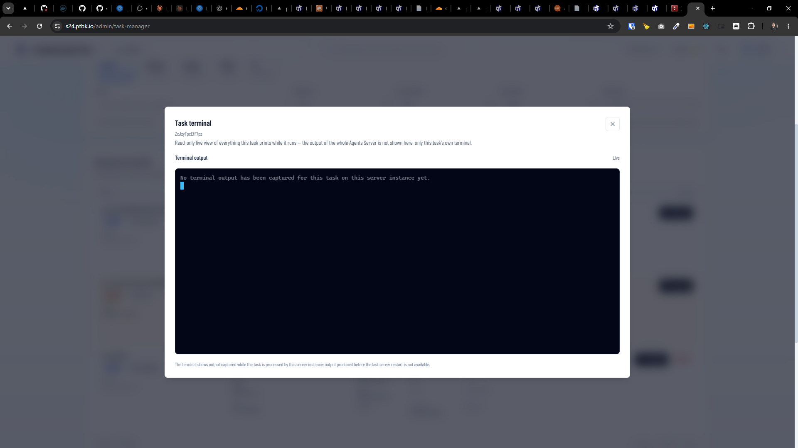
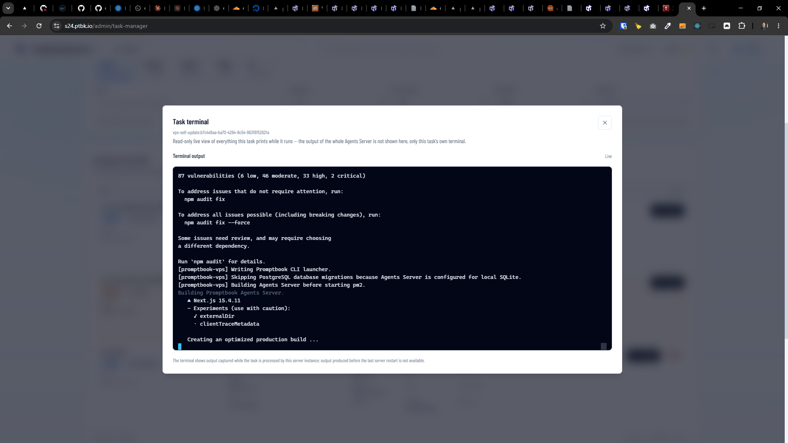

[x] $7.50 11 hours by Claude Code `fable`

[✨😉] In the task manager, allow to see the full CLI terminal of each particular task in real time

-   Now there is just simple post-mortem log of the task, but it is not possible to see the full CLI terminal of each particular task in real time, so you cannot see what is happening in the task in real time.
-   Allow to see both the post-mortem log of the task _(with buttons to download and copy the log)_ and also add button to open the full CLI terminal of each particular task in real time, so that you can see what is happening in the task in real time.
-   The terminal is read-only, you cannot type into it, but you can see the full CLI terminal of each particular task in real time as it is running, so that you can see what is happening in the task in real time.
-   Show only the terminal of the task, not the whole Agents server terminal
-   This should be available for all types of tasks
-   Only super-admin users can see the full CLI terminal
-   Keep in mind the DRY _(don't repeat yourself)_ principle.
-   Do a proper analysis of the current functionality before you start implementing.
-   You are working with the [Agents Server](apps/agents-server) with `/admin/task-manager`

---

[ ]

[✨😉] In the task manager, allow to see the full CLI terminal of each particular task in real time, the chat completion is not working, fix it

-   Now the self-update task terminal is shown correctly in the task manager
-   Also the page-preview task is shown correctly in the task manager
-   **But Chat completion tasks shows just empty terminal**, so you cannot see what is happening in the task in real time.
    -   Now just "No terminal output has been captured for this task on this server instance yet." is shown
    -   Show the CLI of ongoing coding harness in real time, the 1:1 what is happening in the CLI terminal under the hood
-   Keep in mind the DRY _(don't repeat yourself)_ principle.
-   Do a proper analysis of the current functionality before you start implementing.
-   You are working with the [Agents Server](apps/agents-server) with `/admin/task-manager`

