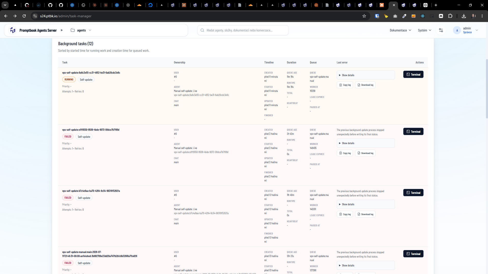

[x] ~$0.5472 2 hours by OpenAI Codex `gpt-5.5`

[✨🕷] When the server is doing self-update the self update works perfectly but in task manager it is shown as failed

-   On `/admin/update` of Agents server you can trigger the self-update of the server
-   On `/admin/update` it is correcly shown as success / fail of the ongoing self-update
-   On `/admin/task-manager` it is shown as failed, even though the self-update was successful
-   The problem is maybe in the fact that during the self-update the Agents server is restarted, the task must be aware of this fact
-   Keep in mind the DRY _(don't repeat yourself)_ principle.
-   Do a proper analysis of the current functionality before you start implementing.
-   You are working with the [Agents Server](apps/agents-server)
-   Add the changes into the [changelog](changelog/_current-preversion.md)

**This is the log:**

```
Task: vps-self-update:e1ff6550-9509-4bde-9072-08dce7b7f89d
Kind: VPS_SELF_UPDATE
Status: FAILED
Created: 2026-07-12T08:06:34+00:00
Queued: 2026-07-12T08:06:34+00:00
Started: 2026-07-12T08:06:34+00:00
Finished: 2026-07-12T08:06:34+00:00
Attempts: 1
Retries: 0
Worker: 148455
Queue: vps-self-update:manual

Last error summary:
The previous background update process stopped unexpectedly before writing its final status.

Last error details:
Removing previous Agents Server pm2 processes and garbage-collecting old versions.
```



