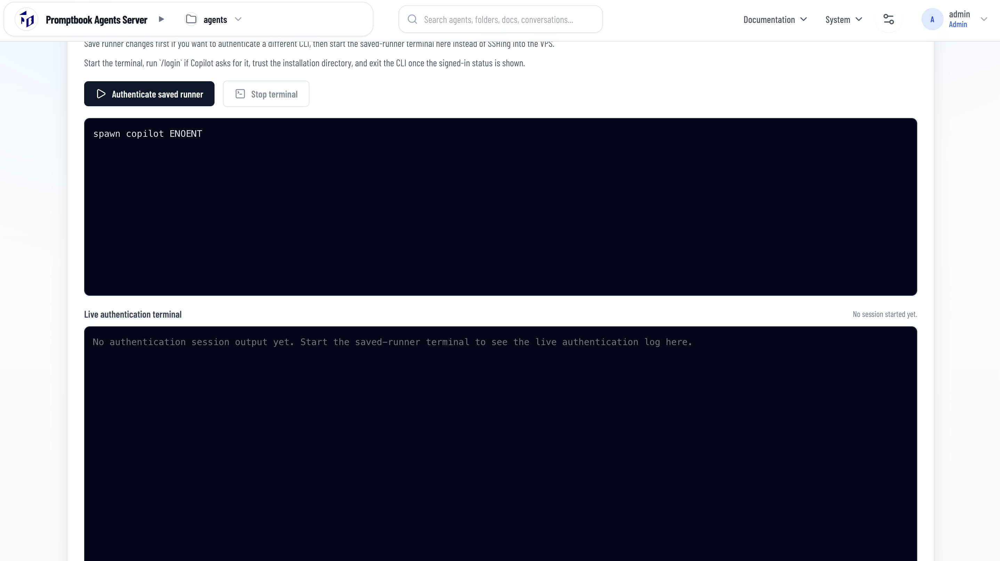

[x] ~$0.1853 2 hours by OpenAI Codex `gpt-5.5`

[✨🛍] In page `/admin/harness-auth` keep just one terminal not two

-   On `/admin/harness-auth` there is option to sign in to harness like OpenAI Codex to use the subscription instead of API key
- But for some reason there are two terminals, keep just "Live authentication terminal" - one thar user can use to sign in to harness like OpenAI Codex
- Only show this terminal when the session is running
-   Keep in mind the DRY _(don't repeat yourself)_ principle.
-   Do a proper analysis of the current functionality before you start implementing.
-   You are working with the [Agents Server](apps/agents-server)
-   Add the changes into the [changelog](changelog/_current-preversion.md)

