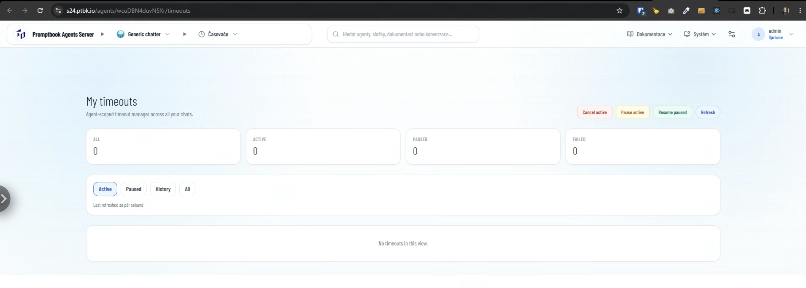

[ ] !!!

[✨🪁] When the agent has defined goals, allow this agent to set up its own cron jobs

- The purpose of this is to have agents that are actually living and doing tasks and working on a given goal by itself, not only reacting to the chat. 
- In the previous versions of the agent server, there was a concept of use timeout, take the useful things and pages from this concept and reimplement this for the agent to set up the cron and time out by itself only from a goal.
    
- There are three situations when the agent can be changing its goals:
    1. When the agent is created or its source is modified, it should be enough that you created an agent with a particular goal for this agent to be awake and act on behalf of this goal.
    2. When you are chatting with the agent, the agent must have the ability to modify its screens from the information from the chat and its goals.
    3. The situation when the agent is awakened by the cron. The agent must be able to modify its crons from the cron awakening itself. 
-   Keep in mind the DRY _(don't repeat yourself)_ principle.
-   Do a proper analysis of the current functionality before you start implementing.
-   You are working with the [Agents Server](apps/agents-server)
-   Add the changes into the [changelog](changelog/_current-preversion.md)


```book
Social media agent

GOAL Keep the Facebook page updated with new posts every day
KNOWLEDGE https://github.com/company/my-awesome-project
```

This should be enough for the agent to figure out what the cron should be


