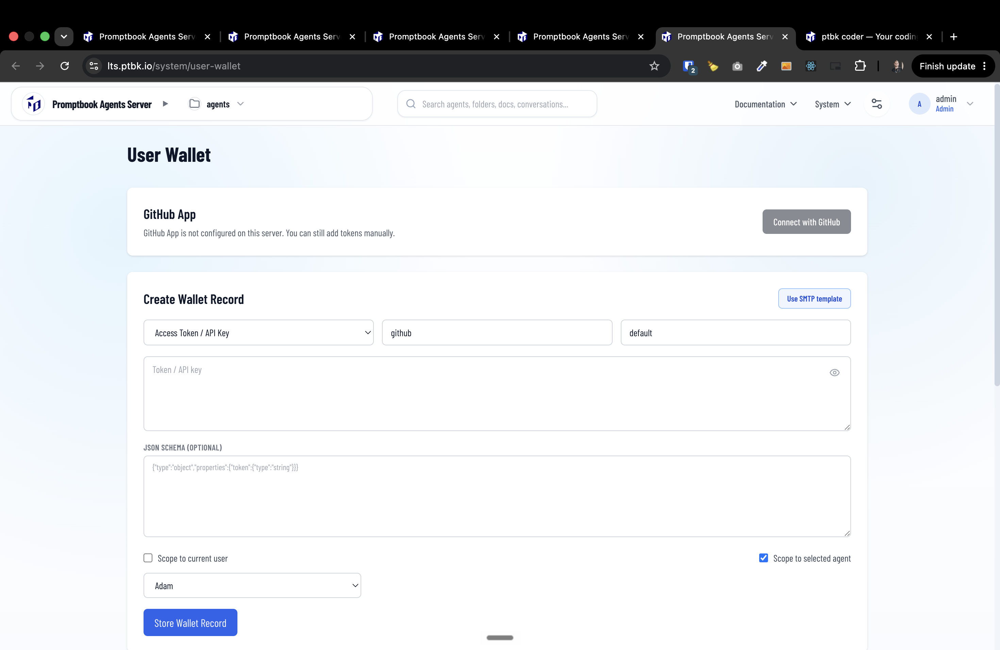
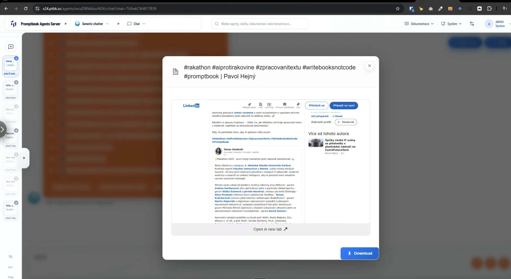

[ ] !!!!

[✨🚤] Each agent should have its own browser profile. 

- Purpose of this change is to give every agent its own isolated environment where they can do their work and have their own persistent data, like cookies, session tokens, and other browser-related information.
-   When the agent uses a browser, for example, for gathering information and knowledge or for performing actions, it should work on its own isolated browser profile. 
- This profile can be managed through the wallet.
    - Wallet is accesible through `/system/user-wallet` on the agent server
    - 
    - The wallet is a system for storing the things which should be persistent but they aren't, the agent source, for example, passwords, sessions, tokens, session IDs, etc., and also they should store the browser profile
    - In the wallet, there shouldn't be probbably stored the profile and all of the files of the browser profile directly. Just some link to the file system where the profile is. 
    - Just to notice that the wallet is called User Wallet, but this name is a little bit deprecated and stupid because it is really the agent wallet, not the User Wallet. The records in the wallet are connected with the agents, not with the users. Every agent has its own wallet: own store passwords, profiles, API keys, etc., change it accordingly.
    - The wallet is a way to give the agent access to the external resources, like the login information to the social media, the logged-in sessions, and, in the future, API keys, credentials, etc. 
- In this profile, there will be saved the session tokens, cookie preferences, and other stuff, which will be persistent and should be permanent throughout the agent's life, not only in one session. 
- This can be useful, for example, when the agent is signed in to some social network, for example Facebook, and is writing posts to Facebook. The user doesn't need to log in every time the agent wants to post there or gather some information from there. 
- When you click on the knowledge chip, you are seeing the live browser session transmitted from the agent server. Allow the agent to trigger a need for login or for the user to do some action when the user logs somewhere. This information is saved in the agent browser profile. 
- Use the browser profile, which is provided by the playwright which is used on the server
- This shouldn't mean that the browser should be kept alive on the server when the user or agent is not using it. It just means that the browser profile should be preserved permanently, not only temporarily. 
-   Keep in mind the DRY _(don't repeat yourself)_ principle.
-   Do a proper analysis of the current functionality before you start implementing.
-   You are working with the [Agents Server](apps/agents-server)
-   Add the changes into the [changelog](changelog/_current-preversion.md)

